# WAD - Web Application Document - Módulo 2 - Inteli

## CodeVolunteer

#### Nomes dos integrantes do grupo

### [Davi Ferreira](http://www.linkedin.com/in/davioliveiraferreira)

### [Eduardo Fidelis](https://www.linkedin.com/in/eduardo-fidelis-chaves?utm_source=share&utm_campaign=share_via&utm_content=profile&utm_medium=android_app)

### [Isabelle Dantas](https://www.linkedin.com/in/iisabelledantas)

### [Kaio Vittor](https://www.linkedin.com/in/kaiovittor/)

### [Mariana de Paula](www.linkedin.com/in/marianadepaulabarbosa)

### [Mariella Kamezawa](https://www.linkedin.com/in/mariella-kamezawa/)

### [Rafaela Lima](https://www.linkedin.com/in/rafaela-silva-de-oliveira-lima-23760925b/)

### [Rodrigo Lee](https://www.linkedin.com/in/rodrigo-lee/)

## Sumário

[1. Introdução](#c1)

[2. Visão Geral da Aplicação Web](#c2)

[3. Projeto Técnico da Aplicação Web](#c3)

[4. Desenvolvimento da Aplicação Web](#c4)

[5. Testes da Aplicação Web](#c5)

[6. Conclusões e trabalhos futuros](#c6)

[7. Referências](#c7)

[Anexos](#c8)

<br>

# <a name="c1"></a>1. Introdução (sprints 1 a 5)

&nbsp;&nbsp;&nbsp;&nbsp;A problemática entregue pelo parceiro (ONG Parceiros Voluntários) é a de que a conexão entre oportunidades de voluntariado e voluntários capacitados para tais oportunidades não ocorre da melhor maneira possível. Isso ocorre pois o sistema comum atual se baseia em uma plataforma em que as organizações divulgam suas vagas disponíveis e esperam as candidaturas, porém, esse é um processo não efetivo já que as ONGS não tem tempo para atualizar rigorosamente a sessão.

&nbsp;&nbsp;&nbsp;&nbsp;Nesse contexto, o grupo CodeVolunteer desenvolverá uma aplicação web descentralizada da instituição e com foco no voluntário, onde o mesmo possa publicar suas atividades e habilidades, bem como suas experiências anteriores. É uma experiência imersiva em que as ONG's terão a possibilidade de encontrar os voluntários e os escolher, não o contrário.

# <a name="c2"></a>2. Visão Geral da Aplicação Web (sprint 1)

&nbsp;&nbsp;&nbsp;&nbsp; Nessa sessão, abordaremos os principais aspectos da aplicação, bem como os processos que levaram às principais tomadas de decisão. Nossa solução visa concentrar voluntários e organizações sociais numa só rede, permitindo de maneira fácil e simples a conexão entre ambos. Além disso, a plataforma terá algo único: uma aba de compartilhamento de projetos para serem replicados por outras pessoas e um feed em que voluntários podem trocar ideias e experiências.

## 2.1. Escopo do Projeto (sprint 1)

### 2.1.1. Contexto da indústria (sprint 1)

&nbsp;&nbsp;&nbsp;&nbsp;A Parceiros Voluntários é uma organização não governamental (ONG) reconhecida por seu compromisso com a promoção do voluntariado e do engajamento cívico. Fundada há décadas, a ONG consolidou-se como uma referência na mobilização de recursos humanos para causas sociais e comunitárias. Porém, a revolução digital transformou não apenas a maneira como as pessoas se conectam e se engajam, mas também a forma como as ONGs operam e alcançam seus objetivos.

&nbsp;&nbsp;&nbsp;&nbsp;Nesse contexto, a Parceiros Voluntários se viu diante da necessidade de adaptar suas estratégias e programas para aproveitar as vantagens oferecidas pelo ambiente digital, bem como se preparar para o setor competitivo que estava inserida, tendo organizações como Instituto Ação Voluntária e Associação Viva Solidariedade como suas principais concorrentes.

&nbsp;&nbsp;&nbsp;&nbsp; Quanto ao modelo de negócios em si, tendo em vista números disponibilizados em 2022, a Parceiros demostrou duas fontes de receitas em seu balanço:

- Projetos e Eventos de assessoramento: Durante o ano foram arrecadados R$3.506.864,00 com diversos tipos de projetos e assessoria para empresas. Esse valor correponde a 90% da receita operacional da Parceiros Voluntários.
- Contribuições de Mantenedores e Apoiadores: Apesar de pouco relevante para o montante das receitas da Parceiros, doações são fundamentais para qualquer organização sem fins lucrativos, permitindo um fôlego operacional e de caixa, uma vez que é uma receita que entra sem nenhuma despesa associada.

### 2.1.2. Modelo de 5 Forças de Porter (sprint 1)

&nbsp;&nbsp;&nbsp;&nbsp;O modelo das 5 Forças de Porter consiste em uma análise setorial minuciosa, a fim de identificar o nível da concorrência e como o produto se encaixa em uma visão macro. Essa análise avalia o ambiente da indústria, a lucratividade e competitividade de um setor. É composta por: Rivalidade entre concorrentes, poder de barganha, ameaça de produtos substitutos, poder de barganha dos clientes e ameaça de novos entrantes. Ao examinar cada uma dessas forças as empresas podem identificar melhor o mercado, a própria organização e concorrentes. Essa é a análise da Parceiros Voluntários:

<div align="center" width="100%">
 <sub>Figura 1: Análise de 5 Forças de Porter do CodeVolunteer</sub><br>


<sup>Fonte: Material produzido pelos autores (2024) [Link do arquivo](https://www.canva.com/design/DAGAKQtrJgo/i8qaiIusebt_rsh2-c6bmg/edit?utm_content=DAGAKQtrJgo&utm_campaign=designshare&utm_medium=link2&utm_source=sharebutton)</sup>

</div>

<div align="center" width="100%">
<sub>Tabela 1: Modelo das 5 Forças de Porter </sub><br>
</div>

| #   | Poder de barganha dos fornecedores                                                                                                                                                                                                                                                                                                                                                                                                                                            |
| --- | ----------------------------------------------------------------------------------------------------------------------------------------------------------------------------------------------------------------------------------------------------------------------------------------------------------------------------------------------------------------------------------------------------------------------------------------------------------------------------- |
| 1.  | No contexto, os fornecedos podem ser órgãos públicos, empresas ou doadores diversos, que possam fornecer recursos financeiros ou institucionais para a ONG. O poder de barganha dos mesmos varia de acordo com a disponibilidade da demanda por causas específicas e do prestígio e reconhecimento da marca da Parceiros Voluntários. Organizações que conseguem estabelecer parcerias sólidas e diversificadas podem ter mais poder de barganha em relação aos fornecedores. |

<div align="center">
<sup>Fonte: Material produzido pelos autores (2024)</sup>
</div>

<br>

<div align="center" width="100%">
<sub>Tabela 2: Ameaça de produtos substitutos </sub><br>
</div>

| #   | Ameaça de produtos substitutos                                                                                                                                                                                                                                                                                                                                                                                                                                              |
| --- | --------------------------------------------------------------------------------------------------------------------------------------------------------------------------------------------------------------------------------------------------------------------------------------------------------------------------------------------------------------------------------------------------------------------------------------------------------------------------- |
| 1.  | Com o crescimento das mídias sociais, se tornou mais fácil criar uma organização e fazê-la conhecida por seu nicho específico, tornando o voluntariado tão amplo e plural. Dentro desse contexto, a ameaça de novos produtos nesse se torna iminente e alta, mas a Parceiros Voluntários consegue se destacar por conseguir fazer a conexão com várias organizações que atuam em nichos diversos. Dessa forma o voluntário consegue escolher qual causa mais se identifica. |

<div align="center">
<sup>Fonte: Material produzido pelos autores (2024)</sup>
</div>

<br>

<div align="center" width="100%">
<sub>Tabela 3: Poder de barganha dos clientes </sub><br>
</div>

| #   | Poder de barganha dos clientes                                                                                                                                                                                                                   |
| --- | ------------------------------------------------------------------------------------------------------------------------------------------------------------------------------------------------------------------------------------------------ |
| 1.  | O poder de barganha desse setor é responsável pelos voluntários da própria organização e pode ser influenciado pela disponibilidade de outras opções de voluntariado e doação, bem como pela transparência, eficácia e prestígio da organização. |

<div align="center">
<sup>Fonte: Material produzido pelos autores (2024)</sup>
</div>

<br>

<div align="center" width="100%">
<sub>Tabela 4: Ameaça de novos entrantes </sub><br>
</div>

| #   | Ameaça de novos entrantes                                                                                                                                                                                                                                                                                                                                                                                                |
| --- | ------------------------------------------------------------------------------------------------------------------------------------------------------------------------------------------------------------------------------------------------------------------------------------------------------------------------------------------------------------------------------------------------------------------------ |
| 1.  | A ameaça de novas ONGs entrarem no mercado de voluntariado e engajamento cívico geralmente é moderada. Embora seja relativamente fácil criar uma nova organização sem fins lucrativos, é difícil estabelecer uma reputação, conquistar a confiança do público e construir redes de voluntários e doadores. Neste quesito, a Parceiros Voluntários também se destaca por já ser uma organização de destaque e relevância. |

<div align="center">
<sup>Fonte: Material produzido pelos autores (2024)</sup>
</div>

<br>

<div align="center" width="100%">
<sub>Tabela 5: Rivalidade entre concorrentes </sub><br>
</div>

| #   | Rivalidade entre concorrentes                                                                                                                                                                                                                                                                                                                                                                                                                                             |
| --- | ------------------------------------------------------------------------------------------------------------------------------------------------------------------------------------------------------------------------------------------------------------------------------------------------------------------------------------------------------------------------------------------------------------------------------------------------------------------------- |
| 1.  | O setor de voluntariado e engajamento cívico pode ser altamente competitivo dependendo da região e nicho de atuação, uma vez que áreas urbanas densamente povoadas tem maior concentração de organizações do tipo, aumentando a concorrência. Outro fator contribuinte é o prestígio e reconhecimento de cada ONG, que pode culminar em uma disparidade na concorrência, sendo o caso da Parceiros Voluntários - uma ONG com anos de atuaçõo e reconhecimento no mercado. |

<div align="center">
<sup>Fonte: Material produzido pelos autores (2024)</sup>
</div>

&nbsp;&nbsp;&nbsp;&nbsp; Sob essa perspectiva, é possível perceber a análise macro do setor de voluntariado no Brail, levando em consideração dados de impacto e demográficos, que culminam em um meio de competitividade moderada,sendo também é um setor que se baseia em confiança e reputação. Dessa forma, a Parceiros Voluntários se encaixa em uma boa posição dentro do meio referido.

<div align="center">
<sup>Fonte: Material produzido pelos autores (2024)</sup>
</div>

### 2.1.3. Análise SWOT (sprint 1)

&nbsp;&nbsp;&nbsp;&nbsp;A Análise SWOT é uma ferramenta estratégica amplamente utilizada em negócios, organizações sem fins lucrativos. Ela envolve a avaliação dos fatores internos e externos que podem afetar o desempenho de uma organização ou projeto. A sigla "SWOT" representa Strengths (Forças), Weaknesses (Fraquezas), Opportunities (Oportunidades) e Threats (Ameaças).

- Forças (Strengths): Esses são os atributos internos positivos da organização ou projeto.
- Fraquezas (Weaknesses): As fraquezas são os aspectos internos negativos que podem prejudicar a organização ou projeto.
- Oportunidades (Opportunities): As oportunidades são fatores externos positivos que a organização ou projeto pode aproveitar. Isso pode incluir mudanças no mercado, avanços tecnológicos, tendências sociais, lacunas no mercado, dentre outros.
- Ameaças (Threats): As ameaças são fatores externos negativos que podem prejudicar a organização ou projeto. Isso pode incluir concorrência acirrada, mudanças na legislação, instabilidade econômica, mudanças nas preferências do consumidor ou qualquer outro desafio externo que possa representar um risco.

&nbsp;&nbsp;&nbsp;&nbsp;Essa é a análise aplicada ao contexto da Parceiros Voluntários:

 <div align="center" width="100%">
 <sub>Figura 2: Análise SWOT do CodeVolunteer</sub><br>
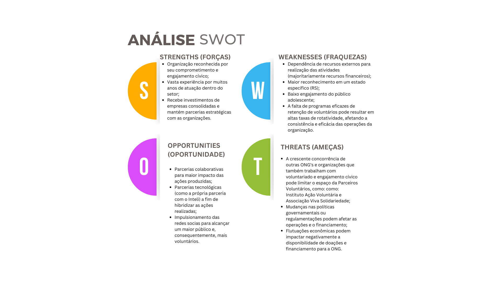

<sup>Fonte: Material produzido pelos autores (2024)
</sup>
</div>

<div align="center" width="100%">
<sub>Tabela 6: Forças da matriz SWOT </sub><br>
</div>

| #   | Forças                                                                                             |
| --- | -------------------------------------------------------------------------------------------------- |
| 1.  | Organização reconhecida por seu comprometimento e engajamento cívico;                              |
| 2.  | Vasta experiência por muitos anos de atuação dentro do setor;                                      |
| 3.  | Recebe investimentos de empresas consolidadas e mantém parcerias estratégicas com as organizações. |

<div align="center">
<sup>Fonte: Material produzido pelos autores (2024)</sup>
</div>

<br>

<div align="center" width="100%">
<sub>Tabela 7: Fraquezas da matriz SWOT </sub><br>
</div>

| #   | Fraquezas                                                                                                                                                               |
| --- | ----------------------------------------------------------------------------------------------------------------------------------------------------------------------- |
| 1.  | Dependência de recursos externos para realização das atividades (majoritariamente recursos financeiros);                                                                |
| 2.  | Maior reconhecimento em um estado específico (RS);                                                                                                                      |
| 3.  | Baixo engajamento do público adolescente;                                                                                                                               |
| 4.  | A falta de programas eficazes de retenção de voluntários pode resultar em altas taxas de rotatividade, afetando a consistência e eficácia das operações da organização. |

<div align="center">
<sup>Fonte: Material produzido pelos autores (2024)</sup>
</div>

<br>

<div align="center" width="100%">
<sub>Tabela 8: Oportunidades da matriz SWOT </sub><br>
</div>

| #   | Oportunidades                                                                                          |
| --- | ------------------------------------------------------------------------------------------------------ |
| 1.  | Parcerias colaborativas para maior impacto das ações produzidas;                                       |
| 2.  | Parcerias tecnológicas (como a própria parceria com o Inteli) a fim de hibridizar as ações realizadas; |
| 3.  | Impulsionamento das redes socias para alcançar um maior público e, consequentemente, mais voluntários. |

<div align="center">
<sup>Fonte: Material produzido pelos autores (2024)</sup>
</div>

<br>

<div align="center" width="100%">
<sub>Tabela 9: Ameaças da matriz SWOT </sub><br>
</div>

| #   | Ameaças                                                                                                                                                                                                                                   |
| --- | ----------------------------------------------------------------------------------------------------------------------------------------------------------------------------------------------------------------------------------------- |
| 1.  | A crescente concorrência de outras ONG’s e organizações que também trabalham com voluntariado e engajamento cívico pode limitar o espaço da Parceiros Voluntários, como: como: Instituto Ação Voluntária e Associação Viva Solidariedade; |
| 2.  | Mudanças nas políticas governamentais ou regulamentações podem afetar as operações e o financiamento;                                                                                                                                     |
| 3.  | Flutuações econômicas podem impactar negativamente a disponibilidade de doações e financiamento para a ONG.                                                                                                                               |

<div align="center">
<sup>Fonte: Material produzido pelos autores (2024)</sup>
</div>

<br>

&nbsp;&nbsp;&nbsp;&nbsp; Após a análise, percebe-se que as tabelas sugerem que a Parceiros Voluntários possui uma sólida base de reconhecimento e apoio, mas também enfrenta desafios significativos, especialmente em relação à dependência de recursos externos e à necessidade de retenção de voluntários. Estratégias para diversificar suas fontes de financiamento e desenvolver programas de envolvimento mais eficazes podem ser áreas-chave para focar no futuro.

### 2.1.4. Solução (sprints 1 a 5):

**1. Qual é o problema a ser resolvido**

&nbsp;&nbsp;&nbsp;&nbsp; A problemática a ser resolvida nesse projeto reside na premissa que as ações voluntárias funcionam de maneira descentralizada, ou seja, é notório a falta de integração entre voluntários e organizações sociais no Brasil. Nesse sentido, a falta de uma plataforma unificada dificulta a conexão entre as pessoas que desejam contribuir com causas sociais e as instituições que necessitam de apoio, resultando em uma alocação ineficiente de recursos humanos e na perda de oportunidades de colaboração.

**2. Quais os dados disponíveis**

&nbsp;&nbsp;&nbsp;&nbsp; A Pesquisa Voluntariado no Brasil 2021, em sua terceira edição, tem como objetivo mensurar o universo de voluntários no cenário brasileiro. Para isso, apresenta, por meio de infográficos, informações como gênero, idade média e regiões do Brasil com maior participação em atividades voluntárias, destacando o gênero feminino, com uma média de 43 anos de idade, e a região sudeste, respectivamente. Ademais, aborda as principais motivações, escolaridade e renda média dos voluntários, bem como as ações solidárias com maior adesão.

**3. Qual a solução proposta**

&nbsp;&nbsp;&nbsp;&nbsp; A solução consiste em criar um protótipo de uma plataforma que atenda às necessidades dos voluntários, visando à integração entre instituições sociais e interessados no voluntariado. Nesse contexto, a equipe CodeVolunteer tem como objetivo de desenvolver um site que contenha seções sobre projetos realizados anteriormente, com o propósito de inspirar o voluntariado, relatos de pessoas que já realizaram uma ação, bem como uma página de login para o cadastro de ONGs e voluntários.

**4. Como a solução proposta deverá ser utilizada**

&nbsp;&nbsp;&nbsp;&nbsp; A solução proposta será utilizada por ONGs, organizações sociais, voluntários e indivíduos interessados em se envolver com o voluntariado, para estabelecerem conexões e colaborarem em ações voluntárias.

&nbsp;&nbsp;&nbsp;&nbsp;Os usuários poderão explorar a plataforma para encontrar oportunidades de voluntariado conforme seus interesses. Além disso, poderão compartilhar experiências marcantes de projetos realizados que poderão ser replicados por outras pessoas. O sucesso será medido pelo aumento nas conexões entre voluntários e instituições sociais, juntamente com feedback positivo sobre a usabilidade e eficácia da plataforma. Adicionalmente, buscamos ver uma mudança no cenário macro de voluntariado no Brasil, com jovens cada vez mais engajados no trabalho voluntário, de maneira que isso seja perceptível por meio de futuras pesquisas.

**5. Quais os benefícios trazidos pela solução proposta**

&nbsp;&nbsp;&nbsp;&nbsp; Os benefícios que esperam-se ao integrar ações sociais e voluntários é gerar uma grande onda de transformação no Brasil para a construção de uma sociedade mais solidária. Nesse sentido, ao concentrar e mobilizar os esforços voluntários, esta plataforma possibilitará que organizações sociais e grupos informais de indivíduos comprometidos com o bem comum, se unam para colaborar em iniciativas, impulsionadas pelo contato facilitado pela plataforma web.

**6. Qual será o critério de sucesso e qual medida será utilizada para o avaliar**

&nbsp;&nbsp;&nbsp;&nbsp; Portanto, o critério de sucesso será que a plataforma desenvolvida seja simples, intuitiva e de fácil acesso e manuseio. Nessa lógica, será realizado teste de usabilidade por parte do público alvo, neste caso os voluntários e pessoas interessadas no voluntariado com o objetivo de avaliar se o site realmente atinge as premissas citadas anteriormente e, desse modo, realizar as mudanças necessárias.

### 2.1.5. Proposta de Valor (sprint 1)

&nbsp;&nbsp;&nbsp;&nbsp; O _Canvas Business Model_ ( Modelo de Negócios Canvas ) foi idealizado por Alexander OsterWalder no ano de 2005 em sua tese de doutorado, na qual apresentava uma metodologia que tinha como objetivo estruturar todos os pontos estratégicos de uma empresa ou produto por meio de diagramas. Nessa lógica, O Value Proposition Canvas ou Proposta de Valor Canvas é uma estrutura mais abrangente do Modelo de Negócios Canvas, assim, é uma ferramenta de gerenciamento estratégico amplamente utilizada para auxiliar as empresas a compreenderem melhor seus clientes e a criar produtos que atendam com eficiência às suas necessidades por meio da compreensão das necessidades, desejos, dores e desafios dos clientes ou usuários.

&nbsp;&nbsp;&nbsp;&nbsp; Nesse conjuntura, a Proposta de Valor Canvas é estruturada em duas formas geométricas, tendo um círculo que representa o perfil do cliente e um quadrado que representa o mapa de valor do produto, sendo que cada uma dessas estruturas é dividida em três setores. Tendo em vista essa estrutura, os três setores do perfil do cliente devem conversar e responder aos três quadrantes do mapa de valor do produto.

&nbsp;&nbsp;&nbsp;&nbsp; Dessa maneira, segue abaixo a Proposta de Valor Canvas desenvolvida pela equipe _CodeVolunteer_, dada a relevância de sua elaboração:

<div align="center" width="100%">
 <sub>Figura 3: Canvas Proposta de Valor do CodeVolunteer</sub><br>
 
 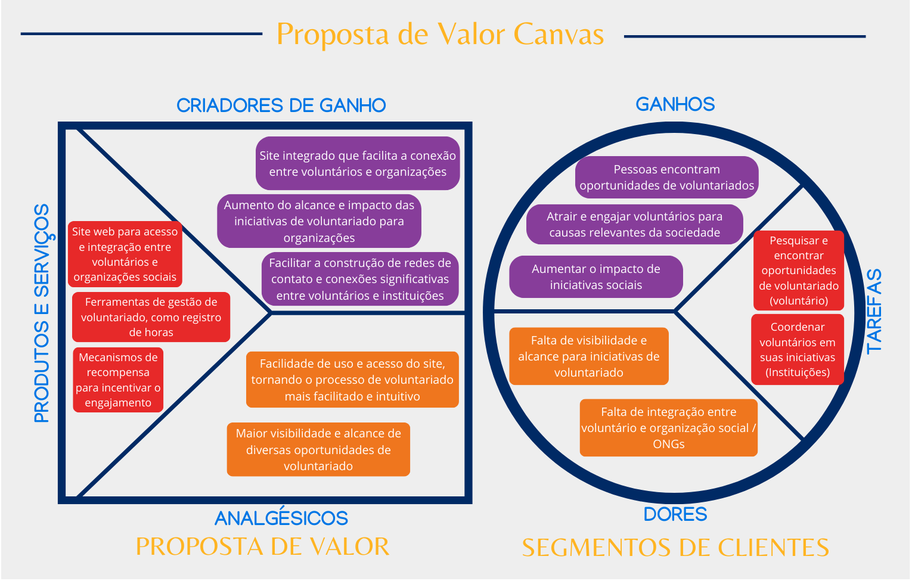
 
 <sup>Fonte: Material produzido pelos autores (2024)</sup>
</div>

[Link do arquivo](https://www.canva.com/design/DAGDMajXOgM/8_aZT0a1fz1Yi3PlhHeeTQ/edit?utm_content=DAGDMajXOgM&utm_campaign=designshare&utm_medium=link2&utm_source=sharebutton)

<div align="center" width="100%">
<sub>Tabela 10: Ganhos da proposta de valor canvas </sub><br>
</div>

| #   | Ganhos                                                                                       |
| --- | -------------------------------------------------------------------------------------------- |
| 1.  | Pessoas interessas em constribuir com ações sociais encontram oportunidades de voluntariados |
| 2.  | Atrair e engajar voluntários para causas relevantes da sociedade                             |
| 3.  | Aumentar o impacto e o alcance de iniciativas sociais                                        |

<div align="center">
<sup>Fonte: Material produzido pelos autores (2024)</sup>
</div>

<br>

<div align="center" width="100%">
<sub>Tabela 11: Dores da proposta de valor canvas </sub><br>
</div>

| #   | Dores                                                                              |
| --- | ---------------------------------------------------------------------------------- |
| 1.  | A falta de visibilidade para iniciativas de voluntariado                           |
| 2.  | A falta de uma integração efetiva entre o voluntário e a organização social / ONGs |

<div align="center">
<sup>Fonte: Material produzido pelos autores (2024)</sup>
</div>

<br>

<div align="center" width="100%">
<sub>Tabela 12: Tarefas da proposta de valor canvas </sub><br>
</div>

| #   | Tarefas                                                 |
| --- | ------------------------------------------------------- |
| 1.  | Voluntário: pesquisar as oportunidades de voluntariado  |
| 2.  | Instituições: coordenar voluntários em suas iniciativas |

<div align="center">
<sup>Fonte: Material produzido pelos autores (2024)</sup>
</div>

<br>

<div align="center" width="100%">
<sub>Tabela 13: Criadores de ganho da proposta de valor canvas </sub><br>
</div>

| #   | Criadores de ganho                                                                                    |
| --- | ----------------------------------------------------------------------------------------------------- |
| 1.  | Site integrado que facilita a conexão entre voluntários e organizações                                |
| 2.  | Aumento do alcance e do impacto das iniciativas de voluntariado para organizações                     |
| 3.  | Facilitar a construção de redes de contato e conexões significativas entre voluntários e instituições |

<div align="center">
<sup>Fonte: Material produzido pelos autores (2024)</sup>
</div>

<br>

<div align="center" width="100%">
<sub>Tabela 14: Analgésicos da proposta de valor canvas </sub><br>
</div>

| #   | Analgésicos                                                                                           |
| --- | ----------------------------------------------------------------------------------------------------- |
| 1.  | Facilidade de uso e acesso do site, tornando o processo de voluntariado mais facilitado e intuitivo   |
| 2.  | Maior visibilidade e alcance de diversas oportunidades de voluntariado                                |
| 3.  | Facilitar a construção de redes de contato e conexões significativas entre voluntários e instituições |

<div align="center">
<sup>Fonte: Material produzido pelos autores (2024)</sup>
</div>

<br>

<div align="center" width="100%">
<sub>Tabela 15: Produtos e serviços da proposta de valor canvas </sub><br>
</div>

| #   | Produtos e serviços                                                        |
| --- | -------------------------------------------------------------------------- |
| 1.  | Site web para acesso e integração entre voluntários e organizações sociais |
| 2.  | Ferramentas de gestão de voluntariado, como registro de horas              |
| 3.  | Mecanismos de recompensa para incentivar o engajamento                     |

<div align="center">
<sup>Fonte: Material produzido pelos autores (2024)</sup>
</div>

&nbsp;&nbsp;&nbsp;&nbsp; Portanto, a estruturação da proposta de valor garante uma percepção mais clara e definida, tanto do público-alvo, quanto do produto a ser desenvolvido e como ele atende as necessidades do usuário. Dessa maneira, evidencia-se a importância da sua elaboração.

### 2.1.6. Matriz de Riscos (sprint 1)

&nbsp;&nbsp;&nbsp;&nbsp; A Matriz de Riscos é uma ferramenta de gestão de projetos para analisar o nível de risco de maneira visual com base nos parâmetros de probabilidade e impacto. Nesse sentido, a sua construção consiste em uma tabela orientada por duas dimensões: probabilidade e impacto, assim, por meio da análise dessas duas dimensões é possível visualizar o estágio em que cada risco se encontra. Dessa maneira, por meio da utilização da matriz de riscos é possível realizar sua priorização de maneira mais assertiva, como também possibilita a tomada de decisão e a realização de medidas preventivas.

&nbsp;&nbsp;&nbsp;&nbsp; As linhas horizontais refere-se à probabilidade que é uma medida da chance da ocorrência de um determinado risco, ou seja, ela reflete o quão fácil ou difícil é a ocorrência desse risco. Ademais, o impacto, representado no eixo horizontal, refere-se às consequências do risco caso o risco incida de fato, podendo ser negativo, como prejuízo financeiro e perda de clientes, ou ainda, positivo, como oportunidades de um novo negócio. Assim, recomenda-se que tanto a probabilidade quanto o impacto sejam classificados em níveis, como muito baixa, baixa, média, alta e muito alta com o objetivo de realizar uma análise mais precisa.

&nbsp;&nbsp;&nbsp;&nbsp; Tendo como base essa premissa, a equipe identificou alguns riscos presentes no projeto, entre eles, põe-se os dispostos abaixo:

<div align="center">
<sub>Figura 4: Matriz de riscos do CodeVolunteer</sub>
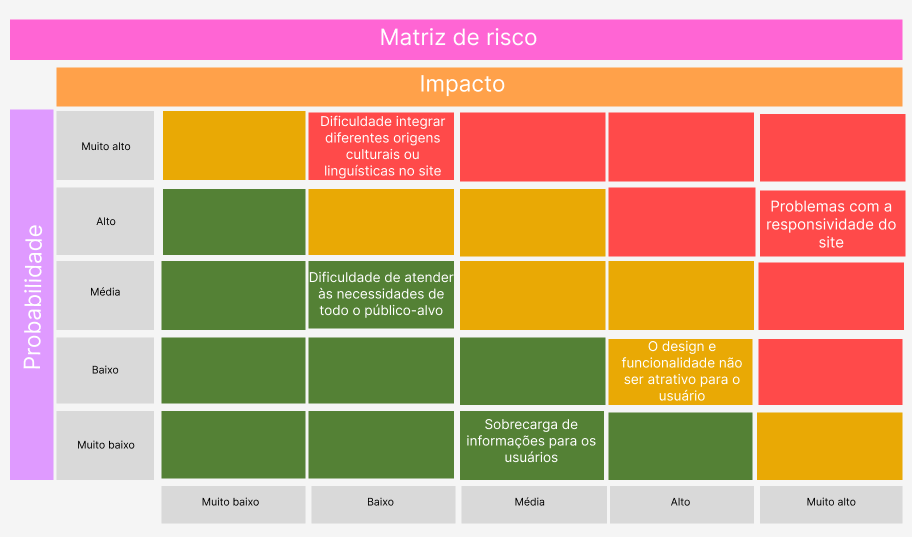
<sup>Fonte: Material produzido pelos autores (2024)</sup>
</div>

[Link do arquivo](<https://www.figma.com/file/kTMk3tDHj6rX2sH56GkrIL/BIGBYTES-matriz-de-risco-(Copy)?type=design&node-id=0-1&mode=design&t=RPGcraJozDLt5jSp-0>)

&nbsp;&nbsp;&nbsp;&nbsp; Assim, a tabela abaixo fornece uma visão geral dos riscos identificados, suas descrições, a validade, a resposta e os planos de ação propostos.

<div align="center">

<sub>Tabela 16 - Tabela de descrição da matriz de riscos </sub>

</div>

| Risco                                                  | Descrição                                                                                                                                                                                       | Validade                       | Resposta                   | Plano de ação                                                                                                                                                                                                                        |
| ------------------------------------------------------ | ----------------------------------------------------------------------------------------------------------------------------------------------------------------------------------------------- | ------------------------------ | -------------------------- | ------------------------------------------------------------------------------------------------------------------------------------------------------------------------------------------------------------------------------------ |
| Problemas com a responsividade do site                 | Alguns possíveis problemas técnicos que afetam a capacidade do site de se adaptar e funcionar corretamente em diferentes dispositivos.                                                          | Durante as 5 sprints.          | Haverá uma resposta ativa. | - Realizar testes com foco na responsividade em distintos dispositivos e navegadores para que assim seja possível implementar correções conforme o necessário com o objetivo de garantir uma boa experiência para todos os usuários. |
| Design e funcionalidade não serem atrativos            | Possibilidade do design da plataforma não ser atrativa ou não atender às expectativas dos usuários o suficiente para retê-los no site.                                                          | Após a sprint 3                | Haverá uma resposta ativa. | - Realizar pesquisas de usuário e testes de usabilidade para entender as suas preferências.                                                                                                                                          |
| Sobrecarga de informações para os usuários             | Risco dos usuários ficarem sobrecarregados com a quantidade de informações apresentadas na plataforma.                                                                                          | Após a sprint 3.               | Haverá uma resposta ativa. | - Procurar, durante os testes de usabilidade, identificar as informações que realmente fazem sentido para o público-alvo com a finalidade de deixar o site o mais simplificado e intuitivo                                           |
| Dificuldade de atender às necessidades do público-alvo | Risco de não conseguir satisfazer as necessidades específicas de cada indivíduo, como auditivas, visuais e de mobilidade, assim como atender às expectativas de todos os segmentos de usuários. | Após a sprint 3                | Haverá uma resposta ativa. | - Procurar, durante os testes de usabilidade, entender as maiores necessidades procuradas pelo público-alvo com o objetivo de tornar a plataforma mais inclusiva e igualitária.                                                      |
| Dificuldade de integrar diferentes culturas            | Dificuldade de garantir que a plataforma seja acessível para os usuários de diferentes origens culturais e linguísticas.                                                                        | Após o site ser colocado no ar | Haverá uma resposta ativa. | Realizar testes de usabilidade com usuários de diferentes origens culturais.                                                                                                                                                         |

<div align="center">
<sup>Fonte: Material produzido pelos autores (2024)</sup>
</div>

&nbsp;&nbsp;&nbsp;&nbsp; Por fim, conclui-se que para o sucesso da plataforma é necessário uma abordagem proativa para enfrentar os desafios que podem surgir ao longo do desenvolvimento e após implementação do site. Assim, destaca-se a importância para a construção da matriz de risco que seja dinâmica e sempre atualizada.

## 2.2. Personas (sprint 1)

&nbsp;&nbsp;&nbsp;&nbsp; Durante a produção do nosso site, houve a criação de um *forms*, o qual direcionado para pessoas voluntárias ou não para entendimento e compreensão maior de nosso público-alvo, obtendo diversas percepções de necessidades da comunidade voluntária. Para consolidar esse conhecimento, houve a criação de 3 personas representativas dos segmentos principais que representam a pesquisa efetuada, convergindo com nossos propósitos.

&nbsp;&nbsp;&nbsp;&nbsp; Cada Persona é construída com base em uma segmentação cuidadosa da base de usuários, incorporando características como idade, sexo, profissão, vontades, habilidades e frustrações. Essas representações são fundamentais para orientar o processo de design centrado no usuário (UX design), garantindo que o produto seja desenvolvido levando em consideração as diferentes perspectivas e contextos de uso.

&nbsp;&nbsp;&nbsp;&nbsp; A primeira persona é uma mulher voluntária jovem, transparece sua energia e disposição em participar da causa e impactar sua região, representando o segmento de voluntarios.

<div align="center" width="100%">
 <sub>Figura 5: Persona de um voluntario</sub><br>
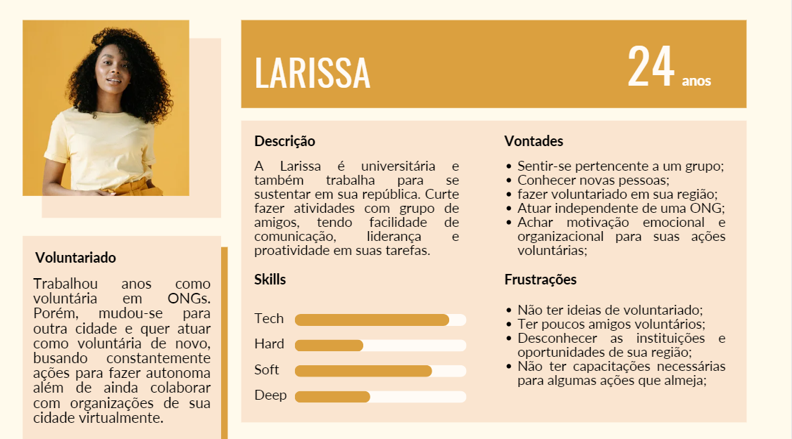

<sup>Fonte: Material produzido pelos autores (2024) </sup>

</div>

&nbsp;&nbsp;&nbsp;&nbsp; A segunda persona é um homem sem muita experiência com voluntariado, ele tem necessidades de conhecer melhor essa área e representa os EX voluntários e pessoas que nunca voluntariaram.

<div align="center" width="100%">
 <sub>Figura 6: Persona de um potencial voluntario</sub><br>
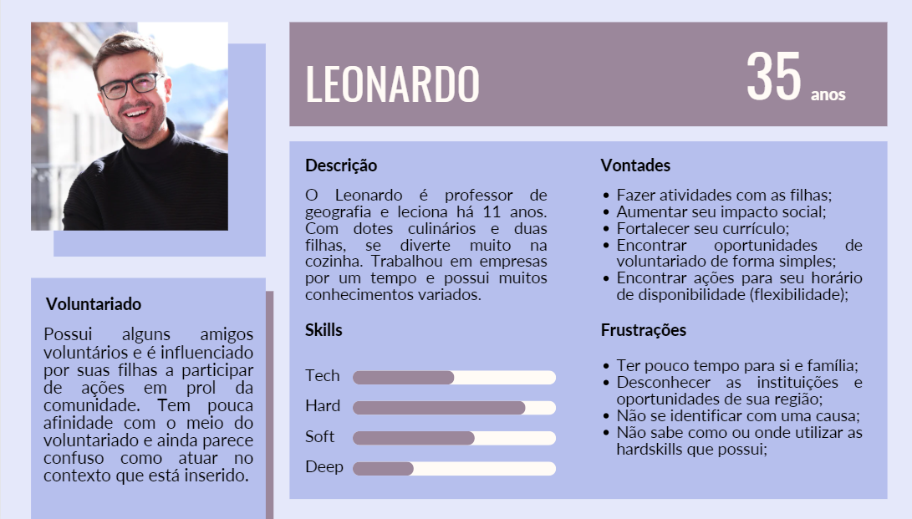

<sup>Fonte: Material produzido pelos autores (2024) </sup>

</div>

&nbsp;&nbsp;&nbsp;&nbsp; Por fim, a terceira persona é uma mulher líder de ONG que tem muita experiencia da comunidade e uma vontade de aumentar sua área de impacto, representando as organizações desse meio.

<div align="center" width="100%">
 <sub>Figura 7: Persona de uma líder de ONG</sub><br>
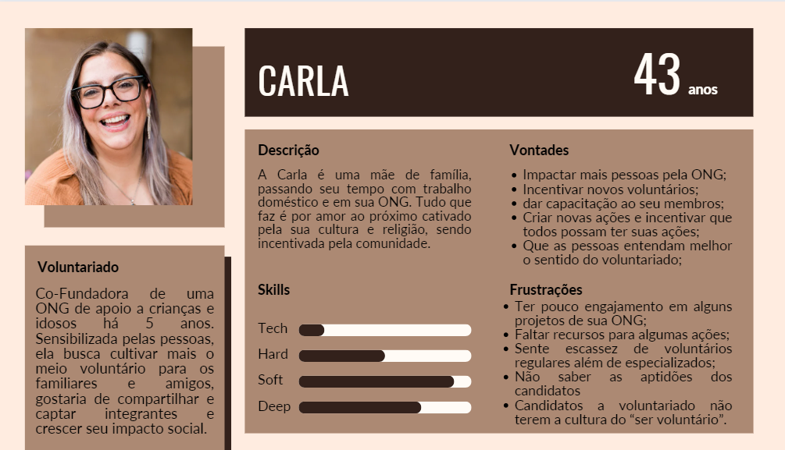

<sup>Fonte: Material produzido pelos autores (2024) </sup>

</div>

&nbsp;&nbsp;&nbsp;&nbsp; Através da criação dessas Personas, nossa equipe conseguiu obter uma compreensão mais profunda de nosso público-alvo, permitindo projetar e desenvolver um site que atenda às suas necessidades e expectativas.

## 2.3. User Stories (sprints 1 a 5)

&nbsp;&nbsp;&nbsp;&nbsp; As User Stories, ou seja, Histórias do Usuário, fazem parte da metodologia ágil e têm como objetivo principal demonstrar a perspectiva do usuário final. As User Stories são baseadas nas personas (conforme descrito na seção 2.2.) e são resumidas em uma frase com estrutura pré-determinada: 'Eu, como [papel/perfil], posso [ação/meta], para [benefício/razão].'.

&nbsp;&nbsp;&nbsp;&nbsp; Os critérios de aceitação vão provar que a User Storie foi concluída com sucesso. Desse modo, uma única User Storie pode gerar várias tasks. 

&nbsp;&nbsp;&nbsp;&nbsp; Para saber se as tasks foram concluídas com sucesso, temos os Critérios de Aceitação (CA), que são afirmações específicas que se verdadeiras, indicam que o objetivo daquela task foi concluído.

&nbsp;&nbsp;&nbsp;&nbsp; Abaixo, estão as tabelas de User Stories e Critérios de Aceitação:

_User Stories larissa_

<div align="center">
<sub>Tabela 17 - User Story Larissa 1 </sub>
</div>

| Identificação        | US1                                                                                                                                                                                                                     |
| -------------------- | ----------------------------------------------------------------------------------------------------------------------------------------------------------------------------------------------------------------------- |
| Persona              | Larissa                                                                                                                                                                                                                 |
| User Story           | "Como universitária, preciso encontrar voluntariados independentes de ONGs e que sejam acessíveis em tempo, para que eu possa continuar me voluntariando sem comprometer minha vida acadêmica." |
| Critério de aceite 1 | CR1: "Em um curto intervalo de tempo, consigo acessar o feed do site pelo celular."                                                                                                                                     |
| Critério de aceite 2 | CR2: "Ao buscar ideias de voluntariado na comunidade, consigo ver na publicação se o projeto é de uma ONG ou de um voluntário."                                                                                               |
| Critério de aceite 3 | CR3: "Ao buscar ideias de voluntariados na barra de pesquisa, posso filtrar, por meio de filtros preexistentes, o tempo a ser dedicado e o custo envolvido."                                                            |

<div align="center">
<sup>Fonte: Material produzido pelos autores (2024)</sup>
</div>

<div align="center">
<sub>Tabela 18 - User Story Larissa 2 </sub>
</div>

| Identificação        | US2                                                                                                                                                                                                        |
| -------------------- | ---------------------------------------------------------------------------------------------------------------------------------------------------------------------------------------------------------- |
| Persona              | Larissa                                                                                                                                                                                                    |
| User Story           | "Como jovem, quero uma maneira de envolver minhas amizades e fazer novos amigos no voluntariado, para assim poder ter uma vida social e ajudar mais pessoas."                                              |
| Critério de aceite 1 | CR1: "No site, posso criar ações de voluntariado e anunciá-las para que os voluntários mais próximos possam se juntar a mim."                                                           |
| Critério de aceite 2 | CR2: "Na plataforma consigo procurar por ações ativas e escolher aquela com a qual mais me identifico para participar, com base na afinidade do que foi escrito na legenda da publicação." |

<div align="center">
<sup>Fonte: Material produzido pelos autores (2024)</sup>
</div>

<div align="center">
<sub>Tabela 19 - User Story Larissa 3 </sub>
</div>

| Identificação        | US3                                                                                                                                                                                                        |
| -------------------- | ---------------------------------------------------------------------------------------------------------------------------------------------------------------------------------------------------------- |
| Persona              | Larissa                          |                                                                                                                                                                          |
| User Story           | "Larissa como uma universitária deseja obter uma métrica das suas atividades e ações sociais com o objetivo de determinar a viabilidade e a aceitação, por meio das bolhas"                        |
| Critério de aceite 1 | CR1: "A plataforma possui a possibilidade de ‘borbulhar’ que seria a funcionalidade de curtir uma publicação"     |
| Critério de aceite 2 | CR2: "Todos os usuários conseguem visualizar a quantidade de ‘borbulhar’ de cada publicação." |

<div align="center">
<sup>Fonte: Material produzido pelos autores (2024)</sup>
</div>

<div align="center">
<sub>Tabela 20 - User Story Larissa 4 </sub>
</div>

| Identificação        | US4                                                                                                                                                                                                       |
| -------------------- | ---------------------------------------------------------------------------------------------------------------------------------------------------------------------------------------------------------- |
| Persona              | Larissa                                                                                                                                                                                                    |
| User Story           | "Larissa como uma jovem que tem afinidade com as tecnologias da atualidade deseja montar um portfólio digital com o objetivo de ganhar visibilidade e atenção para causas sociais."                                              |
| Critério de aceite 1 | CR1: "Todos os usuários conseguem visualizar o perfil da pessoa cadastrada na plataforma, o qual contém as informações básicas da pessoa como nome, idade e interesses, como também as ações voluntárias realizadas anteriormente por ela."                                                           |
| Critério de aceite 2 | CR2: "Conseguir acessar as publicações do próprio perfil e conseguir obter motivação emocional e organizacional para as suas próximas ações sociais." |

<div align="center">
<sup>Fonte: Material produzido pelos autores (2024)</sup>
</div>

_User Storys Leonardo_

<div align="center">
<sub>Tabela 21 - User Story Leonardo 1</sub>
</div>

| Identificação        | US5                                                                                                                                                                                  |
| -------------------- | ------------------------------------------------------------------------------------------------------------------------------------------------------------------------------------- |
| Persona              | Leonardo                                                                                                                                                                              |
| User Story           | "Como professor de geografia e ótimo cozinheiro, preciso encontrar ONGs e instituições que necessitem das minhas habilidades, para que eu possa contribuir da melhor forma possível." |
| Critério de aceite 1 | CR1: "No site, ao entrar em uma publicação de projeto, posso ver as habilidades que eles procuram."                                                                                               |
| Critério de aceite 2 | CR2: "No site, ao criar meu perfil de voluntário, consigo descrever minhas habilidades, experiências e o que ainda preciso aprender."                                                 |

<div align="center">
<sup>Fonte: Material produzido pelos autores (2024)</sup>
</div>

<div align="center">
<sub>Tabela 22 - User Story Leonardo 2 </sub>
</div>

| Identificação        | US6                                                                                                                                                                                                                             |
| -------------------- | ------------------------------------------------------------------------------------------------------------------------------------------------------------------------------------------------------------------------------- |
| Persona              | Leonardo                                                                                                                                                                                                                        |
| User Story           | "Como pai e professor de crianças e jovens, preciso de formas de engajar os jovens e crianças na causa voluntária, para que eu possa incentivar e influenciar meus alunos e filhos a se envolverem na cultura do voluntariado." |
| Critério de aceite 1 | CR1: "No feed do site, consigo postar minhas fotos e experiências de voluntariado."                                                                                                                                             |
| Critério de aceite 2 | CR2: "O feed de publicações do site é parecido com redes sociais já consolidadas"                                                                                                                                               |

<div align="center">
<sup>Fonte: Material produzido pelos autores (2024)</sup>
</div>

<div align="center">
<sub>Tabela 23 - User Story Leonardo 3</sub>
</div>

| Identificação        | US7                                                                                                                                                                                  |
| -------------------- | ------------------------------------------------------------------------------------------------------------------------------------------------------------------------------------- |
| Persona              | Leonardo                                                                                                                                                                              |
| User Story           | "Leonardo como um professor que gosta de manter suas aulas atualizadas e mostrar para seus alunos ideias e oportunidades de voluntariados precisa de uma plataforma que apresenta as publicações de diversas pessoas que também são engajadas nesse meio." |
| Critério de aceite 1 | CR1: "A plataforma web apresentar conteúdos submetidos pelos usuários em forma de postagens                                                                                               |
| Critério de aceite 2 | CR2: "Conseguir visualizar as publicações de diferentes usuários ao redor do Brasil, como também de diferentes causas sociais
"                                                 |

<div align="center">
<sup>Fonte: Material produzido pelos autores (2024)</sup>
</div>

_User Storys Carla_

<div align="center">
<sub>Tabela 24 - User Story Carla 1 </sub>
</div>

| Identificação        | US8                                                                                                                                                                                   |
| -------------------- | ------------------------------------------------------------------------------------------------------------------------------------------------------------------------------------- |
| Persona              | Carla                                                                                                                                                                                 |
| User Story           | "Como diretora de uma ONG responsável pela seleção dos voluntários, preciso de uma forma de filtrá-los pelas habilidades, para que eu possa alocá-los no setor mais adequado da ONG." |
| Critério de aceite 1 | CR1: "Ao entrar no perfil dos voluntários, consigo ver a descrição das habilidades e vontades de cada um."                                                                            |
| Critério de aceite 2 | CR2: "Posso postar as fotos das ações das ONGs para que apenas os voluntários com afins em comum se candidatem."                                                                      |

<div align="center">
<sup>Fonte: Material produzido pelos autores (2024)</sup>
</div>

<div align="center">
<sub>Tabela 25 - User Story Carla 2 </sub>
</div>

| Identificação        | US9                                                                                                                                                                           |
| -------------------- | ----------------------------------------------------------------------------------------------------------------------------------------------------------------------------- |
| Persona              | Carla                                                                                                                                                                         |
| User Story           | "Como uma pessoa com uma rotina cheia, preciso que o site seja fácil de usar, para que eu não desista de me cadastrar e usar a plataforma." |
| Critério de aceite 1 | CR1: "Ao me cadastrar na plataforma, consigo utilizar a opção de cadastro pelo Google."                                                                                       |
| Critério de aceite 2 | CR2: "O cadastro não tem mais de 3 telas." |                                                                                                     

<div align="center">
<sup>Fonte: Material produzido pelos autores (2024)</sup>
</div>                             

<div align="center">
<sub>Tabela 26 - User Story Carla 3 </sub>
</div>

| Identificação        | US10                                                                                                                                                                           |
| -------------------- | ----------------------------------------------------------------------------------------------------------------------------------------------------------------------------- |
| Persona              | Carla   |
| User Story           | "Carla como uma Co-Fundadora de uma ONG de apoio a crianças e idosos necessita de parcerias com ONGs semelhantes, como também encontrar pessoas interessadas em se voluntariar ou colaborar nesta causa social." |
| Critério de aceite 1 | CR1: "É possível visualizar o perfil das pessoas cadastradas na plataforma, bem como seus interesses e habilidades."   |
| Critério de aceite 2 | CR2: "Os usuários na aba de comunidade conseguem filtrar as ações, público-alvo, tipo de usuário, podendo ser ONG ou voluntário, assim como a cidade e estado da publicação."  |

<div align="center">
<sup>Fonte: Material produzido pelos autores (2024)</sup>
</div>

&nbsp;&nbsp;&nbsp;&nbsp; Cada conjunto de tabelas, nomeado como 'User Stories \_\_\_\_', é baseado em uma das três personas. Cada tabela do conjunto possui suas User Stories e Critérios de Aceitação baseados em um aspecto específico do problema apresentado na pesquisa feita para a produção das User Stories. Os critérios de aceitação começarão a ser validados por meio dos wireframes no tópico 3.2.

&nbsp;&nbsp;&nbsp;&nbsp; As *User Stories* desenvolvidas para Larissa, e Carla demonstram um entendimento das necessidades individuais e dos desafios enfrentados por cada persona em suas jornadas de voluntariado. Assim, a construção dessas *User Stories* contribuiram para a realização de um projeto mais embassado.

# <a name="c3"></a>3. Projeto da Aplicação Web (sprints 1 a 4)

## 3.1. Arquitetura (sprints 1)

### Análise e Definição do Escopo

<b> Principal Objetivo:</b> Essa aplicação web construída com ajuda do framework Sails.js tem como principal propósito estabelecer uma plataforma robusta e eficiente, em que a interação do usuário se dá por meio de uma interface desenvolvida com HTML, CSS e Javascript. Essa interface amigável e responsiva irá proporcionar uma experiência fluida ao usuário, permitindo uma navegação intuitiva e agradável.

&nbsp;&nbsp;&nbsp;&nbsp;Nos bastidores, essa interface interage de forma dinâmica com uma API backend desenvolvida em Node.js, de arquitetura MVC e framework Sails.js. Essa API, construída sobre uma arquitetura moderna e escalável, proporciona uma comunicação eficiente entre o front-end e o banco de dados PostgreSQL. Utilizando o poderoso sistema de ORM (Object-Relational Mapping) do Sails.js, a aplicação é capaz de gerenciar de forma eficaz e segura as operações de acesso e manipulação dos dados armazenados no banco.

&nbsp;&nbsp;&nbsp;&nbsp;Com essa arquitetura bem definida, a aplicação web oferece não apenas uma interface elegante e responsiva para os usuários finais, mas também uma base sólida e confiável para o desenvolvimento e manutenção contínua da plataforma. Além disso, a modularidade e extensibilidade do Sails.js permitem uma fácil integração de novos recursos e funcionalidades, garantindo que a plataforma possa crescer e se adaptar às necessidades em constante evolução dos usuários e do mercado.

<b> Principais Módulos, Funcionalidades e Recursos:</b>
<br>&nbsp;&nbsp;&nbsp;&nbsp; - Autenticação de Usuários: Registro de novos usuários, login e logout de usuários, controle de acesso às funcionalidades da plataforma.

&nbsp;&nbsp;&nbsp;&nbsp; - Feed:
Publicação de ideias, classificação e filtragem de ideias por categorias ou tags, pesquisa avançada por ideias.

&nbsp;&nbsp;&nbsp;&nbsp; - Comunidade:
Catálogo de ONGs cadastradas, visualização de informações detalhadas sobre cada ONG (missão, projetos e formas de contato), recursos para os usuários se engajarem com as ONGs, como doações e voluntariado, listagem de projetos para replicação, detalhes sobre cada projeto, incluindo objetivos, metodologia e recursos necessários.

### Diagramas

&nbsp;&nbsp;&nbsp;&nbsp;O nosso diagrama foi dividido em duas partes. Uma parte se refere ao Landing Page e a outra à Plataforma. Isso foi feito para ficar mais organizado, tanto as imagens da arquitetura, como o processo de desenvolvimento do site.

### Diagrama da Landing Page

&nbsp;&nbsp;&nbsp;&nbsp; Abaixo, o diagrama da nossa página inicial (Landing Page):

<div align="center" width="100%">
 <sub>Figura 8: Aquitetura MVC da Landing Page</sub><br>
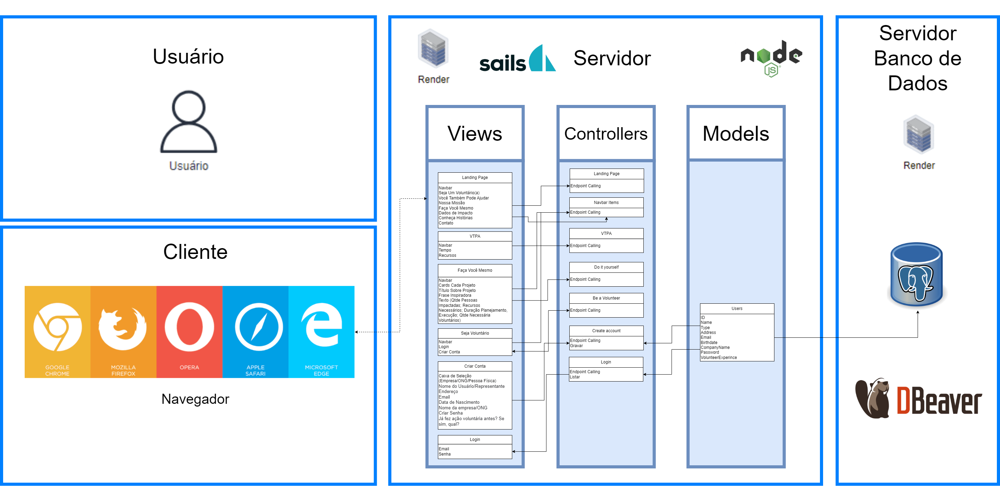 
<sup>Fonte: Material produzido pelos autores (2024)</sup>
</div>

&nbsp;&nbsp;&nbsp;&nbsp;O input nessa imagem são o login e cadastro do usuário, nas páginas de Login e Criar conta. Em todas as outras páginas da Landing Page, a API só responderá à listagens (requisições GET) e a chamadas de endpoint para o frontend.

### Diagrama da Plataforma

&nbsp;&nbsp;&nbsp;&nbsp; Abaixo, o diagrama da nossa plataforma:

<div align="center" width="100%">
 <sub>Figura 9: Aquitetura MVC da Plataforma</sub><br>
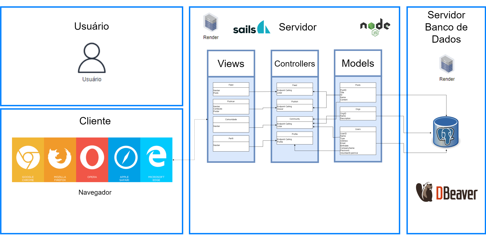
<sup>Fonte: Material produzido pelos autores (2024)</sup>
</div>

&nbsp;&nbsp;&nbsp;&nbsp; Uma vez dentro da plataforma, o usuário terá a possibilidade de fazer diversos tipos de interação com o banco de dados, desde postagens até visualizações do feed e busca por ONGs, projetos parecidos e pessoas de interesses semelhantes.

## 3.2. Wireframes (sprint 1)

&nbsp;&nbsp;&nbsp;&nbsp;O wireframe é uma representação simplificada da estrutura de uma interface digital, seja de um site ou de um aplicativo. Ele tem como objetivo organizar e validar ideias, descrevendo a disposição dos elementos sem entrar em detalhes visuais, como cores, fontes e imagens. Essa etapa é essencial no desenvolvimento do projeto, pois ajuda a visualizar e planejar a distribuição dos elementos na tela do produto digital, facilitando o trabalho de design e garantindo uma experiência de usuário mais eficiente.

&nbsp;&nbsp;&nbsp;&nbsp;Os wireframes abaixo estão no formato de celular, alinhado às preferências do projeto, em que o parceiro demonstrou e explicitou a importância do conceito de _mobile first_, levando em consideração a quantidade de pessoas que utilizam o celular como a principal conexão com a internet no mundo. Essa preocupação atende a maioria de acordo com o parceiro, e também responde ao critério 1 da US1.

<div align="center" width="100%">
<sub>Figura 10: Wireframe dos passos do cadastro na plataforma </sub><br>
 
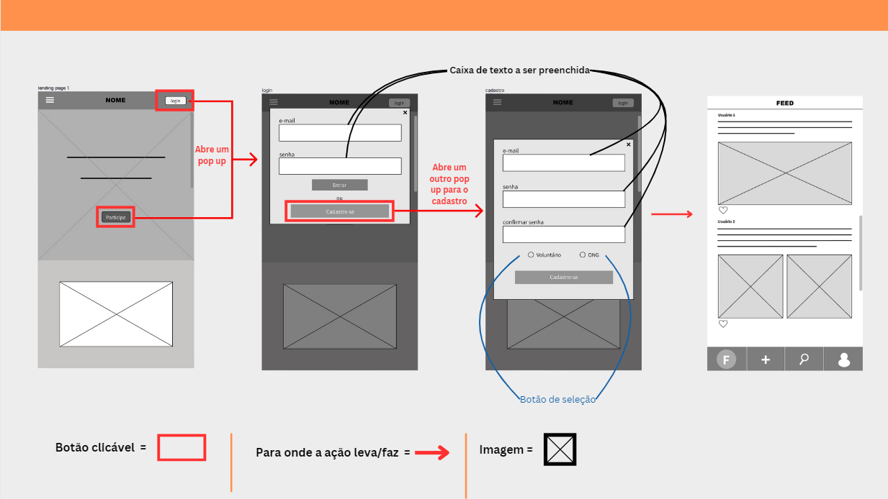
 
<sup>Fonte: Material produzido pelos autores (2024) [Link do arquivo](https://www.canva.com/design/DAGDigz8IDI/gP7ds7fB7irhyaMgE5OQEQ/edit?utm_content=DAGDigz8IDI&utm_campaign=designshare&utm_medium=link2&utm_source=sharebutton)
</sup>
</div>

&nbsp;&nbsp;&nbsp;&nbsp; Nesta primeira seção do wireflow, o usuário é direcionado a interagir com os botões correspondentes na landing page para realizar o cadastro ou o login. Após clicar, um pop-up aparecerá, permitindo que o usuário faça login se já tiver uma conta, preenchendo as caixas de texto apropriadas. Se o usuário não possuir uma conta, também terá a opção de se cadastrar nessa mesma tela. Ao clicar no botão "Cadastre-se", ocorrerá uma mudança no pop-up, onde será necessário preencher um formulário com um email, uma senha e selecionar se a conta é para um voluntário (pessoa física) ou para uma ONG. Após completar o processo de cadastro, o usuário será automaticamente redirecionado para a tela do feed, que corresponde à primeira aba da plataforma Borbulha.

&nbsp;&nbsp;&nbsp;&nbsp;É importante ressaltar que essa seção do wireflow atende à Carla (US6), pois envolve poucas informações e ações para a realização do cadastro. São apenas três dados e três cliques em botões para conclusão. Na página inicial _landing page_, há dois botões que direcionam para essa seção, localizados tanto na _nav bar_ que permanece durante toda a navegação na página, quanto na primeira seção visível. Dessa forma, qualquer pessoa que acesse a página inicial tem mais de uma opção para se cadastrar, garantindo que a informação de cadastro seja acessível.

&nbsp;&nbsp;&nbsp;&nbsp;Para a criação dessas telas, foi colocada em foco um ambiente _clean_, isto é, utilizar as apenas o essencial, já que uma grande quantidade de informações para criar uma conta e na tela incial resultam em uma taxa de confusão mais alta sobre o que fazer. Uma menor complexidade resulta em uma maior rapidez também no login de um usuário já resultado, o que é uma resposta direta à necessidade do critério 1 da US1.

<div align="center" width="100%">
<sub>Figura 11: Wireframe dos passos para a pesquisar conteúdos</sub><br>
 
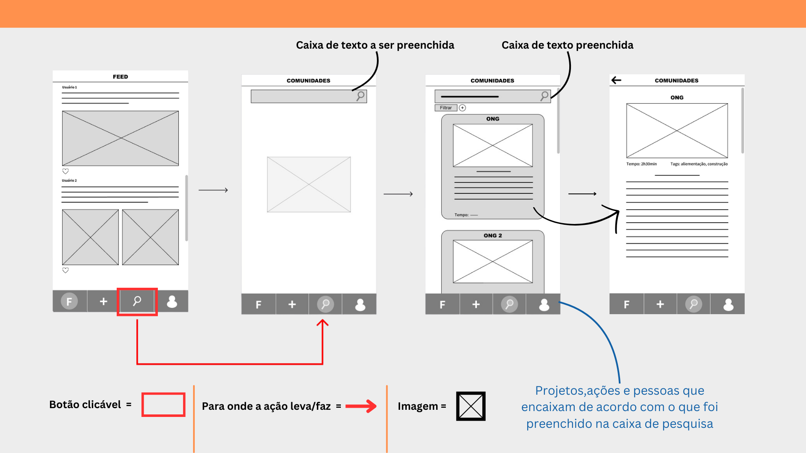

<sup>Fonte: Material produzido pelos autores (2024) [Link do arquivo](https://www.canva.com/design/DAGDio25jRg/zHJFGQRfl6D1gTX_Vc9lbg/edit?utm_content=DAGDio25jRg&utm_campaign=designshare&utm_medium=link2&utm_source=sharebutton)</sup>

</div>

&nbsp;&nbsp;&nbsp;&nbsp;Nesta seção, pode-se identificar a funcionalidade de pesquisar por projetos, pessoas, ou ONGs. Na página inicial dentro da plataforma, o ícone de lupa localizado da seção inferior da tela é um botão que leva para uma próxima página, em que será realizada a pesquisa. Nessa tela, você pode filtrar temas e pesquisar sobre conteúdos da plataforma com as palavras escritas. O filtro serão predefinidos, como tempo, quantos voluntários envolvidos, quanto dinheiro foi gasto, e mostrar, por exemplo, apenas pessoas e ações que estão abertas. Essas funcionalidades foram feitas pensando em resolucionar o critério 3 da US1, e o critério 2 da US2.

&nbsp;&nbsp;&nbsp;&nbsp;Também pensamos que o usuário que está pesquisando sobre um tema mais específico, é coerente que os textos e imagens sejam maiores, já que está se procurando saber mais detalhadamente sobre aquele assunto.

&nbsp;&nbsp;&nbsp;&nbsp;A funcionalidade de pesquisa foi idealizada pensando em como permitir o usuário fazer tanto uma pesquisa macro quanto micro. Assim, não forçamos uma àrdua procura desnecessária e que desencoraja o consumidor da plataforma a permancer nela.

&nbsp;&nbsp;&nbsp;&nbsp;Depois de pesquisar por projetos, é possível clicar no card deles. Ao clicar em um card o usuário é levado para uma página com um título, duração, tags, imagem e texto. Esse último wireframe contém mais informações sobre dado projeto ou ONG selecionada. Existe também um botão de voltar no canto superior esquerdo que ao ser clicado retorna para o wireframe anterior.

<div align="center" width="100%">
 <sub>Figura 12: Wireframe dos passos para a publicação de uma postagem</sub><br>
 
 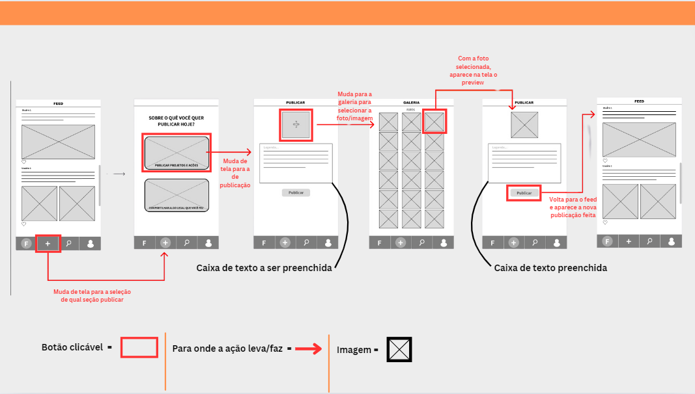
 
 <sup>Fonte: Material produzido pelos autores (2024) [Link do arquivo](https://www.canva.com/design/DAGDio25jRg/zHJFGQRfl6D1gTX_Vc9lbg/edit?utm_content=DAGDio25jRg&utm_campaign=designshare&utm_medium=link2&utm_source=sharebutton)</sup>
</div>

&nbsp;&nbsp;&nbsp;&nbsp;Essa tela atende ao Leonardo (US4), que procura formas de engajar os jovens e crianças na causa voluntária. Dessa maneira, foi pensado em uma tela de publicações com o intuito de compartilhar experiências de voluntariado no feed. Para realizar esse processo o usuário deve clicar no botão "+" localizado na barra de navegação inferior da plataforma. Isso o levará à página de "publicação", onde ele terá a opção de escolher entre uma publicação livre ou uma publicação pré-estruturada. Na publicação livre, ele pode adicionar uma foto e escrever uma legenda na qual deseja compartilhar. Na publicação pré-estruturada, ele pode elaborar uma espécie de “receita” da ação realizada, para que outros possam replicá-la. Após escolher o tipo de publicação, o usuário é direcionado para uma tela onde há um botão para adicionar uma imagem e uma área para escrever a legenda, ou então, preencher os requisitos para a publicação pré-estruturada. Em seguida, ao realizar o processo, é necessário clicar no botão "publicar" para finalizar e compartilhar sua experiência no feed. Diante disso, com o intuito de deixar mais envolvente e engajante, após a publicação, os usuários da plataforma conseguem interagir nos _posts_ deixando _likes_ nas postagens.

<div align="center" width="100%">
 <sub>Figura 13: Wireframe dos passos para a filtrar postagens</sub><br>
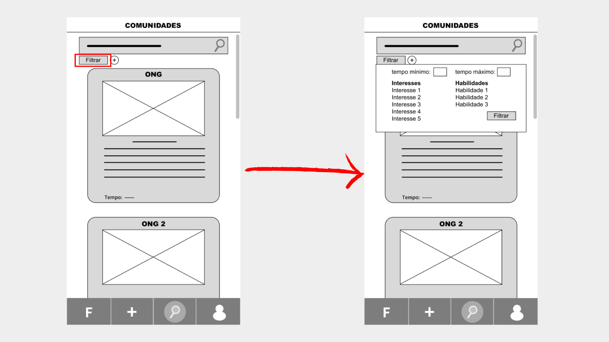
<sup>Fonte: Material produzido pelos autores (2024)<sup>
</div>

&nbsp;&nbsp;&nbsp;&nbsp;Este wireframe mostra uma tela para a funcionalidade de filtro, que está relacionada com as US1 de Larissa e a US3 de Leonardo. É possível filtrar atividades com base no tempo de duração, habilidades necessárias e interesses. Basta clicar no botão 'Filtrar' para acessar todas as opções de filtro disponíveis. Isso permite que o usuário procure posts que atendam à quantidade de tempo disponível ou às suas habilidades. Larissa e Leonardo podem ver posts que são compatíveis com o seus trabalhos e estudos, conhecimentos prévios e experiências de vida.

&nbsp;&nbsp;&nbsp;&nbsp; Portanto, a análise dos wireframes em relação às necessidades do usuário, conforme descritas nas user stories, destaca a importância dessa etapa no processo de desenvolvimento, uma vez que contribui para a criação de produtos digitais que atendem às expectativas do público-alvo. Investir tempo e recursos na elaboração de wireframes é fundamental para garantir a eficácia e o sucesso do produto final, resultando em uma interface digital intuitiva, bem estruturada e funcional.

## 3.3. Guia de estilos (sprints 2 e 3)

### Sprint 2

&nbsp;&nbsp;&nbsp;&nbsp; O guia de estilo é um documento essencial que estabelece as diretrizes de design para uma empresa ou, em menor escala, para um projeto, marca ou produto específico. O propósito deste guia é garantir que os elementos visuais e comunicativos abordados possam ter consistência e alinhamento, independentemente de quem os crie ou quando sejam criados. Assim, este documento costuma incluir aspectos detalhados das cores, tipografia, iconografia, grids e breakpoints, entre outros elementos.

&nbsp;&nbsp;&nbsp;&nbsp; Nessa lógica, a importância de um guia de estilos vai além da simples padronização visual. Ele promove eficiência e economia de tempo, reduzindo a necessidade de decisões ad hoc e garantindo que todos os colaboradores entendam e apliquem as mesmas diretrizes.

&nbsp;&nbsp;&nbsp;&nbsp; Dessa maneira, ele contribui significativamente para a usabilidade. Nessa conjuntura, o guia de estilos assegura que todos os componentes da interface sejam consistentes e previsíveis, ajudando a construir uma jornada de usuário coerente e intuitiva. Assim, não apenas melhora a estética e a funcionalidade do produto, mas também reforça a confiança e a credibilidade do projeto.

&nbsp;&nbsp;&nbsp;&nbsp; Em síntese, o guia de estilos é uma ferramenta indispensável que funciona como um manual de instruções para a expressão visual e estratégica de uma marca ou projeto. Nesse sentido, é crucial garantir que todos os elementos de design trabalhem juntos de forma harmoniosa, apoiando os objetivos gerais do negócio e melhorando a comunicação interna e externa. Dessa forma, nas próximas sessões será apresentado agora as divisões do guia, assim como a explicação por trás das decisões que foram tomadas, e a forma de como utilizar cada componente.

[Link do arquivo](https://www.figma.com/design/ij0wqBxprLc3Q7TKjvhaHh/Guia-de-estilos-APENAS?node-id=25-32&t=9jCYfo8GEjOFI58J-1)

### 3.3.1 Cores

&nbsp;&nbsp;&nbsp;&nbsp; A teoria das cores é fundamentada no aspecto físico da visão, como também na percepção e reação do ser humano de acordo com a sensibilidade do olho (SIRLANGE, 2019, p. 44). Nessa lógica, as cores principais, no desenvolvimento web, são as tonalidades de destaque na plataforma, como também as que vão criar a identidade visual da marca, assim, os tons escolhidos para essa classe foram azul marinho e laranja. Assim, tendo em vista a importância dessas cores, as suas funcionalidades são de compor o fundo da tela principal, botões de chamada para ação, logotipos e o slogan.

<div align="center" width="100%">
 <sub>Figura 14: Cores primárias</sub><br>
 
 
 
 <sup>Fonte: Material produzido pelos autores (2024)  [Link do arquivo](https://www.figma.com/design/ij0wqBxprLc3Q7TKjvhaHh/Guia-de-estilos-APENAS?node-id=25-32&t=9jCYfo8GEjOFI58J-1)</sup>
</div>

&nbsp;&nbsp;&nbsp;&nbsp; Outrossim, as cores acessórias são as tonalidades complementares que vão compor a variedade visual e a hierarquia de informações na plataforma web, dessa maneira, os tons escolhidos para essa classe foram verde, azul, azul claro, roxo, vermelho e amarelo. Assim, as funcionalidades dessas tonalidades são botões secundários, elementos visuais, menus, ícones ou elementos de destaque menos proeminentes.

<div align="center" width="100%">
 <sub>Figura 15: Cores acessórias</sub><br>
 
 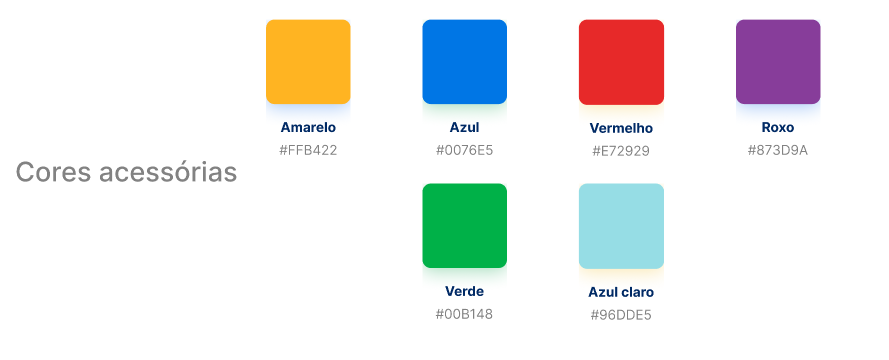
 
 <sup>Fonte: Material produzido pelos autores (2024)  [Link do arquivo](https://www.figma.com/design/ij0wqBxprLc3Q7TKjvhaHh/Guia-de-estilos-APENAS?node-id=25-32&t=9jCYfo8GEjOFI58J-1)</sup>
</div>

&nbsp;&nbsp;&nbsp;&nbsp; Ademais, as cores neutras tem como principal funcionalidade o equilíbrio visual para gerar uma interface mais agradável e confortável visualmente para o usuário, dessa forma, as tonalidades selecionadas para essa classe foram o preto, o branco, o cinza-azulado claro e escuro (SIRLANGE, 2019, p. 47). Nesse sentido, com a finalidade de criar um equilíbrio no site, os tons de preto e cinza reduzem a carga visual e dão ênfase para as cores que são combinadas com elas, além de promover maior legibilidade para o usuário. Por fim, as funcionalidades das cores neutras são o fundo da maior parte do site, os textos e elementos que não necessitam da atenção plena dos usuários, tais como barra de rolagem e bordas.

<div align="center" width="100%">
 <sub>Figura 16: Cores neutras</sub><br>
 
 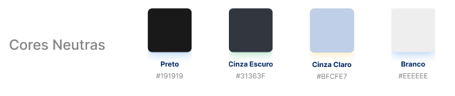
 
 <sup>Fonte: Material produzido pelos autores (2024)  [Link do arquivo](https://www.figma.com/design/ij0wqBxprLc3Q7TKjvhaHh/Guia-de-estilos-APENAS?node-id=25-32&t=9jCYfo8GEjOFI58J-1)</sup>
</div>

&nbsp;&nbsp;&nbsp;&nbsp; Portanto, tendo em vista que as cores exercem forte influência no usuário é de notável importância a seleção de cores para o desenvolvimento de um site para que desse modo seja possível promover a aceitação, interação e compressão dos usuários, assim como na criação da identidade da marca.

### 3.3.2 Tipografia

&nbsp;&nbsp;&nbsp;&nbsp; Tipografia é o estilo do conjunto de letras, caracteres e símbolos usados em um texto, seja ele digital ou impresso. Abaixo temos o guia tipográfico, incluindo fontes, suas características e quando usá-las, além de regras de espaçamento e alinhamento.

<div align="center" width="100%">
 <sub>Figura 17: Guia Tipográfico</sub><br>
 
 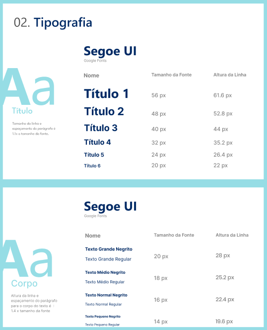
 
 <sup>Fonte: Material produzido pelos autores (2024) [Link do arquivo](https://www.figma.com/design/ij0wqBxprLc3Q7TKjvhaHh/Guia-de-estilos-APENAS?node-id=25-32&t=9jCYfo8GEjOFI58J-1)</sup>
</div>

&nbsp;&nbsp;&nbsp;&nbsp; Além dos fatores apresentados na imagem acima, dentro da tipografia ainda tem-se a cor e legibilidade. Nessa lógica, a legibilidade preza-se por dois fatores: o primeiro é usar pixels escaláveis, com o objetivo de que o tamanho da fonte mantenha a proporção baseada na tela em que se usa, assim mantendo a legibilidade tanto em telas grandes como em pequenas, como segundo ponto, tem-se a cor. Por fim, as letras serão pretas em fundo claro, caso haja uma exceção, deve ser analisada a legibilidade à parte, e as cores obrigatoriamente devem estar na paleta predefinida.

### 3.3.3 Iconografia e imagens

&nbsp;&nbsp;&nbsp;&nbsp; No campo do design gráfico, a iconografia é uma área crucial para a sua elaboração. Nesse sentido, ela utiliza de símbolos visuais com o objetivo de transmitir as informações de maneira clara e breve para o bom entendimento do usuário em diversos contextos. Portanto, trata-se de uma ferramenta essencial para auxiliar na comunicação visual, visto que possibilita que a informação seja facilmente compreendida e memorizada.

&nbsp;&nbsp;&nbsp;&nbsp; Abaixo, segue os ícones utilizados no nosso projeto:

<div align="center" width="100%">
 <sub>Figura 18: Guia de ícones</sub><br>
 
 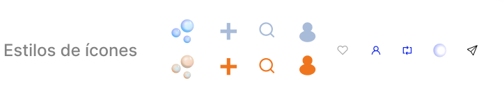
 
 <sup>Fonte: Material produzido pelos autores (2024) [Link do arquivo](https://www.figma.com/design/ij0wqBxprLc3Q7TKjvhaHh/Guia-de-estilos-APENAS?node-id=25-32&t=9jCYfo8GEjOFI58J-1)</sup>
</div>

&nbsp;&nbsp;&nbsp;&nbsp; No âmbito da iconografia existem amplas categorias de ícones, sendo os principais de referência, de semelhança e arbitrários. Nessa lógica, os ícones de referência correspondem à representação do objeto físico que o ícone pretende refletir, como o envelope para simbolizar a caixa de entrada do e-mail. Assim, exemplos dessa classe presentes no presente projeto são os ícones da ‘lupa’ e do ‘mais’, uma vez que a ‘lupa’ é utilizada para procurar algo e o ‘mais’ para criar ou somar alguma coisa (NIELSEN, 2014). Dessa maneira, a funcionalidade da ‘lupa’ é representar o campo de pesquisa por projetos específicos de interesse do voluntário e o de ‘mais’ simbolizar a criação de publicações.

&nbsp;&nbsp;&nbsp;&nbsp; Ademais, os ícones de referências retratam um objeto por meio da analogia a algum conceito ou mensagem que se pretende transmitir, como uma imagem de um grampo para simbolizar a compactação de arquivos (NIELSEN, 2014). Nesse viés, os ícones do boneco, coração e avião de papel são exemplos dessa categoria de iconografia, tendo em vista que o boneco representa o usuário, o coração o conceito de gostar de algo e o avião de papel a ideia de transmitir uma mensagem para alguém. Desse modo, o boneco representa os detalhes do perfil da pessoa, o coração seria de favoritar alguma ação social e o avião seria para compartilhar a publicação com outra pessoa.

&nbsp;&nbsp;&nbsp;&nbsp; Por fim, os significado dos ícones arbitrários são definidos por meio da convenção de um grupo de pessoas ou organizações, como os sinais de trânsito em que um triângulo é um sinal de advertência (NIELSEN, 2014). Nessa conjuntura, os ícones da borbulha com as três bolhas e da bolha única do nosso projeto representam exemplos dessa classe, posto que são frutos de uma criação autêntica com o objetivo de construir a identidade do projeto. Dessa maneira, seguindo tal estética sobre as bolhas e de cada indivíduo convergir sua bolha com o próximo, assim, as funcionalidades do ícone de três bolhas “borbulhando” é representar a sessão do feed e da bolha única é a ‘curtida’ do post.

### 3.3.3.1 Logo

&nbsp;&nbsp;&nbsp;&nbsp; O logo é a imagem da marca e, portanto, é uma parte fundamental da identidade visual. Nessa conjuntura, é um elemento visual que, quando aplicado da forma correta, faz com que os consumidores associem imediatamente a imagem à marca, ajudando a criar reconhecimento e a transmitir mensagem e valores.

&nbsp;&nbsp;&nbsp;&nbsp; Dessa maneira, para uma compreensão mais aprofundada da escolha do logotipo, é fundamental compreender previamente o significado do nosso nome. Nesse viés, optamos por "Borbulha", derivado da palavra "bolha", que carrega consigo a ideia de que cada indivíduo possui sua própria esfera de influência. Assim, ao praticar a caridade, não se rompe apenas a esfera individual, mas sim une-se para formar uma vasta rede de solidariedade, como refletido na expressão: "Borbulhando uma visão voluntária"
.

<div align="center" width="100%">
 <sub>Figura 19: Logo principal no fundo escuro</sub><br>
 
 
 
 <sup>Fonte: Material produzido pelos autores (2024) [Link do arquivo](https://www.canva.com/design/DAGD6eNuEg0/RbtXJ6FLzx9SJeUubOl84A/edit?utm_content=DAGD6eNuEg0&utm_campaign=designshare&utm_medium=link2&utm_source=sharebutton)</sup>
</div>

<div align="center" width="100%">
 <sub>Figura 20: Tabela de logos</sub><br>
 
 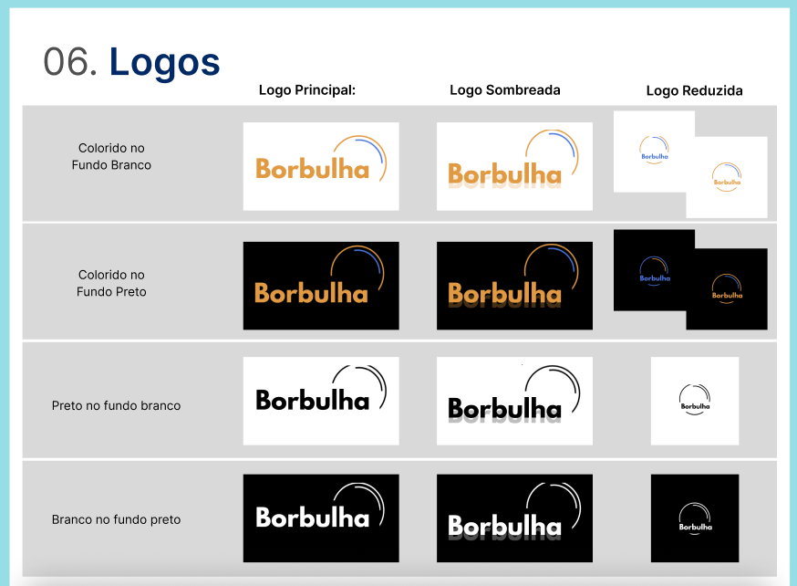
 
 <sup>Fonte: Material produzido pelos autores (2024) [Link do arquivo](https://www.figma.com/design/ij0wqBxprLc3Q7TKjvhaHh/Guia-de-estilos-APENAS?node-id=25-32&t=9jCYfo8GEjOFI58J-1)</sup>
</div>

&nbsp;&nbsp;&nbsp;&nbsp; No logo, busca-se o minimalismo e a simplicidade, utilizando formas básicas e um número reduzido de cores (2 cores), sendo uma principal e outra secundária. Quanto às cores, busca-se inspiração nas cores do nosso parceiro, Parceiros Voluntários. Por fim, usa-se o nosso nome rodeado pelo o círculo, simbolizando a bolha, assim representando nossa proposta de unir indivíduos em uma grande 'bolha' solidária. Assim, o logotipo não é apenas uma imagem, mas sim um símbolo que reflete nossa visão de 'borbulhar' uma cultura de voluntariado e união.

### 3.3.4 Grids e espaçamento

&nbsp;&nbsp;&nbsp;&nbsp; O sistema de grid de 8 pixels é uma ferramenta essencial no mundo do design por trazer clareza e consistência às interfaces digitais. Este sistema não só facilita a vida de quem desenvolve como também aprimora a experiência de quem usa, ao estabelecer um ambiente visual previsível e intuitivo.

&nbsp;&nbsp;&nbsp;&nbsp; Essa técnica se baseia na ideia de que um alinhamento e espaçamento uniforme dos elementos em uma interface podem diminuir significativamente a carga mental do usuário. Isso acontece porque, segundo os princípios da Gestalt (ARTY, 2019), objetos que são visualmente semelhantes ou estão próximos uns dos outros tendem a ser percebidos como parte de um conjunto. Essa percepção facilita o processamento mental e torna a navegação mais fluida e menos confusa.

&nbsp;&nbsp;&nbsp;&nbsp; A flexibilidade é outra grande vantagem do grid de 8 pontos, que se adapta a diferentes tamanhos e resoluções de tela. Isso é essencial em um mundo onde as pessoas alternam constantemente entre smartphones, tablets e computadores. Manter uma interface consistente e responsiva em todos esses dispositivos ajuda a minimizar a estranheza e a manter o usuário confortável, independentemente da plataforma que ele escolha usar.

&nbsp;&nbsp;&nbsp;&nbsp; O uso de um sistema de grid padronizado também agiliza o processo de design e desenvolvimento. Permite aos profissionais reutilizar componentes e padrões de design, acelerando a produção e mantendo um alto nível de consistência em todo o projeto. Reduzir a variedade de medidas para múltiplos de 8 ou 4 simplifica as decisões de design, tornando todo o processo mais eficiente e menos propenso a erros.

&nbsp;&nbsp;&nbsp;&nbsp; Empresas líderes de tecnologia como Google e Apple utilizam de grids em seus designs. O Google com seu Material Design (GOOGLE, 2014) - adotando o grid de 8 pixels - e a Apple, através do Human Interface Guidelines, ambos recomendam grids para alinhar conteúdo de forma a garantir uma experiência de usuário fluida e agradável em todos os dispositivos.

&nbsp;&nbsp;&nbsp;&nbsp; Por fim, o grid de 8 pixels considera a ergonomia visual, alinhando-se à capacidade de toque do dedo humano, o que é especialmente importante em dispositivos móveis. Adaptar o design para se ajustar à ergonomia física não só torna a interação mais confortável como também reduz frustrações, proporcionando uma experiência mais prazerosa e intuitiva.

&nbsp;&nbsp;&nbsp;&nbsp; Segue abaixo as regras para a construção do grid:

<div align="center" width="100%">
<sub>Figura 21: Regras para Grid </sub><br>
 
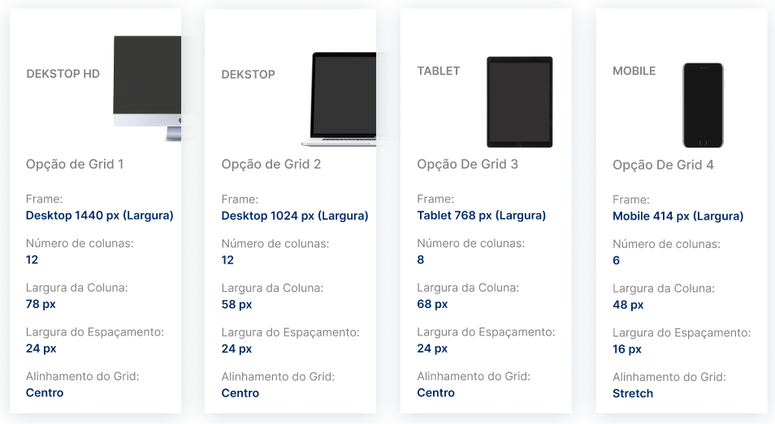
 
<sup>Fonte: Material produzido pelos autores (2024) [Link do arquivo](https://www.figma.com/design/ij0wqBxprLc3Q7TKjvhaHh/Guia-de-estilos-APENAS?node-id=25-32&t=9jCYfo8GEjOFI58J-1)
</sup>
</div>

&nbsp;&nbsp;&nbsp;&nbsp; A figura abaixo representa o modelo das regras do grid apresentadas acima:

<div align="center" width="100%">
<sub>Figura 22: Modelo do Grid </sub><br>
 

 
<sup>Fonte: Material produzido pelos autores (2024) [Link do arquivo](https://www.figma.com/design/ij0wqBxprLc3Q7TKjvhaHh/Guia-de-estilos-APENAS?node-id=25-32&t=9jCYfo8GEjOFI58J-1)
</sup>
</div>

### Sprint 3

&nbsp;&nbsp;&nbsp;&nbsp;Aqui estão atualizações ou itens novos adicionadas ao guia de estilos na sprint 3. Foi criado uma sessão de botões, uma de logo e foram atualizados diversas partes. Foi mudada a tabela de logos e adicionado ao espaçamento. Essas mudanças no guia de estilos buscam garantir maior definição de como o protótipo de alta fidelidade e a aplicação deveriam ser produzidos, permitindo que sigam regras e padrões que garantem uniformidade de elementos de design.

### Iconografia e imagens
&nbsp;&nbsp;&nbsp;&nbsp;Foram adicionados novos icones e mudado o estilos de alguns principais icones da sprint 2 até a 3. Os icones da navbar foram mudados, as bolhas mudaram de um estilo 3D para 2D. Imagens como para o botão de filtro, "borbulhar", localização e número de pessoas foram criadas. Foram escolhidas imagens que possam transmitir o significado exato de suas funcionalidades na plataforma e que permitam que o usuário entenda exatamente o que fazem ao clicar nelas.
<div align="center" width="100%">
 <sub>Figura 23: Guia de ícones</sub><br>
 
 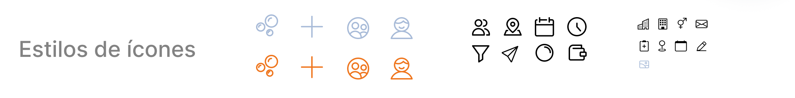
 
 <sup>Fonte: Material produzido pelos autores (2024) [Link do arquivo](https://www.figma.com/design/ij0wqBxprLc3Q7TKjvhaHh/Guia-de-estilos-APENAS?node-id=25-32&t=9jCYfo8GEjOFI58J-1)</sup>
</div>

### Logo
&nbsp;&nbsp;&nbsp;&nbsp;Versões reduzidas dos logos foram removidas, por não manterem a qualidade. O logo permanece o mesmo.
<div align="center" width="100%">
 <sub>Figura 24: Tabela de logos</sub><br>
 
 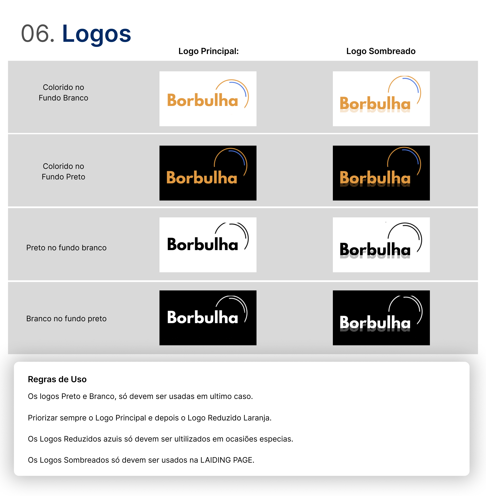
 
 <sup>Fonte: Material produzido pelos autores (2024) [Link do arquivo](https://www.figma.com/design/ij0wqBxprLc3Q7TKjvhaHh/Guia-de-estilos-APENAS?node-id=25-32&t=9jCYfo8GEjOFI58J-1)</sup>
</div>

### Grids e espaçamento
&nbsp;&nbsp;&nbsp;&nbsp;Foi criado um espaçamento geral. Suas regras de uso foram definidas e escritas. Isso permite maior uniformidade nos espaçamentos no protótipo de alta fidelidade. O espaçamento deve ser em múltiplos de 8, e é importante manter uma padronização entre blocos de conteúdos e seções. É dado um exemplo na imagem de como foi aplicado as regras de espaçamento criadas.
<div align="center" width="100%">
<sub>Figura 25: Espaçamento</sub><br>
 
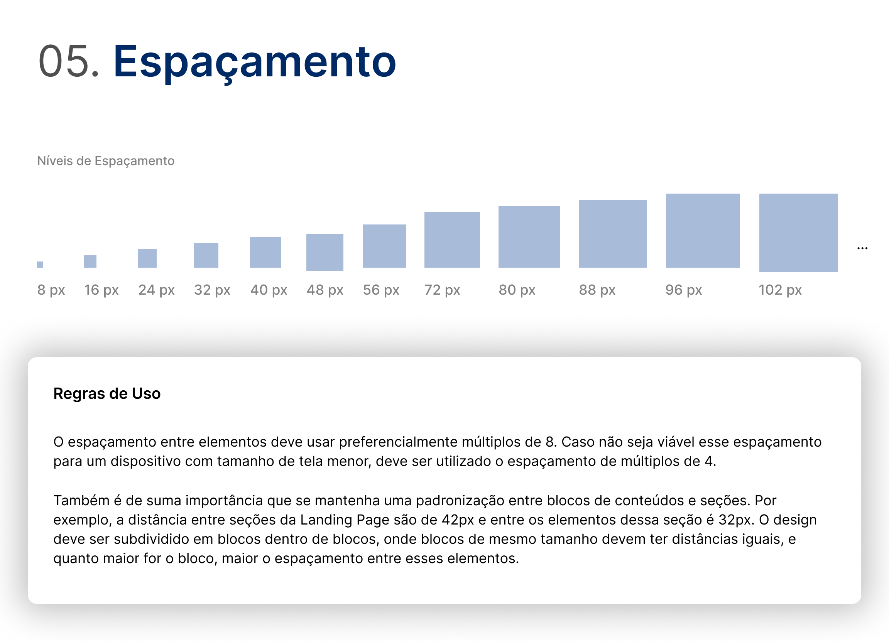
 
<sup>Fonte: Material produzido pelos autores (2024) [Link do arquivo](https://www.figma.com/design/ij0wqBxprLc3Q7TKjvhaHh/Guia-de-estilos-APENAS?node-id=25-32&t=9jCYfo8GEjOFI58J-1)
</sup>
</div>

### Botões 
&nbsp;&nbsp;&nbsp;&nbsp;Criamos uma sessão para os botões no guia de estilos. Foram escritas de forma explícita as regras para a utilização de botões. Isso garante que todos os botões no protótipo de alta fidelidade sigam as mesmas regras. Regras incluem tamanho da borda dos botões em relação aos textos contidos, arredondamento de botões, de onde escolhemos as cores dos botões e suas sombras. Também foram adicionados botões que são apenas texto, utilizados em apenas alguns lugares específicos do protótipo como na página de login/cadastro. Em geral, exceto alguns botões específicos a maioria dos botões devem seguir os mesmos padrões e poderem ser replicados do zero.
<div align="center" width="100%">
<sub>Figura 26: Botões</sub><br>
 
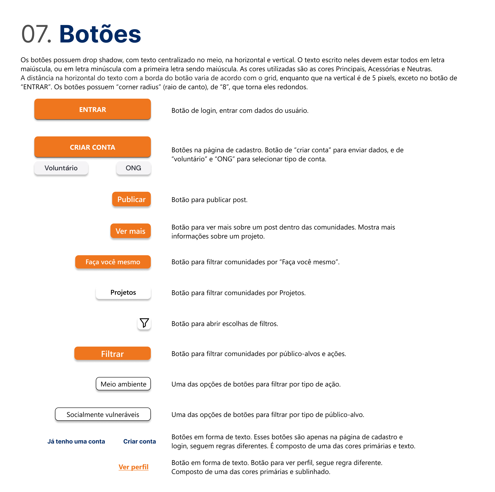
 
<sup>Fonte: Material produzido pelos autores (2024) [Link do arquivo](https://www.figma.com/design/ij0wqBxprLc3Q7TKjvhaHh/Guia-de-estilos-APENAS?node-id=25-32&t=9jCYfo8GEjOFI58J-1)
</sup>
</div>

### Sombras
&nbsp;&nbsp;&nbsp;&nbsp;Agora as sombras estão detalhadas e explicadas. Guia que explicação utilização de sombras e seu padrão em relação aos cards. Isso permite repetir as sombras em diferentes cards, botões e artefatos visuais da mesma forma. Foram definidos os elementos de design que necessitam sombras, também suas intensidades e quando usá-las. As sombras são um elemento visual que traz profundidade para diferentes partes da aplicação web, variando desde botões até cards ou seções inteiras das páginas.
<div align="center" width="100%">
<sub>Figura 27: Sombras</sub><br>
 
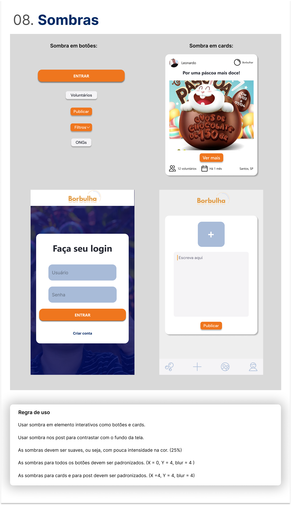
 
<sup>Fonte: Material produzido pelos autores (2024) [Link do arquivo](https://www.figma.com/design/ij0wqBxprLc3Q7TKjvhaHh/Guia-de-estilos-APENAS?node-id=25-32&t=9jCYfo8GEjOFI58J-1)
</sup>
</div>

## 3.4 Protótipo de alta fidelidade (sprints 2 e 3)

### Sprint 2

&nbsp;&nbsp;&nbsp;&nbsp;Nesta seção, se encontra o protótipo de alta fidelidade do Borbulha. O protótipo foi desenvolvido com o objetivo de fornecer uma representação visual detalhada e fiel das principais funcionalidades e interfaces da plataforma.

&nbsp;&nbsp;&nbsp;&nbsp;Com base na experiência do usuário e nos wireframes, foi importate a elaboração de uma prototipação em alta fidelidade que representasse a interface da aplicação web. A mesma tem o intuito de ser um produto visual para validação com o parceiro, como também uma ferramenta de ajuda para os desenvolvedores do frontend que utilizarão CSS e HTML. É uma forma de economizar tempo e recursos, e o mais importante, garantir que os produtos finais atendam às expectativas e necessidades dos usuários de maneira precisa e eficiente

&nbsp;&nbsp;&nbsp;&nbsp;O design do protótipo aborda elementos de identidade visual, como cores, tipografia, ícones e layouts consistentes com nosso guia de estilos, explicado anteriormente. O objetivo é trazer uma experiência do usuário agradável.

&nbsp;&nbsp;&nbsp;&nbsp;O protótipo abrange as seguintes funcionalidades principais do software:

- Login: Tela em que o usuário poderá se logar na plataforma.
<div align="center" width="100%">
 <sub>Figura 28: Tela de Login</sub><br>

 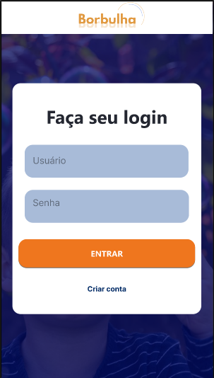
 
 <sup>Fonte: Material produzido pelos autores (2024)</sup>
</div>

- Feed: Tela em que os posts livres aparecem para o usuário, e ele pode "borbulhar" (curtir) uma postagem.
<div align="center" width="100%">
 <sub>Figura 29: Feed</sub><br>

 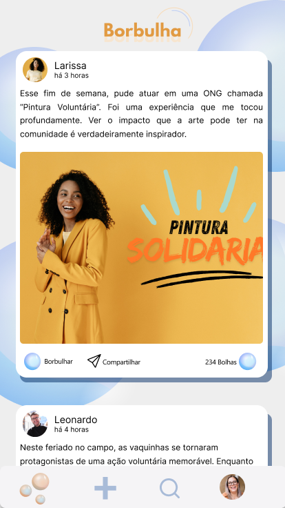
 
 <sup>Fonte: Material produzido pelos autores (2024)</sup>
</div>

- Nova postagem: Tela em que os usuários podem postar uma nova publicação. O usuário deverá escolher entre um post pré-montado para compartilhar seu projeto ou um post livre.
<div align="center" width="100%">
 <sub>Figura 30: Nova Postagem</sub><br>

 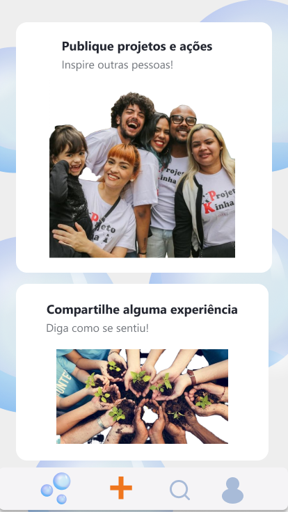
 
 <sup>Fonte: Material produzido pelos autores (2024)</sup>
</div>

- Escrever um post: Tela em que o usuário pode escrever seu post e anexar uma imagem.
<div align="center" width="100%">
 <sub>Figura 31: Escrever post</sub><br>

 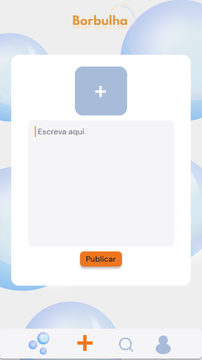
 
 <sup>Fonte: Material produzido pelos autores (2024)</sup>
</div>

- Comunidades: Aba em que o usuário pode achar projetos, ONGs e outros usuários para se conectar.
<div align="center" width="100%">
 <sub>Figura 32: Comunidades</sub><br>

 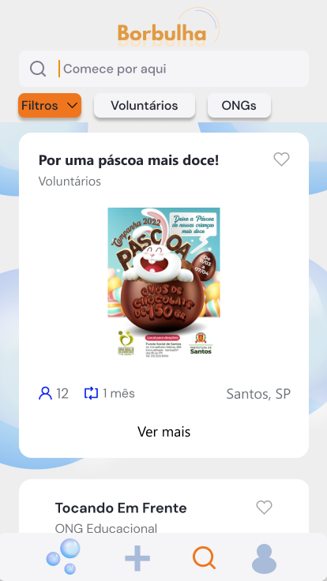
 
 <sup>Fonte: Material produzido pelos autores (2024)</sup>
</div>

- Perfil: Guia em que um usuário pode ver o perfil de outra pessoa.
<div align="center" width="100%">
 <sub>Figura 33: Perfil</sub><br>

 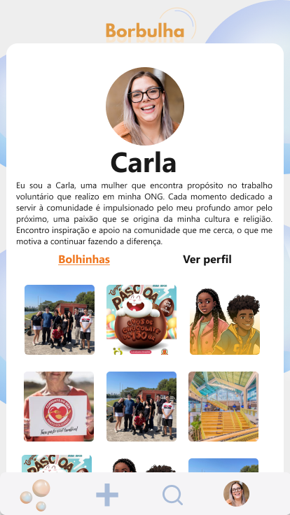
 
 <sup>Fonte: Material produzido pelos autores (2024)</sup>
</div>

- Meus Dados: Aba em que o usuário pode visualizar seus dados de cadastro e alterá-los.
<div align="center" width="100%">
 <sub>Figura 34: Dados</sub><br>

 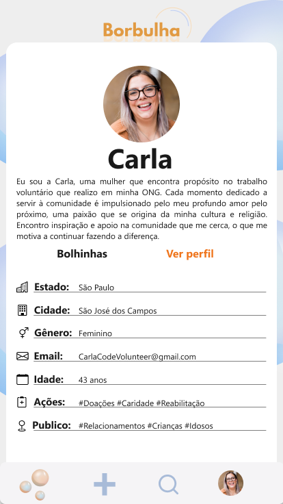
 
 <sup>Fonte: Material produzido pelos autores (2024)</sup>
</div>

&nbsp;&nbsp;&nbsp;&nbsp; Esse protótipo pode ser encontrado nesse [link](https://www.figma.com/proto/kO9szZGxKZ6AyNFBQY8XQX/Guia-de-estilos?node-id=2673-931&starting-point-node-id=2673%3A931&t=DwcRyGakaEfYoLew-1).

&nbsp;&nbsp;&nbsp;&nbsp; Após esse processo, o protótipo de alta fidelidade servirá como uma base sólida para a construção da aplicação web final. Seu papel como uma representação fiel produto final guia os desenvolvedores para o caminho certo. Também acelera o processo de validação com o parceiro. 

### Sprint 3

&nbsp;&nbsp;&nbsp;&nbsp;Nessa sprint foram feitas algumas  atualizações e adições de novas telas, com o intuito de deixar a plataforma visualmente mais bonita e intuitiva.

&nbsp;&nbsp;&nbsp;&nbsp; De maneira geral, o fundo de todas as telas da plataforma Borbulha passou por uma atualização, adotando uma cor mais escura para proporcionar um melhor contraste com os conteúdos exibidos. Além disso, as bolhas usadas no fundo foram redesenhadas para se alinhar mais adequadamente com a identidade visual da plataforma. As antigas bolhas com volume, sombra e brilho foram substituídas por um design 2D mais simples e moderno, contribuindo para aprimorar a estética e a coesão visual da plataforma. Por fim, os ícones dos principais botões de navegação (Feed, Publicação, Comunidade e Perfil) foram atualizados para garantir uniformidade com o guia de estilo.

- Cadastro: Nova tela desenvolvida em que o usuário fará o cadastro para a plataforma. É necessário o preenchimento do nome, email, senha e se o usuário é uma ONG ou um voluntário. 

<div align="center" style="width: 100%;">
    <sub>Figura 35: Cadastro</sub>
    <br>
    
    <br>
    <sup>Fonte: Material produzido pelos autores (2024)</sup>
</div>


- Postagem: Além de descrever os tipos de post para facilitar o entendimento do usuário, a tela agora possue três tipos de post:

&nbsp;&nbsp;&nbsp;&nbsp;Compartilhe algo em seu Feed: Permite postagens livres onde os usuários podem compartilhar experiências ou qualquer outro conteúdo que desejem dividir com a comunidade.

&nbsp;&nbsp;&nbsp;&nbsp;Compartilhe um projeto: Destinado a projetos em andamento que precisam de voluntários, facilitando a busca por ajuda e a divulgação de oportunidades de participação.

&nbsp;&nbsp;&nbsp;&nbsp;Faça você mesmo: Instruções detalhadas sobre como realizar uma ação voluntária específica, permitindo que outros usuários possam replicar a atividade.

<div align="center" width="100%">
    <sub>Figura 36: Nova tela de Postagem </sub><br>
     <br>
    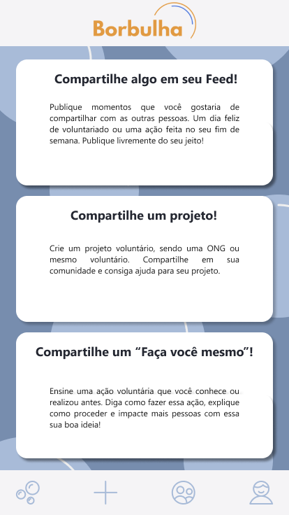
     <br>
    <sup>Fonte: Material produzido pelos autores (2024)</sup>
</div>


- Postagem - Compartilhe em seu Feed: A tela de postagem para o feed foi aprimorada para melhorar a organização dos componentes no grid e garantir coerência com a estrutura dos posts já existentes no feed. Para isso, a área de adição de imagem foi ajustada para corresponder aos tamanhos das fotos apresentadas no feed, proporcionando uma visualização mais consistente. Além disso, foi adicionado um "título na página" que indica o tipo de post, assegurando que o usuário compreenda claramente em que página está e o tipo de conteúdo que está prestes a compartilhar.

<div align="center" width="100%">
    <sub>Figura 37: Postagem - Compartilhe em seu Feed  </sub>
     <br>
     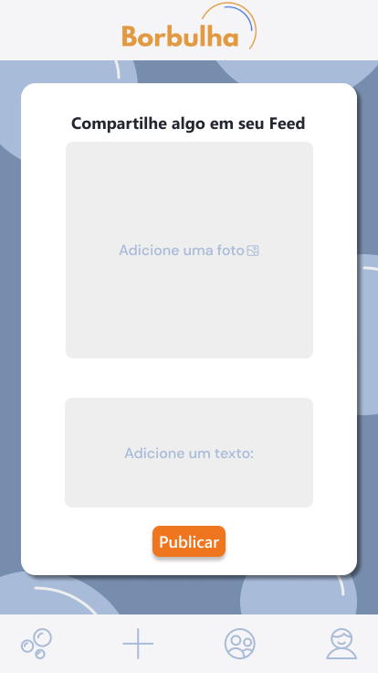
     <br>
    <sup>Fonte: Material produzido pelos autores (2024)</sup>
</div>


- Postagem - Compartilhe um projeto: Seguindo a mesma lógica, foi criada uma página dedicada ao compartilhamento de projetos. Nessa página, o usuário deve preencher todas as caixas de texto que compõem a estrutura da publicação, fornecendo detalhes completos sobre o projeto. Após preencher todas as informações necessárias, o usuário deve clicar no botão "Publicar" para finalizar e compartilhar o projeto com a comunidade. 

<div align="center" width="100%">
    <sub>Figura 38: Postagem - Compartilhe um projeto</sub>
     <br>
     
     <br>
    <sup>Fonte: Material produzido pelos autores (2024)</sup>
</div>


- Postagem - Faça você mesmo: Esta página é dedicada às postagens do tipo "Faça Você Mesmo". Assim como na postagem de projetos, o usuário deve preencher todas as informações solicitadas na estrutura da postagem. Após completar todas as seções necessárias, o usuário pode clicar no botão "Publicar" para compartilhar a ação com a comunidade.

<div align="center" width="100%">
    <sub>Figura 39: Postagem - Faça você mesmo </sub>
     <br>
     
     <br>
    <sup>Fonte: Material produzido pelos autores (2024)</sup>
</div>


&nbsp;&nbsp;&nbsp;&nbsp;A página de comunidade passou por algumas alterações em relação à filtragem e ao modelo de postagem. Os botões de filtragem "Voluntário" e "ONG" foram substituídos por "Projetos" e "Faça Você Mesmo", proporcionando uma busca mais organizada e necessária para os usuários. Além disso, os ícones utilizados nos posts foram modificados para seguir um alinhamento mais coeso com a identidade visual da plataforma. Essas mudanças foram deitas com a intenção de deixar a navegação mais fluida e eficiente na plataforma Borbulha.

- Comunidade - Projetos: Na tela de comunidade há a parte de ver projetos, basta o usuário clicar no botão "Projetos" que a busca será filtrada. Dessa maneira posts relacionados a projetos que ainda estão em andamento e que precisam de voluntários aparecerão.


<div align="center" width="100%">
    <sub>Figura 40: Projetos - comunidade </sub>
     <br>
     
     <br>
    <sup>Fonte: Material produzido pelos autores (2024)</sup>
</div>


- Descrição do Projeto: Ao clicar no botão "Ver mais" em um post de projeto, o usuário é direcionado para uma tela detalhada onde encontrará as informações necessárias sobre o projeto. Nesta tela, serão exibidas a descrição do projeto, as vagas disponíveis, a descrição das vagas, o tempo desde a criação do projeto, a localização e a duração prevista do projeto. Dessa maneira, o usuário interessado deve buscar o site da ONG ou então o contato do voluntário que postou. Esse tipo de post serve apenas para fazer a divulgação e deixar a busca mais fácil.

<div align="center" style="width: 100%;">
    <sub>Figura 41: Tela de descrição do post "projeto"</sub>
    <br>
    
    <br>
    <sup>Fonte: Material produzido pelos autores (2024)</sup>
</div>


- Comunidade - Faça você mesmo: Na tela de comunidade, foi adicionada a seção "Faça Você Mesmo", onde o usuário pode encontrar posts com instruções detalhadas sobre como realizar ações voluntárias específicas. Ao clicar no botão "Faça Você Mesmo", a busca será filtrada para exibir apenas esse tipo de post.

<div align="center" style="width: 100%;">
    <sub>Figura 42: Faça você mesmo - Comunidade</sub>
    <br>
    
    <br>
    <sup>Fonte: Material produzido pelos autores (2024)</sup>
</div>


- Descrição do "Faça você mesmo": Ao clicar no botão "Faça Você Mesmo", o usuário é redirecionado para uma página que contém uma descrição de como realizar a ação voluntária. Nessa página, o usuário encontrará informações sobre a quantidade de voluntários necessários, a duração do projeto e qualquer custo associado. O objetivo desse tipo de post é inspirar os usuários a replicarem essa ação voluntária, fornecendo orientações claras e detalhadas para facilitar a sua execução.

<div align="center" style="width: 100%;">
    <sub>Figura 43: Tela de descrição do post "faça você mesmo"</sub>
    <br>
    
    <br>
    <sup>Fonte: Material produzido pelos autores (2024)</sup>
</div>


- Comunidade - Filtro: Foi desenvolvida a aba de filtro que apresenta opções para selecionar tipos de ações e públicos-alvo específicos. Ao clicar no botão com o ícone de filtro, a aba aparece e o usuário pode escolher quais ações e públicos-alvo deseja buscar. Em seguida, basta clicar no botão "Filtrar" para aplicar as seleções feitas e visualizar os resultados correspondentes. Essa funcionalidade tem o objetivo de tornar a pesquisa mais rápida e eficaz para o usuário.

<div align="center" style="width: 100%;">
    <sub>Figura 44: Filtro - Comunidade</sub>
    <br>
    
    <br>
    <sup>Fonte: Material produzido pelos autores (2024)</sup>
</div>


Perfil: Para garantir uma disposição mais organizada das informações no perfil e seguir o padrão do grid, foram realizadas algumas modificações. A posição da foto e do nome do usuário foi alterada, além disso um ícone de lápis foi adicionado para representar a opção de edição de perfil, embora ainda não esteja funcional. Essas alterações visam melhorar a experiência do usuário ao acessar e visualizar seu perfil na plataforma.

<div align="center" style="width: 100%;">
    <sub>Figura 45: Nova tela de Perfil</sub>
    <br>
    
    <br>
    <sup>Fonte: Material produzido pelos autores (2024)</sup>
</div>


<div align="center" style="width: 100%;">
    <sub>Figura 46: Nova tela de Perfil</sub>
    <br>
    
    <br>
    <sup>Fonte: Material produzido pelos autores (2024)</sup>
</div>

Esse protótipo pode ser encontrado nesse [link](https://www.figma.com/proto/ZQUm66jlZuNRMmnbVkO4f7/Prot%C3%B3tipo-de-alta-e-fluxo-de-tela?page-id=0%3A1&node-id=1-2255&viewport=3156%2C657%2C0.32&t=JF1jPof1FBSdcVnm-1&scaling=min-zoom&starting-point-node-id=1%3A2255 ).

Para acessar o fluxo de tela e as user stories ligadas, acesse esse [link](https://www.figma.com/design/aICQkbMuPOESwoO42PatRC/Untitled?node-id=0-1&t=L7WmWTpvYzbkUXfn-1)

### Sprint 4

&nbsp;&nbsp;&nbsp;&nbsp; Nessa sprint, foram realizadas alterações no protótipo de alta fidelidade da plataforma Borbulha. As principais atualizações incluem o desenvolvimento da Landing Page, a redefinição da Tela de Comunidade e a remoção da Publicação "Compartilhe seu Projeto".

&nbsp;&nbsp;&nbsp;&nbsp; **Landing Page:** A _landing page_ da plataforma Borbulha foi projetada para ser a primeira impressão que os usuários têm ao acessar o site. Com o objetivo de atrair a atenção dos visitantes e incentivá-los a se cadastrar na plataforma, a _landing page_ inclui informações como a missão VTM (Voluntário transformador Massivo), os relatos de Usuários, os impactos da Plataforma, além do botão “Seja voluntário” que direciona os usuários para a tela de cadastro, facilitando o início da jornada na plataforma.

<div align="center" style="width: 100%;">
    <sub>Figura 47: Landing Page </sub>
    <br>
    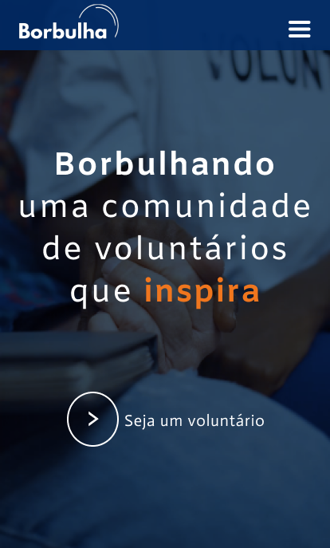
    <br>
    <sup>Fonte: Material produzido pelos autores (2024)</sup>
</div>

Para uma visualização completa da tela, clique [aqui](https://www.figma.com/proto/CkHzRczgQZRDsNKHxQ7dJh/sprint-4?node-id=27-863&t=RZpSKuJsH3m2N0fi-0&scaling=min-zoom&page-id=0%3A1).

&nbsp;&nbsp;&nbsp;&nbsp; **Postagem:** A tela de tipo de postagem, volta a possuir dois tipo de publicação:

- **Compartilhe algo em seu Feed:** Permite postagens livres onde os usuários podem compartilhar experiências ou qualquer outro conteúdo que desejem dividir com a comunidade.

- **Faça você mesmo:** Instruções detalhadas sobre como realizar uma ação voluntária específica, permitindo que outros usuários possam replicar a atividade.

<div align="center" style="width: 100%;">
    <sub>Figura 48: Tipo de publicação </sub>
    <br>
    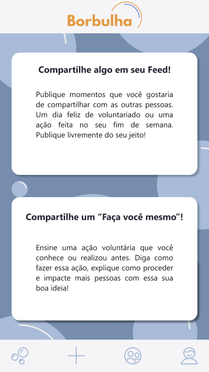
    <br>
    <sup>Fonte: Material produzido pelos autores (2024)</sup>
</div>

&nbsp;&nbsp;&nbsp;&nbsp; Comunidade: Na tela de Comunidade, as opções de filtragem "Faça você mesmo" e "Projetos" foram removidas. Após a exclusão da publicação "Compartilhe seu projeto", a necessidade de filtragem foi simplificada para incluir apenas os tipos de Ação e de Público-alvo que é acionado ao clicar no ícone de filtro.

<div align="center" style="width: 100%;">
    <sub>Figura 49: Comunidade </sub>
    <br>
    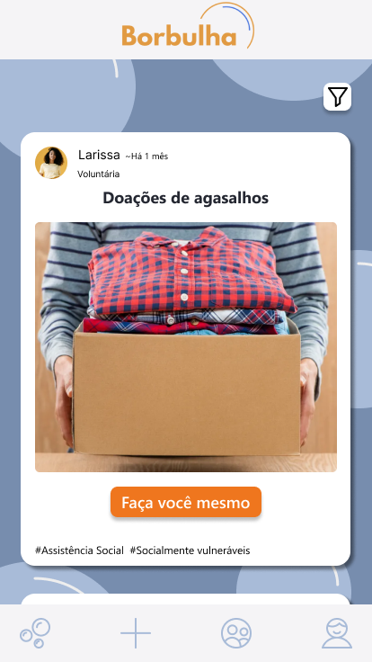
    <br>
    <sup>Fonte: Material produzido pelos autores (2024)</sup>
</div>

Visualização do protótipo [aqui](https://www.figma.com/proto/CkHzRczgQZRDsNKHxQ7dJh/sprint-4?node-id=27-863&t=RZpSKuJsH3m2N0fi-0&scaling=min-zoom&page-id=0%3A1).

Visualização do fluxo de tela [aqui](https://www.figma.com/design/CkHzRczgQZRDsNKHxQ7dJh/sprint-4?node-id=27-863&t=RZpSKuJsH3m2N0fi-0).

### Sprint 5

&nbsp;&nbsp;&nbsp;&nbsp;Nessa sprint foram realizadas poucas alterações no protótipo de alta fidelidade. As principais atualizações foram na tela de cadastro e na tela de publicação.


&nbsp;&nbsp;&nbsp;&nbsp;**Cadastro:** Na tela de cadastro, foi adicionado um botão ao lado do campo de senha, permitindo ao usuário ocultar ou visualizar a senha digitada. Essa funcionalidade facilita a orientação do usuário durante o processo de cadastro.


<div align="center" style="width: 100%;">
    <sub>Figura 50: Cadastro </sub>
    <br>
    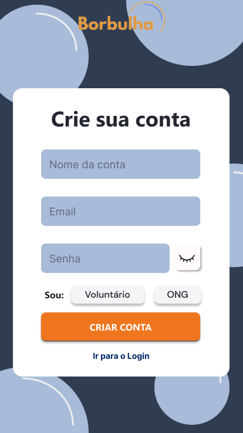
    <br>
    <sup>Fonte: Material produzido pelos autores (2024)</sup>
</div>

&nbsp;&nbsp;&nbsp;&nbsp;**Tela de publicação:** Na tela de publicação, foi alterado os botões dos tipos de postagens. Imagens de pessoas foram adicionadas com o intuito de representar a união, a solidariedade e a convivência do voluntariado, trazendo assim um sentimento de comunidade para o usuário.


<div align="center" style="width: 100%;">
    <sub>Figura 51: Tela de publicação </sub>
    <br>
    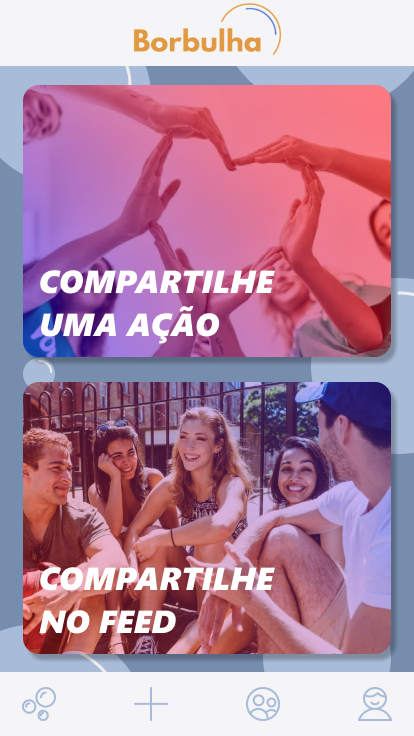
    <br>
    <sup>Fonte: Material produzido pelos autores (2024)</sup>
</div>

Visualização do protótipo [aqui](https://www.figma.com/design/j72fqoBU0pCkq8ww6WPDR8/Sprint-5?node-id=0-1&t=Qm6eufpDvsEchldj-0).


## 3.5. Modelagem do banco de dados (sprints 2 e 3)

&nbsp;&nbsp;&nbsp;&nbsp; Um banco de dados é um sistema organizado para armazenar e gerenciar conjuntos de dados, permitindo acesso eficiente às informações. Esses dados, que variam em complexidade, são essenciais para sistemas de software, como websites. Na criação de um website, a modelagem do banco de dados desempenha um papel fundamental ao definir a estrutura e organização dos dados, garantindo que atendam às necessidades do sistema de forma eficiente e segura.

&nbsp;&nbsp;&nbsp;&nbsp; O processo de modelagem do banco de dados iniciou-se com o entendimento maior do negócio e identificação das informações fundamentais a serem armazenadas e manipuladas durante a aplicação do projeto web. Com a definição dos dados que serão utilizados, foi-se desenvolvido a rede de relações que esses dados possuem entre si, resultando em um sistema mais robusto de relacionamento de dados, partindo do modelo conceitual para um modelo lógico.

### 3.5.1. Modelo relacional (sprints 2)

&nbsp;&nbsp;&nbsp;&nbsp; Partindo da modelagem realizada e contextualizada no início do tópico 3.5, foi desenvolvido uma estrutura sistêmica de dados relacionais para a utilização do contexto do projeto. Com esse modelo relacional do banco de dados é possível compreender a estrutura do banco de dados, as entidades envolvidas e como elas se relacionam entre si para atender às necessidades do sistema. Tendo isso posto, esse tópico detalha o resultado obtido.

<div align="center" width="100%">
 <sub>Figura 52: Banco de dados relacional</sub><br>
 
 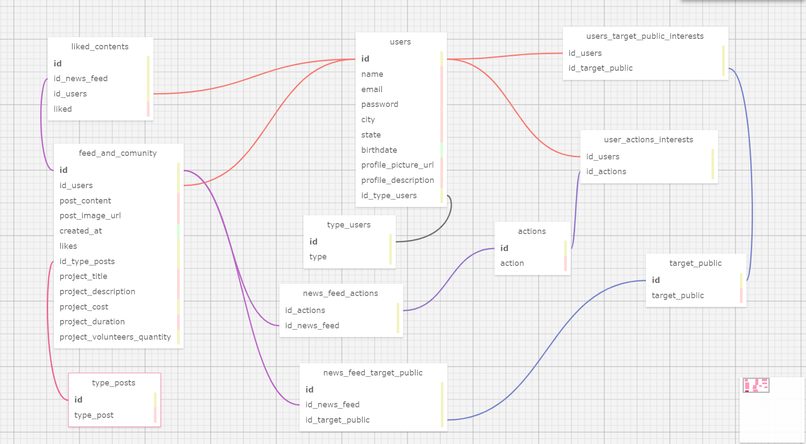
 
 <sup>Fonte: Material produzido pelos autores (2024)</sup>
</div>

&nbsp;&nbsp;&nbsp;&nbsp; Está abaixo posicionada a descrição de cada tabela presente para maior compreensão do banco de dados relacionais desenvolvido.

<div align="center">
<sub>Tabela 27 - Tabela de bancos de dados relacional </sub>
</div>

| tabela                        | descrição                                                                                                                                                                                                                                                                   |
| ----------------------------- | --------------------------------------------------------------------------------------------------------------------------------------------------------------------------------------------------------------------------------------------------------------------------- |
| users                         | Essa tabela armazena os dados relacionados aos usuários do sistema. Isso inclui informações como nome, email, senha e quaisquer outros detalhes específicos do usuário que sejam relevantes para a plataforma. Cada registro nesta tabela representa um usuário individual. |
| type_users                    | Essa tabela define as diferentes classificações de usuários no sistema, distinguindo entre voluntários e organizações não governamentais (ONGs). Cada registro nesta tabela identifica o tipo de usuário ao qual um determinado registro na tabela "users" pertence.        |
| users_target_public_interests | Aqui são registrados os interesses específicos do público-alvo para os quais os usuários direcionam suas atividades voluntárias. Isso pode incluir categorias como crianças em situação de rua, idosos, animais abandonados, entre outros.                                  |
| target_public                 | Essa tabela lista os diferentes tipos de públicos-alvo que podem ser selecionados pelos usuários. Cada registro representa um grupo demográfico ou categoria específica de pessoas para as quais as ações voluntárias são direcionadas.                                     |
| users_actions_interests       | Aqui são registrados os interesses dos usuários em relação a tipos específicos de ações voluntárias. Isso pode incluir atividades como abrigos de animais, distribuição de alimentos, ensino de habilidades, entre outros.                                                  |
| actions                       | Nessa tabela são listados os diferentes tipos de ações voluntárias disponíveis na plataforma. Cada registro representa uma atividade específica que os usuários têm interesse em realizar em benefício da comunidade ou de uma causa específica.                            |
| feed_and_community            | Essa tabela armazena os dados relacionados às publicações feitas no feed da plataforma e nas comunidades. Isso inclui informações como o texto da postagem, data e hora da publicação, imagem, e outros detalhes relevantes.                                                |
| type_posts                    | Aqui são definidos os diferentes tipos de postagens que podem ser feitas na plataforma, distinguindo entre publicação livre (onde os usuários podem escrever livremente) e publicações pré-estruturadas (que seguem um formato específico para compartilhar uma ação).      |
| news_feed_target_public       | Essa tabela registra os diferentes públicos-alvo que estão associados às postagens feitas no feed da plataforma. Isso ajuda a direcionar as postagens para grupos específicos de interesse.                                                                                 |
| news_feed_actions             | Aqui são registradas as diferentes ações voluntárias que estão relacionadas às postagens feitas no feed da plataforma. Isso ajuda a categorizar as postagens com base nas atividades que estão sendo promovidas.                                                            |
| liked_contents                | Nessa tabela é registrada a interação dos usuários com as postagens no feed, indicando se um usuário específico curtiu ou não uma determinada postagem.                                                                                                                     |

<div align="center">
<sup>Fonte: Material produzido pelos autores (2024)</sup>
</div>

&nbsp;&nbsp;&nbsp;&nbsp; Para melhor compreensão, segue abaixo um modelo SQL que exemplifica a estrutura do banco de dados que será utilizada durante toda a aplicação. Para o ambiente, utilizamos o banco de dados PostgreSQL e a plataforma para administração desses dados é o DBeaver.

&nbsp;&nbsp;&nbsp;&nbsp; O modelo referido inclui tabelas de armazenamento de dados e de referenciamento dos mesmos, como usuários, tipos de usuários, ações, públicos-alvo, conteúdos do feed da comunidade e interações dos usuários com esses conteúdos.

&nbsp;&nbsp;&nbsp;&nbsp; O método para alteração e criação dos elementos no banco de dados é o CRUD - uma abreviação para Create, Read, Update e Delete, que são as operações básicas utilizadas em bancos de dados relacionais. Essas operações permitem criar, ler, atualizar e excluir registros em uma tabela de um banco de dados. No momento, os comandos existentes são os de criação das tabelas.

```sql
create schema borbulha;
CREATE TABLE type_users (
  id SERIAL PRIMARY KEY,
  type_user VARCHAR(25) NOT NULL
);
CREATE TABLE users (
  id SERIAL PRIMARY KEY,
  name VARCHAR(50) NOT NULL,
  email VARCHAR(50) NOT NULL,
  password VARCHAR(12) DEFAULT NULL,
  city VARCHAR(50) DEFAULT NULL,
  state VARCHAR(50) DEFAULT NULL,
  birthdate DATE DEFAULT NULL,
  profile_picture_url VARCHAR DEFAULT NULL,
  profile_description VARCHAR(250) DEFAULT NULL,
  id_type_users INTEGER
);
CREATE TABLE target_public (
  id SERIAL PRIMARY KEY,
  target_public VARCHAR(50) NOT NULL
);
CREATE TABLE actions (
  id SERIAL PRIMARY KEY,
  action VARCHAR NOT NULL
);
CREATE TABLE type_posts (
  id SERIAL PRIMARY KEY,
  type_post VARCHAR(25) NOT NULL
);
CREATE TABLE users_target_public_interests (
  id_users INTEGER not NULL,
  id_target_public INTEGER NOT null,
  FOREIGN KEY (id_users) REFERENCES users(id),
  FOREIGN KEY (id_target_public) REFERENCES target_public(id)
);
CREATE TABLE users_actions_interests (
  id_users INTEGER NOT NULL,
  id_actions INTEGER NOT null,
  FOREIGN KEY (id_users) REFERENCES users(id),
  FOREIGN KEY (id_actions) REFERENCES actions(id)
);
CREATE TABLE feed_and_comunity (
  id SERIAL PRIMARY KEY,
  id_users INTEGER NOT NULL,
  post_content VARCHAR(250),
  post_image_url VARCHAR,
  created_at TIMESTAMP,
  likes INTEGER,
  id_type_posts INTEGER,
  project_title VARCHAR(25) DEFAULT NULL,
  project_description VARCHAR(250) DEFAULT NULL,
  project_cost DECIMAL DEFAULT NULL,
  project_duration VARCHAR(50) DEFAULT NULL,
  project_volunteers_quantity INTEGER DEFAULT null,
  FOREIGN KEY (id_users) REFERENCES users(id),
  FOREIGN KEY (id_type_posts) REFERENCES type_posts(id)
);
CREATE TABLE liked_contents (
  id_feed_and_comunity INTEGER NOT NULL,
  id_users INTEGER NOT NULL,
  FOREIGN KEY (id_feed_and_comunity) REFERENCES feed_and_comunity(id),
  FOREIGN KEY (id_users) REFERENCES users(id)
);

CREATE TABLE feed_and_comunity_actions (
  id_actions INTEGER,
  id_feed_and_comunity INTEGER NOT null,
  FOREIGN KEY (id_actions) REFERENCES actions(id),
  FOREIGN KEY (id_feed_and_comunity) REFERENCES feed_and_comunity(id)
);

CREATE TABLE feed_and_comunity_target_public (
  id SERIAL PRIMARY KEY,
  id_feed_and_comunity INTEGER NOT NULL,
  id_target_public INTEGER NOT null,
  FOREIGN KEY (id_feed_and_comunity) REFERENCES feed_and_comunity(id),
  FOREIGN KEY (id_target_public) REFERENCES target_public(id)
);
```

&nbsp;&nbsp;&nbsp;&nbsp; Ao implementar esse modelo, seria possível gerenciar usuários, tipos de usuários, ações, públicos-alvo e interações do usuário com conteúdo compartilhado na plataforma. No entanto, este modelo pode ser expandido e adaptado de acordo com os requisitos específicos da aplicação e as necessidades do projeto. A criação e manutenção do banco de dados da plataforma Borbulha é fundamental para estabelecer um ambiente escalável e eficiente.

### Sprint 3

 &nbsp;&nbsp;&nbsp;&nbsp; Pensando na atualização da modelagem para melhor garantir a experiência do usuário, foi imprescindível a alteração do tipo de dado em algumas colunas de tabelas específicas.

 &nbsp;&nbsp;&nbsp;&nbsp; No geral, não houveram mudanças drásticas, o que facilita o andamento do projeto e a prospecção do próximo passo, uma vez que a mudança abrupta interfere em todo o sistema *back/front*.

 ```sql
  ALTER TABLE user ALTER COLUMN type_users TYPE VARCHAR;

  ALTER TABLE typepost  ALTER COLUMN type_post TYPE VARCHAR;

  ALTER TABLE feedandcommunity  ALTER COLUMN cost TYPE VARCHAR;
  ```
 


 


### 3.5.2. Consultas SQL e lógica proposicional (sprint 3)


&nbsp;&nbsp;&nbsp;&nbsp; A Lógica proposicional é uma área da lógica matemática que estuda as proposições e as operações lógicas que podem ser realizadas sobre elas. As proposições, por sua vez, são declarações que podem ser classificadas como verdadeiras ou falsas. A lógica proposicional se concentra em como essas proposições podem ser combinadas e manipuladas usando operadores lógicos para formar proposições mais complexas.

&nbsp;&nbsp;&nbsp;&nbsp; A lógica proposicional pode ser relacionada a consultas SQL (Structured Query Language) na forma como ambas utilizam operadores lógicos para combinar condições e obter resultados específicos. Sendo capaz de selecionar mais adequadamente quais dados e informações estarão disponíveis naquele momento na aplicação ou mesm visíveis ao usuário. Isso pode ser visto em diversas aplicações do back-end desenvolvido, presentes a seguir:

<br>Feed - Com o tipo de post aberto, Aparecem post mais recentes, posts da mesma região, > 7 dias e que vc não tenha curtido ainda.
<br>Comunnity - Com o tipo de post fechado, Aparecem post mais recentes, posts da mesma região.
<br>Comunnity com filtros -
<br>SELECT * FROM feed_and_comunnity WHERE (type_posts = 'free' AND created_at >= NOW() - INTERVAL 7 DAY AND city_post = 'cidade' AND city = 'cidade') ORDER BY created_at DESC;


#1 | Postagens presentes no feed
--- | ---
**Expressão SQL** | SELECT * FROM comunnity WHERE (type_posts = 'free' AND created_at >= NOW() - INTERVAL 7 DAY) ORDER BY created_at DESC;
**Proposições lógicas** | $A$: O post é do tipo 'aberto' (type_posts = 'free')<br> $B$: O post foi publicado dentro de 7 dias (created_at >= NOW() - INTERVAL 7 DAY)
**Expressão lógica proposicional** | $(A \land B)$
**Tabela Verdade** | <table> <thead> <tr> <th>$A$</th> <th>$B$</th> <th>$(A \land B)$</th> </tr> </thead> <tbody> <tr> <td>F</td> <td>F</td> <td>F</td> </tr> <tr> <td>F</td> <td>V</td> <td>F</td> </tr> <tr> <td>V</td> <td>F</td> <td>F</td> </tr> <tr> <td>V</td> <td>V</td> <td>V</td> </tr> </tbody> </table>
 
#2 | Postagens presentes na comunidade
--- | ---
**Expressão SQL** | SELECT * FROM feed_and_comunnity WHERE (type_posts = 'close' AND created_at >= NOW() - INTERVAL 30 DAY) ORDER BY city_post = city DESC, created_at DESC;
**Proposições lógicas** | $A$: O post é do tipo 'fechado' (type_posts = 'close')<br> $B$: O post foi publicado dentro de 30 dias (created_at >= NOW() - INTERVAL 30 DAY)
**Expressão lógica proposicional** | $(A \land B)$
**Tabela Verdade** | <table> <thead> <tr> <th>$A$</th> <th>$B$</th> <th>$(A \land B)$</th> </tr> </thead> <tbody> <tr> <td>F</td> <td>F</td> <td>F</td> </tr> <tr> <td>F</td> <td>V</td> <td>F</td> </tr> <tr> <td>V</td> <td>F</td> <td>F</td> </tr> <tr> <td>V</td> <td>V</td> <td>V</td> </tr> </tbody> </table>

#3 | Postagens presentes no perfil
--- | ---
**Expressão SQL** | SELECT * FROM feed_and_comunnity WHERE (type_posts = 'open' AND id_USER = X) ORDER BY created_at DESC;
**Proposições lógicas** | $A$: O post é do tipo 'aberto' (type_posts = 'free')<br> $B$: O id do autor do post é um número inteiro, sendo o numero do id_users (id_USER = X)
**Expressão lógica proposicional** | $(A \land B)$
**Tabela Verdade** | <table> <thead> <tr> <th>$A$</th> <th>$B$</th> <th>$(A \land B)$</th> </tr> </thead> <tbody> <tr> <td>F</td> <td>F</td> <td>F</td> </tr> <tr> <td>F</td> <td>V</td> <td>F</td> </tr> <tr> <td>V</td> <td>F</td> <td>F</td> </tr> <tr> <td>V</td> <td>V</td> <td>V</td> </tr> </tbody> </table>

#4 | Postagens presentes na comunidade com um filtro de Voluntários
--- | ---
**Expressão SQL** | SELECT * FROM feed_and_comunnity WHERE (type_posts = 'close' AND created_at >= NOW() - INTERVAL 30 DAY AND type_users = 'voluntario') ORDER BY city_post = city DESC, created_at DESC;
**Proposições lógicas** | $A$: O post é do tipo 'fechado' (type_posts = 'close')<br> $B$: O post foi publicado dentro de 30 dias (created_at >= NOW() - INTERVAL 30 DAY) <br> $C$: O tipo de usuário é 'voluntario'
**Expressão lógica proposicional** | $(A \land B \land C)$
**Tabela Verdade** | </p><table><thead><tr><th>$A$</th><th>$B$</th><th>$C$</th><th>$A \land B$</th><th>$(A \land B \land C)$</th></tr></thead><tbody><tr><td>F</td><td>F</td><td>F</td><td>V</td><td>F</td></tr><tr><td>F</td><td>F</td><td>V</td><td>V</td><td>F</td></tr><tr><td>F</td><td>V</td><td>F</td><td>F</td><td>F</td></tr><tr><td>F</td><td>V</td><td>V</td><td>F</td><td>F</td></tr><tr><td>V</td><td>F</td><td>F</td><td>F</td><td>F</td></tr><tr><td>V</td><td>F</td><td>V</td><td>F</td><td>F</td></tr><tr><td>V</td><td>V</td><td>F</td><td>V</td><td>F</td></tr><tr><td>V</td><td>V</td><td>V</td><td>V</td><td>V</td></tr></tbody></table>


#5 | Postagens presentes na comunidade com um filtro de ONGs
--- | ---
**Expressão SQL** | SELECT * FROM feed_and_comunnity WHERE (type_posts = 'close' AND created_at >= NOW() - INTERVAL 30 DAY AND type_users = 'ONG') ORDER BY city_post = city DESC, created_at DESC;
**Proposições lógicas** | $A$: O post é do tipo 'fechado' (type_posts = 'close')<br> $B$: O post foi publicado dentro de 30 dias (created_at >= NOW() - INTERVAL 30 DAY) <br> $C$: O tipo de usuário é 'ONG'
**Expressão lógica proposicional** | $(A \land B \land C)$
**Tabela Verdade** | </p><table><thead><tr><th>$A$</th><th>$B$</th><th>$C$</th><th>$A \land B$</th><th>$(A \land B \land C)$</th></tr></thead><tbody><tr><td>F</td><td>F</td><td>F</td><td>V</td><td>F</td></tr><tr><td>F</td><td>F</td><td>V</td><td>V</td><td>F</td></tr><tr><td>F</td><td>V</td><td>F</td><td>F</td><td>F</td></tr><tr><td>F</td><td>V</td><td>V</td><td>F</td><td>F</td></tr><tr><td>V</td><td>F</td><td>F</td><td>F</td><td>F</td></tr><tr><td>V</td><td>F</td><td>V</td><td>F</td><td>F</td></tr><tr><td>V</td><td>V</td><td>F</td><td>V</td><td>F</td></tr><tr><td>V</td><td>V</td><td>V</td><td>V</td><td>V</td></tr></tbody></table>

## 3.6. WebAPI e endpoints (sprint 3)

&nbsp;&nbsp;&nbsp;&nbsp; Em sails.js - framework utilizado durante toda a aplicação - endpoints são url's que exemplificam ações específicas da aplicação. Os mesmos funcionam para manipular requisições HTTP *(POST, GET, PUT, DELETE, etc.)*, interagindo com o banco de dados. Dessa forma, a aplicação se torna robusta ao passo que as requisições feitas pela VIEW conseguem ser definidas e gerenciadas pelos controladores (CONTROLLERS), mapeando para ações específicas que você deseja que a aplicação execute, consultando/requerindo o banco de dados.

 &nbsp;&nbsp;&nbsp;&nbsp;As requisições HTTP citadas acima são solicitações enviadas por um cliente (como um navegador web ou um aplicativo) para um servidor web, pedindo algum recurso ou serviço. O servidor processa a requisição e responde com os dados solicitados ou uma mensagem de status. No caso da presente aplicação, utiliza-se a arquitetura MVC *(MODELS, VIEWS E CONTROLLERS)*, como dito anteriormente, para processar e alinhar esse processo.

  Os endpoints utilizados na aplicação são: 

### Endpoints de Usuário (/user)

**POST /user**

- Descrição: Cria um novo usuário e insere seus dados no banco;
- Controlador: UserController.create;
- Parâmetros: Nenhum
- User Story 9 (US9)

```js
 {
  "createdAt": 1716511594327,
  "updatedAt": 1716511594327,
  "id": 3,
  "name": "eduardo",
  "email": "teste@email.com",
  "password": "spfc",
  "city": "SAOPAULO",
  "state": "SP",
  "birthdate": "10/03/2004",
  "profile_picture_url": "yyyyyyy",
  "profile_description": "sou top",
  "type_users": 3
}
 ```

**GET /user/:userID**

- Descrição: Busca e expõe todos os dados de um usuário específico pelo ID;
- Controlador: UserController.findOne;
- Parâmetros: userID

```js
{
  "createdAt": 1716503122187,
  "updatedAt": 1716503122187,
  "id": 2,
  "name": "eduardo",
  "email": "teste@email.com",
  "password": "spfc",
  "city": "SAOPAULO",
  "state": "SP",
  "birthdate": "10/03/2004",
  "profile_picture_url": "yyyyyyy",
  "profile_description": "sou top",
  "type_users": 3
}
 ```

**GET /user**

- Descrição: Busca e expõe todos os dados dos usuários já cadastrados;
- Controlador: UserController.find;
- Parâmetros: Nenhum

```js
 {
    "createdAt": 1716503122187,
    "updatedAt": 1716503122187,
    "id": 2,
    "name": "eduardo",
    "email": "teste@email.com",
    "password": "spfc",
    "city": "SAOPAULO",
    "state": "SP",
    "birthdate": "10/03/2004",
    "profile_picture_url": "yyyyyyy",
    "profile_description": "sou top",
    "type_users": 3
  },
  {
    "createdAt": 1716511594327,
    "updatedAt": 1716511594327,
    "id": 3,
    "name": "eduardo",
    "email": "teste@email.com",
    "password": "spfc",
    "city": "SAOPAULO",
    "state": "SP",
    "birthdate": "10/03/2004",
    "profile_picture_url": "yyyyyyy",
    "profile_description": "olá, galera",
    "type_users": 3
  }
 ```

**PUT /user/:userID**

- Descrição: Atualiza os dados de um usuário;
- Controlador: UserController.update;
- Parâmetros: userID
- User Story 9 (US9)

```js
{
  "createdAt": 1716503122187,
  "updatedAt": 1716514181748,
  "id": 2,
  "name": "eduardo",
  "email": "tresmundial@email.com",
  "password": "spfc",
  "city": "SAOPAULO",
  "state": "SP",
  "birthdate": "10/05/2004",
  "profile_picture_url": "zzzzz",
  "profile_description": "tricolor",
  "type_users": 3
}
 ```

**DELETE /user/:userID**

- Descrição: Deleta os dados de um usuário;
- Controlador: UserController.delete;
- Parâmetros: userID

```js
{
  "createdAt": 1716511594327,
  "updatedAt": 1716511594327,
  "id": 3,
  "name": "eduardo",
  "email": "teste@email.com",
  "password": "spfc",
  "city": "SAOPAULO",
  "state": "SP",
  "birthdate": "10/03/2004",
  "profile_picture_url": "yyyyyyy",
  "profile_description": "olá, galera",
  "type_users": 3
}
 ```

### Endpoints de Tipo de Usuário (/type-user)

**POST /type-user**

- Descrição: Cria o tipo de usuário para o usuário;
- Controlador: TypeUserController.create;
- Parâmetros: Nenhum
- User Story 9 (US9)

```js
{
  "createdAt": 1716514580098,
  "updatedAt": 1716514580098,
  "id": 5,
  "type_user": "Voluntario"
}
 ```
**GET /type-user/type-userID**

- Descrição: Consulta e expõe o tipo de usuário por ID;
- Controlador: TypeUserController.findOne;
- Parâmetros: type-userID

```js
  {
    "createdAt": 1716498246856,
    "updatedAt": 1716498246856,
    "id": 2,
    "type_user": "ONG"
  },
  {
    "createdAt": 1716498263934,
    "updatedAt": 1716498263934,
    "id": 3,
    "type_user": "Voluntario"
  }


 ```
### Endpoints de Tipo de Post (/type-post)

**GET /type-post**

- Descrição: Consulta e expõe os tipos de post;
- Controlador: TypePostController.find;
- Parâmetros: Nenhum
- User Story 1 (US1)
- User Story 10 (US10)

```js
 {
    "createdAt": 0,
    "updatedAt": 1716497284630,
    "id": 1,
    "type_post": "Livre"
  },
  {
    "createdAt": 0,
    "updatedAt": 1716497300686,
    "id": 2,
    "type_post": "Pre-montado"
  }
 ```

 **GET /type-post/:typePostId**

- Descrição: Consulta e expõe os tipos de post;
- Controlador: TypePostController.findOne;
- Parâmetros: typePostId
- User Story 1 (US1)
- User Story 10 (US10)

```js
{
  "createdAt": 0,
  "updatedAt": 1716497284630,
  "id": 1,
  "type_post": "Livre"
}
```

 **PUT /type-post/:typePostId**

- Descrição: Consulta e expõe os tipos de post;
- Controlador: TypePostController.findOne;
- Parâmetros: typePostId

```js
{
  "createdAt": 0,
  "updatedAt": 1716515602704,
  "id": 2,
  "type_post": "Pre-montado"
}
```

### Endpoints de Interesse de Público-alvo por Usuário (/user-target-public-interests)

**POST /user-target-public-interests**

- Descrição: Cria públicos-alvos selecionados pelos usuários;
- Controlador: UserTargetPublicInterestsController.create;
- Parâmetros: Nenhum
- User Story 8 (US8)
- User Story 10 (US10)

```js
 {
  "createdAt": 1716516138005,
  "updatedAt": 1716516138005,
  "id": 6,
  "id_user": 3,
  "id_target_public": 4
}
 ```

**GET /user-target-public-interests**

- Descrição: Verifica e expõe os públicos-alvos selecionados pelos usuários;
- Controlador: UserTargetPublicInterestsController.find;
- Parâmetros: Nenhum
- User Story 8 (US8)
- User Story 10 (US10)

```js
{
  "createdAt": 1716516138005,
  "updatedAt": 1716516138005,
  "id": 6,
  "id_user": 3,
  "id_target_public": {
    "createdAt": 1716505992347,
    "updatedAt": 1716505992347,
    "id": 4,
    "target_public": "criancas"
  }
}
 ```

**GET /user-target-public-interests/:id**

- Descrição: Verifica e expõe os públicos-alvos selecionados pelo usuário específico(id);
- Controlador: UserTargetPublicInterestsController.findOne;
- Parâmetros: ID
- User Story 8 (US8)
- User Story 10 (US10)

```js
{
  "createdAt": 1716516138005,
  "updatedAt": 1716516138005,
  "id": 6,
  "id_user": 3,
  "id_target_public": {
    "createdAt": 1716505992347,
    "updatedAt": 1716505992347,
    "id": 4,
    "target_public": "criancas"
  }
}
 ```
### Endpoints de Interesse de Público-alvo por Usuário (/user-actions-interests)

**GET /user-actions-interests**

- Descrição: Verifica e expõe as ações selecionadas pelos usuários;
- Controlador: UserActionsInterestsController.find;
- Parâmetros: Nenhum
- User Story 8 (US8)
- User Story 10 (US10)

```js
{
    "createdAt": 1716500926676,
    "updatedAt": 1716500926676,
    "id": 1,
    "id_user": 2,
    "id_action": {
      "createdAt": 1716334134663,
      "updatedAt": 1716334134663,
      "id": 1,
      "actions": "esporte"
    }
  },
  {
    "createdAt": 1716516433174,
    "updatedAt": 1716516433174,
    "id": 2,
    "id_user": 2,
    "id_action": {
      "createdAt": 1716334134663,
      "updatedAt": 1716334134663,
      "id": 1,
      "actions": "esporte"
    }
  },
  {
    "createdAt": 1716516486975,
    "updatedAt": 1716516486975,
    "id": 3,
    "id_user": 6,
    "id_action": {
      "createdAt": 1716334134663,
      "updatedAt": 1716334134663,
      "id": 1,
      "actions": "esporte"
    }
  },
  {
    "createdAt": 1716516532971,
    "updatedAt": 1716516532971,
    "id": 4,
    "id_user": 2,
    "id_action": {
      "createdAt": 1716334134663,
      "updatedAt": 1716334134663,
      "id": 1,
      "actions": "esporte"
    }
  },
  {
    "createdAt": 1716516556147,
    "updatedAt": 1716516556147,
    "id": 5,
    "id_user": 2,
    "id_action": {
      "createdAt": 1716334201215,
      "updatedAt": 1716334201215,
      "id": 2,
      "actions": "culinária"
    }
  },
  {
    "createdAt": 1716516644287,
    "updatedAt": 1716516644287,
    "id": 6,
    "id_user": 1,
    "id_action": {
      "createdAt": 1716334134663,
      "updatedAt": 1716334134663,
      "id": 1,
      "actions": "esporte"
    }
  },
  {
    "createdAt": 1716516753337,
    "updatedAt": 1716516753337,
    "id": 7,
    "id_user": 2,
    "id_action": {
      "createdAt": 1716334134663,
      "updatedAt": 1716334134663,
      "id": 1,
      "actions": "esporte"
    }
  }
 ```
**GET /user-actions-interests/:id**

- Descrição: Verifica e expõe as ações selecionadas pelo usuário específico(id);
- Controlador: UserActionsInterestsController.findOne;
- Parâmetros: ID
- User Story 8 (US8)
- User Story 10 (US10)

```js
{
    "createdAt": 1716500926676,
    "updatedAt": 1716500926676,
    "id": 1,
    "id_user": 2,
    "id_action": {
      "createdAt": 1716334134663,
      "updatedAt": 1716334134663,
      "id": 1,
      "actions": "esporte"
    }
  }
 ```
### Endpoints de Interesse de Público-alvo (target-public)

**GET /target-public/:targetPublicID**

- Descrição: Verifica e expõe cada público-alvo pelo seu ID;
- Controlador: TargetPublicController.findOne;
- Parâmetros: targetPublicID
- User Story 8 (US8)
- User Story 10 (US10)

```js
{
  "createdAt": 0,
  "updatedAt": 0,
  "id": 3,
  "target_public": "Crianças"
}
 ```
**GET /target-public**

- Descrição: Verifica e expõe cada público-alvo selecionado pelos usuários;
- Controlador: TargetPublicController.find;
- Parâmetros: Nenhum
- User Story 8 (US8)
- User Story 10 (US10)

```js

  {
    "createdAt": 0,
    "updatedAt": 0,
    "id": 1,
    "target_public": "Animais"
  },
  {
    "createdAt": 0,
    "updatedAt": 0,
    "id": 3,
    "target_public": "Crianças"
  },
  {
    "createdAt": 1716505992347,
    "updatedAt": 1716505992347,
    "id": 4,
    "target_public": "criancas"
  }

```

**POST /target-public**

- Descrição: Cria um público-alvo;
- Controlador: TargetPublicController.create;
- Parâmetros: Nenhum
- User Story 8 (US8)
- User Story 10 (US10)

```js
{
  "createdAt": 1716517326378,
  "updatedAt": 1716517326378,
  "id": 5,
  "target_public": "criancas"
}
 ```
**PUT /target-public/:targetPublicID**

- Descrição: Atualiza o público-alvo pelo ID referido;
- Controlador: TargetPublicController.update;
- Parâmetros: targetPublicID

```js
{
  "createdAt": 0,
  "updatedAt": 0,
  "id": 1,
  "target_public": "Animais"
}
 ```
**DELETE /target-public/:targetPublicID**

- Descrição: Deleta o público-alvo pelo ID referido;
- Controlador: TargetPublicController.delete;
- Parâmetros: targetPublicID

```js
{
  "createdAt": 0,
  "updatedAt": 0,
  "id": 1,
  "target_public": "Animais"
}
 ```
### Endpoints de posts curtidos (liked-content)

**GET /liked-content**

- Descrição: Consulta e expõe os post curtidos;
- Controlador: LikedContentController.find;
- Parâmetros: Nenhum

```js
[
  {
    "createdAt": 1716487536344,
    "updatedAt": 1716487536344,
    "id": 1,
    "liked": true,
    "id_feed_and_community": 2,
    "id_user": 1
  },
  {
    "createdAt": 1716490049555,
    "updatedAt": 1716490049555,
    "id": 2,
    "liked": true,
    "id_feed_and_community": 2,
    "id_user": 2
  }
]
 ```

**GET /liked-content/:likedContentId/:userId/liked?**

- Descrição: Consulta e expõe o post curtido pelo id do usuário;
- Controlador: LikedContentController.findOne;
- Parâmetros: likedContentId/:userId/liked?

```js

{
  "createdAt": 1716487536344,
  "updatedAt": 1716487536344,
  "id": 1,
  "liked": true,
  "id_feed_and_community": 2,
  "id_user": 1
}

 ```

**POST /liked-content/:likedContentId/:userId/liked?**

- Descrição: Verifica se o post já foi curtido ou não pelo id do usuário e cria a curtida;
- Controlador: LikedContentController.create;
- Parâmetros: :likedContentId/:userId/liked?
- User Story 3 (US3)

```js
 {
  "createdAt": 1716517652726,
  "updatedAt": 1716517652726,
  "id": 3,
  "liked": true,
  "id_feed_and_community": null,
  "id_user": null
}
 ```
**DELETE /liked-content/:likedContentId/:userId/liked?**

- Descrição: Verifica se o post já foi curtido ou não pelo id do usuário e deleta a curtida;
- Controlador: LikedContentController.delete;
- Parâmetros: :likedContentId/:userId/liked?

```js
{
  "createdAt": 1716487536344,
  "updatedAt": 1716487536344,
  "id": 1,
  "liked": true,
  "id_feed_and_community": 2,
  "id_user": 1
}
 ```
### Endpoints de Feed e Comunidade (feed-and-community)

**GET /feed-and-community**

- Descrição: Verifica todos os posts já criados;
- Controlador: FeedAndCommunityController.find;
- Parâmetros: Nenhum
- User Story 1 (US1)

```js
[
  {
    "createdAt": 1716483122270,
    "updatedAt": 1716483122270,
    "id": 2,
    "post_content": "bom dia, pessoal!",
    "post_image_url": "xxxxxxxx",
    "likes": 0,
    "project_title": "a",
    "project_description": "a",
    "project_cost": "0",
    "project_duration": "a",
    "project_volunteers_quantity": 0,
    "id_user": 1,
    "id_type_post": {
      "createdAt": 0,
      "updatedAt": 1716497284630,
      "id": 1,
      "type_post": "Livre"
    }
  },
  {
    "createdAt": 1716516981601,
    "updatedAt": 1716516981601,
    "id": 3,
    "post_content": "Fiz doação de cesta basica ontem e foi muito legal!",
    "post_image_url": "zz",
    "likes": 0,
    "project_title": "Doação de cestas basicas",
    "project_description": "Fiz doação de cesta basica ontem",
    "project_cost": "250",
    "project_duration": "Um dia",
    "project_volunteers_quantity": 10,
    "id_user": null,
    "id_type_post": {
      "createdAt": 0,
      "updatedAt": 1716515602704,
      "id": 2,
      "type_post": "Pre-montado"
    }
  },
  {
    "createdAt": 1716517475302,
    "updatedAt": 1716517475302,
    "id": 4,
    "post_content": "Minha experiência enquanto um voluntário religioso foi curiosa.",
    "post_image_url": "zz",
    "likes": 99,
    "project_title": "Uma missao inspiradora",
    "project_description": "Auxiliamos no cuidado a saude de criancas carentes.",
    "project_cost": "0",
    "project_duration": "10 anos",
    "project_volunteers_quantity": 150,
    "id_user": null,
    "id_type_post": {
      "createdAt": 0,
      "updatedAt": 1716515602704,
      "id": 2,
      "type_post": "Pre-montado"
    }
  },
  {
    "createdAt": 1716517689530,
    "updatedAt": 1716517689530,
    "id": 5,
    "post_content": "Doacao de brinquedos no natal e sempre uma atitude nobre. Eu faco a minha parte e voce",
    "post_image_url": "zz",
    "likes": 150,
    "project_title": "Doe brinquedos no natal!",
    "project_description": "Muitas criancas nao recebem presentes no natal, portanto quem pode axuiliar e doa-los, deveria faze-lo.",
    "project_cost": "300",
    "project_duration": "1 semana",
    "project_volunteers_quantity": 150,
    "id_user": null,
    "id_type_post": {
      "createdAt": 0,
      "updatedAt": 1716515602704,
      "id": 2,
      "type_post": "Pre-montado"
    }
  },
  {
    "createdAt": 1716517690966,
    "updatedAt": 1716517690966,
    "id": 6,
    "post_content": "Doacao de brinquedos no natal e sempre uma atitude nobre. Eu faco a minha parte e voce",
    "post_image_url": "zz",
    "likes": 150,
    "project_title": "Doe brinquedos no natal!",
    "project_description": "Muitas criancas nao recebem presentes no natal, portanto quem pode axuiliar e doa-los, deveria faze-lo.",
    "project_cost": "300",
    "project_duration": "1 semana",
    "project_volunteers_quantity": 150,
    "id_user": null,
    "id_type_post": {
      "createdAt": 0,
      "updatedAt": 1716515602704,
      "id": 2,
      "type_post": "Pre-montado"
    }
  },
  {
    "createdAt": 1716517710194,
    "updatedAt": 1716517710194,
    "id": 7,
    "post_content": "Doacao de brinquedos no natal e sempre uma atitude nobre. Eu faco a minha parte e voce",
    "post_image_url": "zz",
    "likes": 150,
    "project_title": "Doe brinquedos no natal!",
    "project_description": "Muitas criancas nao recebem presentes no natal, portanto quem pode axuiliar e doa-los, deveria faze-lo.",
    "project_cost": "300",
    "project_duration": "1 semana",
    "project_volunteers_quantity": 150,
    "id_user": null,
    "id_type_post": {
      "createdAt": 0,
      "updatedAt": 1716515602704,
      "id": 2,
      "type_post": "Pre-montado"
    }
  },
  {
    "createdAt": 1716518240806,
    "updatedAt": 1716518240806,
    "id": 8,
    "post_content": "O salvamente de tartarugas em extincao e muito necessario para a manutencao da fauna e flora.",
    "post_image_url": "zz",
    "likes": 150,
    "project_title": "Tartarugas pedem ajuda",
    "project_description": "Pegar filhotinhos que estao em perigo e fundamental para ajudar na manutencao da especie",
    "project_cost": "20",
    "project_duration": "1 dia",
    "project_volunteers_quantity": 30,
    "id_user": null,
    "id_type_post": {
      "createdAt": 0,
      "updatedAt": 1716515602704,
      "id": 2,
      "type_post": "Pre-montado"
    }
  }
]
 ```
**GET /feed-and-community/:postId**

- Descrição: Verifica todos os posts já criados por um usuário específico;
- Controlador: FeedAndCommunityController.findOne;
- Parâmetros: postId
- User Story 4 (US4)

```js
{
  "createdAt": 1716516981601,
  "updatedAt": 1716516981601,
  "id": 3,
  "post_content": "Fiz doação de cesta basica ontem e foi muito legal!",
  "post_image_url": "zz",
  "likes": 0,
  "project_title": "Doação de cestas basicas",
  "project_description": "Fiz doação de cesta basica ontem",
  "project_cost": "250",
  "project_duration": "Um dia",
  "project_volunteers_quantity": 10,
  "id_user": null,
  "id_type_post": {
    "createdAt": 0,
    "updatedAt": 1716515602704,
    "id": 2,
    "type_post": "Pre-montado"
  }
}
 ```
**POST /feed-and-community**

- Descrição: Cria um post;
- Controlador: FeedAndCommunityController.create;
- Parâmetros: Nenhum
- User Story 4 (US4)

```js
{
  "createdAt": 1716518938366,
  "updatedAt": 1716518938366,
  "id": 9,
  "post_content": "bom dia, pessoal!",
  "post_image_url": "xxxxxxxx",
  "likes": 0,
  "project_title": "a",
  "project_description": "a",
  "project_cost": "0",
  "project_duration": "a",
  "project_volunteers_quantity": 0,
  "id_user": 1,
  "id_type_post": 1
}
 ```
**PUT /feed-and-community/:postId**

- Descrição: Atualiza a publicação de um post específico;
- Controlador: FeedAndCommunityController.update;
- Parâmetros: postId
- User Story 4 (US4)

```js
{
  "createdAt": 1716483122270,
  "updatedAt": 1716519028457,
  "id": 2,
  "post_content": "boa tarde galera!",
  "post_image_url": "xxxxxxxx",
  "likes": 0,
  "project_title": "a",
  "project_description": "a",
  "project_cost": "0",
  "project_duration": "a",
  "project_volunteers_quantity": 0,
  "id_user": 1,
  "id_type_post": 1
}
 ```
**DELETE /feed-and-community/:postId**

- Descrição: Deleta a publicação de um post específico;
- Controlador: FeedAndCommunityController.delete;
- Parâmetros: postId

```js
 {
  "createdAt": 1716516981601,
  "updatedAt": 1716516981601,
  "id": 3,
  "post_content": "Fiz doação de cesta basica ontem e foi muito legal!",
  "post_image_url": "zz",
  "likes": 0,
  "project_title": "Doação de cestas basicas",
  "project_description": "Fiz doação de cesta basica ontem",
  "project_cost": "250",
  "project_duration": "Um dia",
  "project_volunteers_quantity": 10,
  "id_user": null,
  "id_type_post": {
    "createdAt": 0,
    "updatedAt": 1716515602704,
    "id": 2,
    "type_post": "Pre-montado"
  }
}
 ```
### Endpoints de Feed e Comunidade (feed-and-community-actions)

**GET /feed-and-community-actions**

- Descrição: Consulta e expõe todos os posts dentro de feed e comunidade que tem alguma ação selecionada;
- Controlador: FeedAndCommunityActionsController.find;
- Parâmetros: Nenhum
- User Story 10 (US10)

```js
  {
    "createdAt": 0,
    "updatedAt": 0,
    "id": 1,
    "id_action": {
      "createdAt": 1716334134663,
      "updatedAt": 1716334134663,
      "id": 1,
      "actions": "esporte"
    },
    "id_feed_and_community": null
  },
  {
    "createdAt": 0,
    "updatedAt": 0,
    "id": 2,
    "id_action": {
      "createdAt": 1716334201215,
      "updatedAt": 1716334201215,
      "id": 2,
      "actions": "culinária"
    },
    "id_feed_and_community": null
  },
  {
    "createdAt": 0,
    "updatedAt": 0,
    "id": 3,
    "id_action": {
      "createdAt": 1716334134663,
      "updatedAt": 1716334134663,
      "id": 1,
      "actions": "esporte"
    },
    "id_feed_and_community": null
  }
 ```
**GET /feed-and-community-actions/:actionID**

- Descrição: Consulta e expõe todos os posts dentro de feed e comunidade que uma ação específica (ID) está selecionada;
- Controlador: FeedAndCommunityActionsController.findOne;
- Parâmetros: Nenhum
- User Story 10 (US10)

```js
  {
    "createdAt": 0,
    "updatedAt": 0,
    "id": 1,
    "id_action": {
      "createdAt": 1716334134663,
      "updatedAt": 1716334134663,
      "id": 1,
      "actions": "esporte"
    },
    "id_feed_and_community": null
  },
 ```
**POST /feed-and-community-actions**

- Descrição: Cria/insere uma ação em um post de feed e comunidade;
- Controlador: FeedAndCommunityActionsController.create;
- Parâmetros: Nenhum
- User Story 10 (US10)

```js
{
  "createdAt": 1716680395019,
  "updatedAt": 1716680395019,
  "id": 4,
  "id_action": 1,
  "id_feed_and_community": 7
}
 ```
### Endpoints de Feed e Comunidade (feed-and-community-target-public)

**GET /feed-and-community-target-public**

- Descrição: Consulta e expõe todos os posts dentro de feed e comunidade que tem algum/alguns públicos-alvos selecionados;
- Controlador: FeedAndCommunityTargetPublicController.find;
- Parâmetros: Nenhum
- User Story 10 (US10)

```js
 {
  "createdAt": 1716485769379,
  "updatedAt": 1716485769379,
  "id": 2,
  "id_feed_and_community": 2,
  "id_target_public": null
},

{
  "createdAt": 1716585769380,
  "updatedAt": 1716585769380,
  "id": 3,
  "id_feed_and_community": 3,
  "id_target_public": 1
}
 ```
**GET /feed-and-community-target-public/:targetPublicID**

- Descrição: Consulta e expõe todos os posts dentro de feed e comunidade que um público-alvo (ID) está selecionado;
- Controlador: FeedAndCommunityTargetPublicController.findOne;
- Parâmetros: targetPublicID
- User Story 10 (US10)

```js
{
  "createdAt": 1716485769379,
  "updatedAt": 1716485769379,
  "id": 2,
  "id_feed_and_community": 2,
  "id_target_public": null
}
 ```
**POST /feed-and-community-target-public**

- Descrição: Cria/insere um público-alvo em um post de feed e comunidade;
- Controlador: FeedAndCommunityTargetPublicController.create;
- Parâmetros: Nenhum
- User Story 10 (US10)

```js
{
  "createdAt": 1716519375947,
  "updatedAt": 1716519375947,
  "id": 3,
  "id_feed_and_community": 2,
  "id_target_public": 1
}
 ```
**PUT /feed-and-community-target-public/:targetPublicID**

- Descrição: Atualiza um público-alvo específico (ID)em um post de feed e comunidade;
- Controlador: FeedAndCommunityTargetPublicController.update;
- Parâmetros: targetPublicID
- User Story 10 (US10)

```js
{
  "createdAt": 1716519375947,
  "updatedAt": 1716519375947,
  "id": 3,
  "id_feed_and_community": 2,
  "id_target_public": 1
}
 ```

&nbsp;&nbsp;&nbsp;&nbsp; A partir desses *endpoints*, faz-se possível uma interação eficiente entre usuário e servidor, melhorando não apenas a experiência do usuário, mas também facilita a manutenção e escalabilidade da aplicação. Dessa forma, asseguramos que a aplicação continuará a atender às necessidades dos usuários e a se adaptar às mudanças no ambiente tecnológico.


# <a name="c4"></a>4. Desenvolvimento da Aplicação Web

## 4.1. Primeira versão da aplicação web 

 &nbsp;&nbsp;&nbsp;&nbsp; Para a primeira versão da aplicação web, foi estipulada a entrega de um *backend* pré-estruturado que obtivesse e correspondesse corretamente certas requisições, bem como a visualização do *frontend* com um *html* rudimentar agregado à um CSS simples que começasse a se assemelhar com a estrutura do protótipo de alta fidelidade. 

  &nbsp;&nbsp;&nbsp;&nbsp; Durante o processo, alguns desafios foram enfrentados e processos foram refeitos para que o primeira versão fosse satisfatória. Portanto, o guia de estilos foi alterado para agregar mais elementos não-existentes anteriormente, o protótipo de alta fidelidade foi refeito em algumas telas para atingir melhor concordância, como também foram adicionadas mais opções de navegação durante a aplicação, auxiliando na programação do *frontend*.

  &nbsp;&nbsp;&nbsp;&nbsp; As telas da aplicação realizadas e entregues foram: página de Login, página de Cadastro, página de Feed, página de Comunidades, página de Perfil pessoal e Perfil externo e página de publicação direcionando para dois tipos de posts possíveis.

  **Login**

  &nbsp;&nbsp;&nbsp;&nbsp; Nessa página, o usuário poderá realizar seu login com e-mail e senha, tendo a interface uma requisição de validação dos dados com base nos cadastrados. 

  ```html
  <!DOCTYPE html>
<html lang="pt-br">
    <head>
        <meta charset="UTF-8">
        <title>Borbulha </title>
    </head>

    <body>
        <div class="login-container">
            <h1>Login</h1>
            <form action="/login" method="post">
                <div class="form-group">
                    <label for="username">e-mail</label>
                    <input type="email" id="username" name="username" required>
                </div>
                <div class="form-group"><label for="password">Senha</label>
                 
                    <div class="password-container">
                        <input type="password" id="password" name="password" required>
                        <span class="toggle-password" onclick="verSenha('password', this)">👁</span>
                    </div>
                </div>
                <button type="submit">Entrar</button>
            </form>
        </div>
        <script>
            function verSenha(passwordId, icon) {
                const senha = document.getElementById(passwordId);
                if (senha.type === 'password') {
                    senha.type = 'text';
                    icon.textContent = 'xx'; // Opcional: mude o ícone
                } else {
                    senha.type = 'password';
                    icon.textContent = '👁'; // Opcional: mude o ícone
                }
            }
        </script>
    </body>
</html>
  ```
  &nbsp;&nbsp;&nbsp;&nbsp;**Cadastro**

  &nbsp;&nbsp;&nbsp;&nbsp; Nessa página, o usuário poderá realizar seu cadastro, preenchendo informações como: Nome completo, data de aniversário, e-mail, cidade e estado. O usuário também será possibilitado de escolher as ações que mais o interessam, bem como o público-alvo que tem mais afinidade/experiência para voluntariar.

```html
<!DOCTYPE html>
<html lang="pt-br">


<head>
    <meta charset="UTF-8">
    <title>Borbulha </title>
</head>

<body>

    <!-- INICIO CABECALHO -->
    <!-- titulo em texto, sera substituido pelo logo-->
    <header>
        <h1>Borbulha</h1>
    </header>

    <!-- texto, subtitulo -->
    <h2>Cadastre-se!</h2>
    <h3>E venha borbulhar com a gente!</h3>
    <!-- FIM CABEÇALHO -->

    <!-- INICIO CAMPO NOME -->
    <form action="/enviar" method="post">
        <label for="nome">Nome:</label>
        <input type="text" id="nome" name="nome">
    </form>
    <!-- FIM CAMPO NOME -->

    <!-- INICIO CAMPO E-MAIL -->
    <form>
        <label for="email">Email:</label>
        <input type="email" id="email" name="email">
    </form>
    <!-- FIM CAMPO E-MAIL -->

    <!-- INICIO CAMPO SENHA -->
    <form>
        <label for="senha">Senha:</label>
        <div class="password-container">
            <input type="password" id="password1" name="senha">
            <span class="toggle-password" onclick="verSenha('password1', this)">👁</span>
        </div>
    </form>

    <!-- INICIO CAMPO SENHA -->
    <!-- INICIO CAMPO CONFIRMAR SENHA -->
    <form>
        <label for="confirmar-senha">Confirme sua senha:</label>
        <div class="password-container">
            <input type="password" id="password2" name="confirmar-senha">
            <span class="toggle-password" onclick="verSenha('password2', this)">👁</span>
        </div>
    </form>

    <script>
        function verSenha(passwordId, icon) {
            const senha = document.getElementById(passwordId);
            if (senha.type === 'password') {
                senha.type = 'text';
                icon.textContent = 'xx'; // Opcional: mude o ícone
            } else {
                senha.type = 'password';
                icon.textContent = '👁'; // Opcional: mude o ícone
            }
        }
    </script>
    <!-- FIM CAMPO SENHA -->


    <!-- INICIO CAMPO DATA DE NASCIMENTO -->
    <form>
        <label for="dob">Data de Nascimento:</label>
        <input type="date" id="data_de_nacimento" name="data_de_nacimento"><br><br>
    </form>
    <!-- FIM CAMPO DATA DE NASCIMENTO -->

    <!-- INICIO CAMPO CIDADE-ESTADO -->
    <form>
        <label for="selecaoEstados">Selecione seu estado:</label>
        <select id="selecaoEstados" name="selecaoEstados"></select>
    </form>

    <form>
        <label for="selecaoCidades">Selecione sua cidade:</label>
        <select id="selecaoCidades" name="selecaoCidades"></select>
    </form>

    <script>
        // Lista de estados
        var estados =

        // Dicionário de cidades por estado
        var cidadesPorEstado = {
           
        };

        var selecaoEstados = document.getElementById("selecaoEstados");
        var selecaoCidades = document.getElementById("selecaoCidades");

        // Função para preencher a caixa de seleção de cidades com base no estado selecionado
        function preencherCidades() {
            var estadoSelecionado = selecaoEstados.value;
            selecaoCidades.innerHTML = ""; // Limpa as opções existentes

            // Verifica se o estado selecionado possui cidades
            if (cidadesPorEstado.hasOwnProperty(estadoSelecionado)) {
                var cidades = cidadesPorEstado[estadoSelecionado];
                // Adiciona cada cidade como uma opção na caixa de seleção
                cidades.forEach(function (cidade) {
                    var option = document.createElement("option");
                    option.text = cidade;
                    option.value = cidade;
                    selecaoCidades.add(option);
                });
            }
        }

        // Adiciona um ouvinte de evento para detectar mudanças na seleção do estado
        selecaoEstados.addEventListener("change", preencherCidades);

        // Preenche inicialmente as cidades com base no estado selecionado
        preencherCidades();

        // Preenche a caixa de seleção de estados
        estados.forEach(function (estado) {
            var option = document.createElement("option");
            option.text = estado;
            option.value = estado;
            selecaoEstados.add(option);
        });    
    </script>
    <!-- FIM CAMPO CIDADE-ESTADO -->

    <!-- INICIO CAMPO TEXTO -->
    <form>
        <label for="texto">Descreva você:</label><br>
        <textarea id="texto" name="texto" placeholder="Digite aqui..."></textarea><br>

    </form>
    <!-- FIM CAMPO TEXTO -->

    <!-- INICIO CAIXA DE SELEÇÃO #s-->
    <fieldset>
        <legend>Escolha os tipos de voluntariados que mais combinam com você</legend>

        <div>
            <input type="checkbox" id="" name="scales" checked />
            <label for="scales">#animais</label>
            <input type="checkbox" id="horns" name="horns" />
            <label for="horns">#crianças</label>
            <input type="checkbox" id="horns" name="horns" />
            <label for="horns">#causa ambiental</label>
            <input type="checkbox" id="horns" name="horns" />
            <label for="horns">#moradores de rua</label>
        </div>

        <div>
            <input type="checkbox" id="horns" name="horns" />
            <label for="horns">#idosos</label>
            <input type="checkbox" id="horns" name="horns" />
            <label for="horns">#educação</label>
            <input type="checkbox" id="horns" name="horns" />
            <label for="horns">#saude</label>
            <input type="checkbox" id="horns" name="horns" />
            <label for="horns">#vulnerabilidade social</label>
        </div>
    </fieldset>
    <!-- FIM CAIXA DE SELEÇÃO #s -->

    <!-- INICIO CAMPO ME CADASTRAR COMO -->
    <label for="selecaoCidades">Me cadatrar como:</label>
    <select name="select">
        <option value="valor1">Voluntario</option>
        <option value="valor2">Organização Social</option>
    </select>
    <!-- FIM CAMPO ME CADASTRAR COMO -->


<!-- INICIO CAMPO FOTO DE PERFIL -->
<!-- botão que permite escolher o arquivo de imagem -->
<form id="uploadForm" action="/upload" method="POST" enctype="multipart/form-data">
    <label for="fileInput">Escolha sua foto de perfil:</label>
    <input type="file" id="fileInput" name="imagem" accept="image/*" required>
</form>

<div id="ajuste" style="display: none;">
    <h3>Ajuste a sua imagem</h3>
    <div id="ajusteContainer">
        
    </div>
    <button id="cropButton">Cortar</button>
</div>

<script src="https://cdnjs.cloudflare.com/ajax/libs/cropperjs/1.5.12/cropper.min.js"></script>
<link href="https://cdnjs.cloudflare.com/ajax/libs/cropperjs/1.5.12/cropper.min.css" rel="stylesheet">

<style>
    .circular {
        width: 113px; /* 3 cm em pixels (assumindo 96 DPI) */
        height: 113px; /* 3 cm em pixels (assumindo 96 DPI) */
        border-radius: 50%;
        object-fit: cover;
    }
</style>

<script>
    let cropper;
    document.getElementById("fileInput").addEventListener("change", function (event) {
        const file = event.target.files[0];
        if (file) {
            const reader = new FileReader();
            reader.onload = function (e) {
                const ajusteImage = document.getElementById("ajusteImage");
                ajusteImage.src = e.target.result;
                document.getElementById("ajuste").style.display = "block";

                // Iniciar o Cropper.js
                if (cropper) {
                    cropper.destroy(); // Destruir o cropper anterior se existir
                }
                cropper = new Cropper(ajusteImage, {
                    aspectRatio: 1, // Quadrado
                    viewMode: 2, // Visualização quadrada
                    zoomable: true, // Habilitar zoom
                });
            }
            reader.readAsDataURL(file);
        }
    });

    document.getElementById("cropButton").addEventListener("click", function () {
        if (cropper) {
            const canvas = cropper.getCroppedCanvas({
                width: 113, // 3 cm em pixels (assumindo 96 DPI)
                height: 113 // 3 cm em pixels (assumindo 96 DPI)
            });
            const ajusteImage = document.getElementById("ajusteImage");
            ajusteImage.src = canvas.toDataURL();
            ajusteImage.classList.add("circular");
            cropper.destroy(); // Destruir o cropper após cortar
            cropper = null;
        }
    });
</script>
<!-- FIM CAMPO FOTO DE PERFIL-->

</body>

</html>
  ```
  &nbsp;&nbsp;&nbsp;&nbsp; **Feed**

  &nbsp;&nbsp;&nbsp;&nbsp; Nessa página, o usuário irá encontrar um feed com várias postagens diversas sobre as experiências alheias acerca do voluntariado e como o mesmo impacta positivamente em suas vidas. Nela, será possível "borbulhar" a publicação (curtir), compartilhar e ver a quantidade de "bolhas" (curtidas).

```html
<!DOCTYPE html>
<html lang="pt-BR">
<head>
    <meta charset="UTF-8">
    <meta name="viewport" content="width=device-width, initial-scale=1.0">
    <title>Feed de Publicações - Borbulha</title>
    <link rel="stylesheet" href="..\..\assets\styles\feed.css">
</head>
<body>

    <div class="logo"> <h3>Borbulha</h3> </div>

    <div class="feed-container">
        <div class="post">
            <div class="post-header">
                <a href="URL_DA_OUTRA_TELA" style="display: inline-block; color: #fff; padding: 10px 20px; text-decoration: none; border-radius: 5px;">
                    
                </a>
        
                <div class="user-info">
                    <span class="username">Larissa</span>
                    <span class="time">xx/xx/xxxx às 0h00</span>
                </div>
            </div>
            <div class="post-content">
                <p> Descrição do projeto </p>
                
            </div>
            <div class="post-footer">
                <div class="actions">
                    <button style="border: none; background: none; cursor: pointer;">
                        
                    </button>                    
                    <span>Borbulhar</span>
                    <button style="border: none; background: none; cursor: pointer;">
                        
                    </button> 
                    <span>Compartilhar</span>
                </div>
                <div class="likes">0 Bolhas
                    
                </div>
            </div>
        </div>

        <div class="post">
            <div class="post-header">
                
                <div class="user-info">
                    <span class="username">Leonardo</span>
                    <span class="time"> xx/xx/xxxx às 0h00 </span>
                </div>
            </div>
            <div class="post-content">
                <p>Descrição do projeto</p>
                
            </div>
            <div class="post-footer">
                <div class="actions">
                    <button style="border: none; background: none; cursor: pointer;">
                        
                    </button>  
                    <span>Borbulhar</span>
                    <button style="border: none; background: none; cursor: pointer;">
                        
                    </button> 
                    <span>Compartilhar</span>
                </div>
                <div class="likes">0 Bolhas
                    
                </div>
            </div>
        </div>
    </div>

    <!-- INICIO RODAPÉ -->
    <div class="footer">
            <button style="margin: 5px;">🫧</button> 
            <button style="margin: 5px;">➕</button>
            <button style="margin: 5px;">🔍</button>
            <button style="margin: 5px;">👤</button>
    </div>
    <!-- FIM RODAPÉ -->

</body>

</html>
  ```
  &nbsp;&nbsp;&nbsp;&nbsp;**Comunidades**

  &nbsp;&nbsp;&nbsp;&nbsp; Nessa página, o usuário irá encontrar uma página de comunidades, reunindo apenas as postagens de projetos e ações específicas. Em cada postagem, é possível ver todos os itens preenchidos e citados na aba de publicações. 

```html
<!DOCTYPE html>
<html lang="pt-br">
<head>
    <meta charset="UTF-8">
    <meta name="viewport" content="width=device-width, initial-scale=1.0">
    <title>Feed</title>
    <style>
        /* Reset de margens e paddings */
        body {
            margin: 0;
            padding: 0;
            font-family: Arial, sans-serif;
            overflow-x: hidden; /* Impede a rolagem horizontal */
        }
        header, .footer {
            position: fixed;
            left: 0;
            width: 100%;
            background-color: #f0f0f0;
            text-align: center;
            z-index: 1000;
        }
        header {
            top: 0;
            padding: 20px 0;
        }
        .content {
            padding-top: 70px; /* Ajuste de acordo com a altura do cabeçalho */
            padding-bottom: 70px; /* Ajustado para dar espaço ao footer */
            display: flex;
            flex-direction: column;
            align-items: center;
            overflow-y: auto; /* Adicionado para permitir rolagem */
        }
        .footer {
            bottom: 0;
            display: flex;
            justify-content: space-around;
            background-color: #f0f0f0;
            padding: 10px 0;
        }
      
        * {
            margin: 0;
            padding: 0;
            box-sizing: border-box;
        }

        .feed {
            width: 100%;
            max-width: 600px; /* Limitar a largura do feed */
            margin: 20px auto; /* Centralizar o feed */
            background-color: #fff;
            border-radius: 8px;
            box-shadow: 0 0 10px rgba(0, 0, 0, 0.1); /* Adicionado sombra para destacar */
            overflow: hidden; /* Adicionado para conter floats */
            overflow-y: auto; /* Adicionado para permitir rolagem vertical */
}

        .profile-button {
            display: flex;
            align-items: center;
            text-decoration: none;
            color: #333;
            padding: 15px; /* Adicionado espaço interno */
        }

        .profile-picture {
            width: 50px;
            height: 50px;
            border-radius: 50%;
            margin-right: 10px;
        }

        .profile-name {
            font-size: 16px;
            font-weight: bold;
        }

        .feed-item {
            border-bottom: 1px solid #ccc; /* Adicionado separador */
            padding: 20px;
        }

        .feed-title h3 {
            margin: 0;
            font-size: 20px;
            color: #333;
            margin-bottom: 10px; /* Adicionado espaço inferior */
        }

        .feed-content {
            margin-bottom: 15px;
            color: #555;
        }

        .feed-image {
            max-width: 100%;
            border-radius: 8px;
            margin-bottom: 10px; /* Adicionado espaço inferior */
        }

        .feed-date {
            font-size: 14px;
            color: #777;
            padding: 0 20px 20px; /* Adicionado espaço interno */
        }

        .profile-button:hover .profile-name {
            text-decoration: underline;
        }
    </style>
</head>

<body>
    <!-- INICIO CABEÇALHO "BORBULHA"-->
    <header>
        <h1>Borbulha</h1>
    </header>
    <!-- FIM CABEÇALHO "BORBULHA" -->


    

    <button>asdasdad</button>


    <div class="content">
        <form>
            <label for="escolha">Filtro:</label>
            <select id="escolha" name="escolha">
              <option value="opcao1">Tempo</option>
              <option value="opcao2">até 1 dia</option>
              <option value="opcao3">até 3 dias</option>
            </select>
            <select id="escolha" name="escolha">
                <option value="opcao1">Voluntarios</option>
                <option value="opcao2">só eu</option>
                <option value="opcao3">2-3</option>
              </select>
              <select id="escolha" name="escolha">
                <option value="opcao1">Tipo de Ação</option>
                <option value="opcao2">Meio Ambiente</option>
                <option value="opcao3">Educação</option>
              </select>
          </form>

          <form>
            <label for="opcao1">Animais</label>
            <input type="checkbox" id="opcao1" name="opcao1" value="opcao1">
            
            <label for="opcao2">Idosos</label>
            <input type="checkbox" id="opcao2" name="opcao2" value="opcao2">
            
            <label for="opcao3">Crianças</label>
            <input type="checkbox" id="opcao3" name="opcao3" value="opcao3">
        </form>

        <div>
            <div class="feed">
                <a href="/perfil" class="profile-button">
                    
                    <span class="profile-name">Nome BD</span>
                </a>
                
                <div class="feed-item">
                    <div class="feed-title"><h3>Título do Post 1</h3></div>
                    
                    <div class="feed-content">
                        <p id="partial-content">Conteúdo do post 1 ...</p>
                        <p id="full-content" style="display: none;">Conteúdo do post 1fuiahdigsifhdsfhsdfhodsfusdfsdf </p>
                        <button onclick="toggleFullContent()">Ver Texto Completo</button>
                    </div>
                    
                    <script>
                        function toggleFullContent() {
                            var partialContent = document.getElementById('partial-content');
                            var fullContent = document.getElementById('full-content');
                            
                            if (fullContent.style.display === 'none') {
                                partialContent.style.display = 'none';
                                fullContent.style.display = 'block';
                                document.querySelector('.feed-content button').textContent = 'Ocultar Texto Completo';
                            } else {
                                partialContent.style.display = 'block';
                                fullContent.style.display = 'none';
                                document.querySelector('.feed-content button').textContent = 'Ver Texto Completo';
                            }
                        }
                    </script>
                    
                </div>
                <div class="feed-date">22 de maio de 2024</div>
                
            </div>
        </div>
        
         
           <div><h>👤100</h> <button>🔃Refazer Projeto</button></div>
        </div>
        
    </div>    


    <!-- mais um feed -->

    <div>
        
        <div class="feed">
            <a href="/perfil" class="profile-button">
                
                <span class="profile-name">Nome BD</span>
            </a>
            
            <div class="feed-item">
                <div class="feed-title"><h3>Título do Post 1</h3></div>
                
                <div class="feed-content2">
                    <p id="partial-content2">Conteúdo do post 2 ...</p>
                    <p id="full-content2" style="display: none;">Conteúdo do post 1fuiahdigsifhdsfhsdfhodsfusdfsdf </p>
                    <button onclick="toggleFullContent2()">Ver Texto Completo</button>
                </div>
                
                <script>
                    function toggleFullContent2() {
                        var partialContent2 = document.getElementById('partial-content2');
                        var fullContent2 = document.getElementById('full-content2');
                        
                        if (fullContent2.style.display === 'none') {
                            partialContent2.style.display = 'none';
                            fullContent2.style.display = 'block';
                            document.querySelector('.feed-content2 button').textContent = 'Ocultar Texto Completo';
                        } else {
                            partialContent2.style.display = 'block';
                            fullContent2.style.display = 'none';
                            document.querySelector('.feed-content2 button').textContent = 'Ver Texto Completo';
                        }
                    }
                </script>
                
            </div>
            <div class="feed-date">22 de maio de 2024</div>
            
     
        <div><h>👤100</h> <button>🔃Refazer Projeto</button></div>

        
        
        <div>   . </div>
        <div>    . </div>
     
    </div>
    
</div> 
    <!-- INICIO RODAPÉ -->
    <div class="footer">
        <button style="margin: 5px;">🫧</button> 
        <button style="margin: 5px;">➕</button>
        <button style="margin: 5px;">🔍</button>
        <button style="margin: 5px;">👤</button>
    </div>
    <!-- FIM RODAPÉ -->
</body>
</html>
  ```
   &nbsp;&nbsp;&nbsp;&nbsp; **Perfil p/ visualização de publicações próprias (Bolhinhas)**

  &nbsp;&nbsp;&nbsp;&nbsp; Nessa página, o usuário irá conseguir visualizar o próprio perfil e as "bolhinhas" são a galeria de postagens do usuário armazenadas sem seu perfil.
```html
<!DOCTYPE html>
<html lang="en">

<head>
    <meta charset="UTF-8">
    <meta name="viewport" content="width=device-width, initial-scale=1.0">
    <title>Borbulha</title>
</head>

<body style="margin: 0; padding: 0; font-family: Arial, sans-serif;">

    <header style="text-align: center; padding: 20px; background-color: #f0f0f0; width: 100%; position: fixed; top: 0; left: 0;">
        <h1 style="margin: 0;">Borbulha</h1>

        
    </header>

    <div style="padding-top: 80px; display: flex; flex-direction: column; align-items: center; min-height: 100vh;">
        <div style="width: 100%; display: flex; justify-content: center; margin: 20px 0;">
            <div style="width: 100px; height: 100px; border-radius: 50%; overflow: hidden;">
                
            </div>
        </div>

        <h2 style="text-align: center;">Nome do BD</h2>

        <div style="text-align: center; padding: 10px; width: 90%;">
            <p>Lorem ipsum dolor sit amet consectetur adipisicing elit. Aut, voluptate? Lorem ipsum dolor sit, amet consectetur adipisicing elit. Pariatur aliquid consequatur repellendus, eligendi minus odit cumque vero provident, voluptates, cum voluptatum minima ipsum totam eos id porro sequi ducimus ut!</p>
        </div>

        <div style="margin: 20px 0;">

            <a href="perfil_do_Usuario_proprio_bolhinhas.html" style="text-decoration: none;">
            <button style="margin: 5px;">bolhinhas</button>
            
            
            <a href="perfil_do_Usuario_proprio_verPerfil.html"style="text-decoration: none;">
            <button style="margin: 5px;">ver perfil</button>
        </div>

        <table style="width: 100%; max-width: 300px; border-collapse: collapse;">
            <tr>
                <td style="padding: 5px; text-align: center;">
                    
                </td>
                <td style="padding: 5px; text-align: center;">
                    
                </td>
                <td style="padding: 5px; text-align: center;">
                    
                </td>
            </tr>
            <tr>
                <td style="padding: 5px; text-align: center;">
                    
                </td>
                <td style="padding: 5px; text-align: center;">
                    
                </td>
                <td style="padding: 5px; text-align: center;">
                    
                </td>
            </tr>
            <tr>
                <td style="padding: 5px; text-align: center;">
                    
                </td>
                <td style="padding: 5px; text-align: center;">
                    
                </td>
                <td style="padding: 5px; text-align: center;">
                    
                </td>
            </tr>
        </table>

        <div style="height: 50px;"></div> <!-- espaço para rodapé fixo -->
    </div>

    <div style="display: flex; justify-content: space-around; width: 100%; background-color: #f0f0f0; padding: 10px 0; position: fixed; bottom: 0; left: 0;">
        <a href="-----------------">
        <button style="margin: 5px;">🫧</button>

        <a href="--------------">
        <button style="margin: 5px;">➕</button>

        <a href="comunidades.html">
        <button style="margin: 5px;">🔍</button>

        <a href="perfil_do_Usuario_proprio_bolhinhas.html">
        <button style="margin: 5px;">👤</button>

    </div>

</body>
</html>
  ```
   &nbsp;&nbsp;&nbsp;&nbsp; **Página de publicar**

  &nbsp;&nbsp;&nbsp;&nbsp; Nessa página, o usuário deverá escolher qual o tipo de publicação deseja realizar: Alguma experiência ou um projeto/ação específica que tenha realizado. Após realizar essa escolha, o mesmo será redirecionado para outra página correspondente.

```html
<!DOCTYPE html>
<html lang="en">
  <head>
    <meta charset="UTF-8" />
    <meta name="viewport" content="width=device-width, initial-scale=1.0" />
    <link rel="stylesheet" href="styles/publish.css"/>
    <style>
      main {
        background-image: url("images/frontend/main-background.svg");
        background-attachment: fixed;
        background-size: cover;
        background-repeat: repeat;
      }
    </style>
  </head>
  <body>
    <main>
      <div class="card">
        <div class="card-description">
          <div class="card-title">
            <p>Publique projetos e ações</p>
          </div>
          <div class="card-subtitle">
            <p>Inspire outras pessoas!</p>
          </div>
        </div>
        
      </div>
      <div class="card">
        <div class="card-description">
          <div class="card-title">
            <p>Compartilhe alguma experiência</p>
          </div>
          <div class="card-subtitle">
            <p>Diga como se sente!</p>
          </div>
        </div>
        
      </div>
    </main>
    <footer>
      
      
      
      
    </footer>
  </body>
</html>
  ```
   &nbsp;&nbsp;&nbsp;&nbsp;**Formulário de post livre "Compartilhe sua experiência!"**
  
  &nbsp;&nbsp;&nbsp;&nbsp; Nessa página, o usuário poderá criar uma publicação livre contando sobre suas experiências e aventuras no mundo do voluntariado.

```html
<!DOCTYPE html>
<html lang="pt-br">


<head>
    <meta charset="UTF-8">
    <title>Borbulha </title>
    <style>
        select[multiple] {
            width: 200px;
            height: 150px;
            cursor: pointer;
        }

        /* Estilo para as opções selecionadas */
        .selected {
            background-color: #b3d4fc;
        }
    </style>
</head>

<body>

    <!-- INICIO CABECALHO -->
    <!-- titulo em texto, sera substituido pelo logo-->
    <header>
        <h1>Borbulha</h1>
    </header>

    <!-- texto, subtitulo -->
    <h2>Crie sua publicação!</h2>
    <!-- FIM CABEÇALHO -->

    <!-- INICIO CAMPO FOTO DE POSTAGEM -->

    <!-- botão que permite escolher o arquivo de imagem -->
    <form id="uploadForm" action="/upload" method="POST" enctype="multipart/form-data">
        <label for="fileInput"> <b> Escolha a imagem: </b> </label>
        <input type="file" id="fileInput" name="imagem" accept="image/*" required>
    </form>

    <div id="ajuste" style="display: none;">
        <div id="ajusteContainer">
            
        </div>
        <button id="cropButton">Cortar</button>
    </div>

    <script src="https://cdnjs.cloudflare.com/ajax/libs/cropperjs/1.5.12/cropper.min.js"></script>
    <link href="https://cdnjs.cloudflare.com/ajax/libs/cropperjs/1.5.12/cropper.min.css" rel="stylesheet">

    <style>
        .quadrado {
            width: 113px; /* 3 cm em pixels (assumindo 96 DPI) */
            height: 113px; /* 3 cm em pixels (assumindo 96 DPI) */
            border-radius: 50%;
            object-fit: cover;
        }
    </style>

    <script>
        let cropper;
        document.getElementById("fileInput").addEventListener("change", function (event) {
            const file = event.target.files[0];
            if (file) {
                const reader = new FileReader();
                reader.onload = function (e) {
                    const ajusteImage = document.getElementById("ajusteImage");
                    ajusteImage.src = e.target.result;
                    document.getElementById("ajuste").style.display = "block";

                    // Iniciar o Cropper.js
                    if (cropper) {
                        cropper.destroy(); // Destruir o cropper anterior se existir
                    }
                    cropper = new Cropper(ajusteImage, {
                        aspectRatio: 1, // Quadrado
                        viewMode: 1, // Visualização quadrada
                        zoomable: true, // Habilitar zoom
                    });
                }
                reader.readAsDataURL(file);
            }
        });

        document.getElementById("cropButton").addEventListener("click", function () {
            if (cropper) {
                const canvas = cropper.getCroppedCanvas({
                    width: 113, // 3 cm em pixels (assumindo 96 DPI)
                    height: 113 // 3 cm em pixels (assumindo 96 DPI)
                });
                const ajusteImage = document.getElementById("ajusteImage");
                ajusteImage.src = canvas.toDataURL();
                ajusteImage.classList.add("circular");
                cropper.destroy(); // Destruir o cropper após cortar
                cropper = null;
            }
        });
    </script>
    <!-- FIM CAMPO FOTO DE POSTAGEM-->

    <br>

    <!-- INICIO CAMPO NOME PROJETO -->
    <form action="/enviar" method="post">
        <label for="nome"> <b> Nome do projeto: </b> </label>
        <input type="text" id="nome" name="nome">
    </form>
    <!-- FIM CAMPO NOME PROJETO -->

    <br>

    <!-- INICIO DO CAMPO DE DURAÇÃO -->
    <form>
        <label for="dob"> <b> Duração do projeto: </b> </label>

        <label for="years">Anos:</label>
        <select id="years" name="years">
            <option value="0">0</option>
            <option value="1">1</option>
            <option value="2">2</option>
            <option value="3">3</option>
            <option value="4">4</option>
            <option value="5">5</option>
            <option value="6">6</option>
            <option value="7">7</option>
            <option value="8">8</option>
            <option value="9">9</option>
            <option value="10">10</option>
            <option value="11">11</option>
            <option value="12">12</option>
            <option value="13">13</option>
            <option value="14">14</option>
            <option value="15">15</option>
            <option value="16">16</option>
            <option value="17">17</option>
            <option value="18">18</option>
            <option value="19">19</option>
            <option value="20">20</option>
            
        </select>

        <label for="months">Meses:</label>
        <select id="months" name="months">
            <option value="0">0</option>
            <option value="1">1</option>
            <option value="2">2</option>
            <option value="3">3</option>
            <option value="4">4</option>
            <option value="5">5</option>
            <option value="6">6</option>
            <option value="7">7</option>
            <option value="8">8</option>
            <option value="9">9</option>
            <option value="10">10</option>
            <option value="11">11</option>
        </select>

        <label for="days">Dias:</label>
        <select id="days" name="days">
            <option value="0">0</option>
            <option value="1">1</option>
            <option value="2">2</option>
            <option value="3">3</option>
            <option value="4">4</option>
            <option value="5">5</option>
            <option value="6">6</option>
            <option value="7">7</option>
            <option value="8">8</option>
            <option value="9">9</option>
            <option value="10">10</option>
            <option value="11">11</option>
            <option value="12">12</option>
            <option value="13">13</option>
            <option value="14">14</option>
            <option value="15">15</option>
            <option value="16">16</option>
            <option value="17">17</option>
            <option value="18">18</option>
            <option value="19">19</option>
            <option value="20">20</option>
            <option value="21">21</option>
            <option value="22">22</option>
            <option value="23">23</option>
            <option value="24">24</option>
            <option value="25">25</option>
            <option value="26">26</option>
            <option value="27">27</option>
            <option value="28">28</option>
            <option value="29">29</option>
            <option value="30">30</option>
        </select>

        <label for="hours">Horas:</label>
        <select id="hours" name="hours">
            <option value="1">1</option>
            <option value="2">2</option>
            <option value="3">3</option>
            <option value="4">4</option>
            <option value="5">5</option>
            <option value="6">6</option>
            <option value="7">7</option>
            <option value="8">8</option>
            <option value="9">9</option>
            <option value="10">10</option>
            <option value="11">11</option>
            <option value="12">12</option>
            <option value="13">13</option>
            <option value="14">14</option>
            <option value="15">15</option>
            <option value="16">16</option>
            <option value="17">17</option>
            <option value="18">18</option>
            <option value="19">19</option>
            <option value="20">20</option>
            <option value="21">21</option>
            <option value="22">22</option>
            <option value="23">23</option>
        </select>

    </form>

    <!-- FIM DO CAMPO DE DURAÇÃO -->

    <br>

    <!-- INICIO DO CAMPO DE QUANTIDADE DE VOLUNTÁRIOS -->
    <form>
        <label for="dob"> <b> Quantidade de voluntários: </b> </label>

        <label for="project_volunteers_quantity"> </label>
        <select id="project_volunteers_quantity" name="project_volunteers_quantity">
            <option value="1">1</option>
            <option value="2">2</option>
            <option value="4">4</option>
            <option value="6">6</option>
            <option value="8">8</option>
            <option value="10">10</option>
            <option value="12">12</option>
            <option value="14">14</option>
            <option value="16">16</option>
            <option value="18">18</option>
            <option value="20">20</option>
            <option value="22">22</option>
            <option value="24">24</option>
            <option value="26">26</option>
            <option value="28">28</option>
            <option value="30">30</option>
            <option value="32">32</option>
            <option value="34">34</option>
            <option value="36">36</option>
            <option value="38">38</option>
            <option value="40">40</option>
            <option value="42">42</option>
            <option value="44">14</option>
            <option value="46">46</option>
            <option value="48">48</option>
            <option value="50">50</option>

            
        </select>
        
    </form>

    <!-- FIM DO CAMPO DE QUANTIDADE DE VOLUNTÁRIOS -->

    <br>

    <!-- INICIO DO CAMPO TIPO DE AÇÃO -->
    <form>
        <label for="dob"> <b> Tipo de ação: </b> </label>

        <label for="tipoAção"> </label>
        <select id="tipoAção" name="tipoAção">
            <option value="Meio ambiente">Meio ambiente</option>
            <option value="Educação">Educação</option>
            <option value="Tech">Tech</option>
            <option value="Saúde">Saúde</option>
            <option value="Esportes">Esportes</option>        
        </select>
        
    </form>

    <!-- FIM DO CAMPO DE TIPO DE AÇÃO -->

    <br>

    <!-- INICIO DO CAMPO PÚBLICO-ALVO -->
    <form>
        <label for="dob"><b>Público-alvo:</b></label>
    
        <label for="tipoAção"></label>
        <select id="tipoAção" name="tipoAção[]">
            <option value="Idosos">Idosos</option>
            <option value="Crianças">Crianças</option>
            <option value="Animais">Animais</option>
            <option value="Estrangeiros">Estrangeiros</option>       
        </select>
    </form>

    <!-- FIM DO CAMPO DE PÚBLICO-ALVO -->
    
    <br>

    <!-- INICIO CAMPO DESCRIÇÃO -->
    <form>

        <textarea id="texto" name="texto" placeholder="Descreva aqui o projeto"></textarea><br>

    </form>
    <!-- FIM CAMPO DESCRIÇÃO -->
    
</body>

</html>
  ```
   &nbsp;&nbsp;&nbsp;&nbsp; **Formulário de post estruturado "Publique projetos e ações"**

  &nbsp;&nbsp;&nbsp;&nbsp; Nessa página, o usuário poderá criar uma publicação estruturada, contendo sessões específicas para descrição, preço, duração, entre outras especificações como seleção e corte de imagens. Após a publicação ser feita, ela deverá ir futuramente para a página de comunidades.

```html
<!DOCTYPE html>
<html lang="pt-br">


<head>
    <meta charset="UTF-8">
    <title>Borbulha </title>
</head>

<body>

    <!-- INICIO CABECALHO -->
    <!-- titulo em texto, sera substituido pelo logo-->
    <header>
        <h1>Borbulha</h1>
    </header>

    <!-- texto, subtitulo -->
    <h2>Crie sua publicação!</h2>
    <!-- FIM CABEÇALHO -->

    <!-- INICIO CAMPO FOTO DE POSTAGEM -->

    <!-- botão que permite escolher o arquivo de imagem -->
    <form id="uploadForm" action="/upload" method="POST" enctype="multipart/form-data">
        <label for="fileInput">Escolha sua foto de perfil:</label>
        <input type="file" id="fileInput" name="imagem" accept="image/*" required>
    </form>

    <div id="ajuste" style="display: none;">
        <h3>Ajuste a sua imagem</h3>
        <div id="ajusteContainer">
            
        </div>
        <button id="cropButton">Cortar</button>
    </div>

    <script src="https://cdnjs.cloudflare.com/ajax/libs/cropperjs/1.5.12/cropper.min.js"></script>
    <link href="https://cdnjs.cloudflare.com/ajax/libs/cropperjs/1.5.12/cropper.min.css" rel="stylesheet">

    <style>
        .quadrado {
            width: 113px; /* 3 cm em pixels (assumindo 96 DPI) */
            height: 113px; /* 3 cm em pixels (assumindo 96 DPI) */
            border-radius: 50%;
            object-fit: cover;
        }
    </style>

    <script>
        let cropper;
        document.getElementById("fileInput").addEventListener("change", function (event) {
            const file = event.target.files[0];
            if (file) {
                const reader = new FileReader();
                reader.onload = function (e) {
                    const ajusteImage = document.getElementById("ajusteImage");
                    ajusteImage.src = e.target.result;
                    document.getElementById("ajuste").style.display = "block";

                    // Iniciar o Cropper.js
                    if (cropper) {
                        cropper.destroy(); // Destruir o cropper anterior se existir
                    }
                    cropper = new Cropper(ajusteImage, {
                        aspectRatio: 1, // Quadrado
                        viewMode: 1, // Visualização quadrada
                        zoomable: true, // Habilitar zoom
                    });
                }
                reader.readAsDataURL(file);
            }
        });

        document.getElementById("cropButton").addEventListener("click", function () {
            if (cropper) {
                const canvas = cropper.getCroppedCanvas({
                    width: 113, // 3 cm em pixels (assumindo 96 DPI)
                    height: 113 // 3 cm em pixels (assumindo 96 DPI)
                });
                const ajusteImage = document.getElementById("ajusteImage");
                ajusteImage.src = canvas.toDataURL();
                ajusteImage.classList.add("circular");
                cropper.destroy(); // Destruir o cropper após cortar
                cropper = null;
            }
        });
    </script>
    <!-- FIM CAMPO FOTO DE POSTAGEM-->

    <!-- INICIO CAMPO TEXTO -->
    <form>

        <textarea id="texto" name="texto" placeholder="Escreva aqui"></textarea><br>

    </form>
    <!-- FIM CAMPO TEXTO -->


</body>

</html>
  ```
&nbsp;&nbsp;&nbsp;&nbsp; Faz-se importante a ação de ressaltar que, para a primeira versão, foi destacada a importância das arquiteturas rústicas de um *frontend* que a priori, realizasse algumas resquisições da API.

&nbsp;&nbsp;&nbsp;&nbsp; Já no banco de dados, foram feitas alterações certeiras no que diz repeito aos tipos de dados que algumas colunas iriam receber, uma vez que algumas informações não mais condiziam com o formato *integer*, por exemplo. Foi preciso popular os dados de cada tabela para que os primeiros testes fossem realizados

```sql
  ALTER TABLE "user" ALTER COLUMN type_users TYPE VARCHAR;

  ALTER TABLE typepost  ALTER COLUMN type_post TYPE VARCHAR;

    INSERT INTO "user"  (name, email, password, city, state, birthdate, profile_picture_url, profile_description, type_users)
    VALUES
    ('Eduardo Silva', 'eduardo.silva1@example.com', 'senha123', 'SAOPAULO', 'SP', '2004-03-10', 'https://example.com/profile1.jpg', 'Gosto de futebol e tecnologia', 1),
('Ana Oliveira', 'ana.oliveira@example.com', 'senha456', 'RIODEJANEIRO', 'RJ', '2004-04-12', 'https://example.com/profile2.jpg', 'Amante de viagens e culinária', 2),
('Carlos Souza', 'carlos.souza@example.com', 'senha789', 'CURITIBA', 'PR', '2003-05-15', 'https://example.com/profile3.jpg', 'Apaixonado por música e fotografia', 3),
('Maria Santos', 'maria.santos@example.com', 'senhaABC', 'BELOHORIZONTE', 'MG', '2002-06-18', 'https://example.com/profile4.jpg', 'Entusiasta de esportes e leitura', 1),
('João Pereira', 'joao.pereira@example.com', 'senhaDEF', 'PORTOALEGRE', 'RS', '2001-07-20', 'https://example.com/profile5.jpg', 'Adoro cinema e séries', 2),
('Fernanda Lima', 'fernanda.lima@example.com', 'senhaGHI', 'SALVADOR', 'BA', '2004-08-22', 'https://example.com/profile6.jpg', 'Fã de arte e design', 3),
('Pedro Almeida', 'pedro.almeida@example.com', 'senhaJKL', 'FORTALEZA', 'CE', '2003-09-25', 'https://example.com/profile7.jpg', 'Gamer e entusiasta de tecnologia', 1),
('Luciana Ribeiro', 'luciana.ribeiro@example.com', 'senhaMNO', 'RECIFE', 'PE', '2002-10-27', 'https://example.com/profile8.jpg', 'Amante de animais e natureza', 2),
('Marcos Costa', 'marcos.costa@example.com', 'senhaPQR', 'MANAUS', 'AM', '2001-11-30', 'https://example.com/profile9.jpg', 'Chef de cozinha e viajante', 3),
('Paula Gomes', 'paula.gomes@example.com', 'senhaSTU', 'FLORIANOPOLIS', 'SC', '2000-12-01', 'https://example.com/profile10.jpg', 'Fotógrafa e aventureira', 1);

```
  &nbsp;&nbsp;&nbsp;&nbsp; Para o backend, as mudanças foram constantes para que a conexão entre usuário e servidor fosse robusta e eficiente, portanto, como primeira versão, os endpoints das rotas criadas que funcionalizam as requisições HTTP estão citados na sessão [3.6 - Web API & Endpoints](#3.6-webapi-e-endpoints-(sprint-3))

  &nbsp;&nbsp;&nbsp;&nbsp; Dado o contexto, a primeira versão é finalizada de forma que os próximos passos poderão ser escaláveis e projetados de uma maneira mais sucinta e organizada.

## 4.2. Segunda versão da aplicação web 

&nbsp;&nbsp;&nbsp;&nbsp; No desenvolvimento da segunda versão web, o ponto focal no *front-end* foi a refatoração do código HTML e a implementação da estilização de todas as páginas, com base no protótipo de alta fidelidade do figma, como também a integração das páginas estilizadas com o banco de dados. Nesse sentido, essa etapa de refatoração do HTML foi necessária para melhorar a organização e entendimento dos códigos, como também estabelecer um padrão entre as páginas produzidas pelos diferentes integrantes da equipe.

&nbsp;&nbsp;&nbsp;&nbsp; Ademais, com o objetivo de aprimorar o visual da aplicação para um estilo visual coerente com nosso figma e atrativo houve a estilização de todas as páginas utilizando o CSS, além da adição das tags script, com javascript, para a implementação de funcionalidades específicas de cada tela, como a formatação do *input* de uma imagem, navegação entre as telas e as requisições necessárias. Além do desenvolvimento dos testes unitários.


&nbsp;&nbsp;&nbsp;&nbsp; Segue a abaixo os códigos de cada tela com mais detalhes:

&nbsp;&nbsp;&nbsp;&nbsp; **CSS padrão**

&nbsp;&nbsp;&nbsp;&nbsp; Com o objetivo de padronizar todas nossas telas, fez-se necessário criar um arquivo CSS que iria servir para todas as páginas, execeto para o cadastro e o login, por não possuir cabeçalho e rodapé em sua estrutura. Assim, segue o código desse CSS abaixo:

``` css

  @import url("https://fonts.googleapis.com/css2?family=Noto+Sans:ital,wght@0,100..900;1,100..900&display=swap");


/* Adicionar no head */
/* <link rel="stylesheet" href="styles/index.css" /> */

header {
  width: 100%;
  display: flex;
  flex-direction: column;
  align-items: center;
  justify-content: center;
  background-color:#eeeeee;
  position: fixed ;
  z-index: 2;
  margin: 0%;   
}
  
footer {
  background-color: #F5F4F6;
  position: fixed;
  bottom: 0;
  z-index: 1000;
  width: 100%;
  display: flex;
  flex-direction: row;
  padding-top: 8px;
  padding-right: 4rem;
  padding-left: 4.20rem;
  gap: 2.875rem; 
  justify-content: center;

}


```
&nbsp;&nbsp;&nbsp;&nbsp; **Cadastro e Login**

&nbsp;&nbsp;&nbsp;&nbsp; Como mencionado anteriormente, nas telas de cadastro e login, o HTML foi refatorado e o CSS foi implementado. Nesse contexto, a tela de cadastro foi simplificada para torná-la mais simples e rápida, mantendo apenas os campos de input para nome, email, senha e a escolha entre ONG ou voluntário.

&nbsp;&nbsp;&nbsp;&nbsp; Segue o código do cadastro:

``` html

<!DOCTYPE html>
<html lang="pt-BR">

  <head>
    <meta charset="UTF-8" />
    <meta name="viewport" content="width=device-width, initial-scale=1.0" />
    <meta id="meta" http-equiv="refresh" />
    <link rel="stylesheet" href="styles/cadastro-login.css" />
    
    <style>
      body {
        background-image: url(images/frontend/fundo-escuro.svg);
      }
    </style>

    <script src="https://cdn.jsdelivr.net/npm/axios@1.6.7/dist/axios.min.js"></script>

  </head>

  <body>

    <header>
      
    </header>

    <div class="box-login">

      <h1>Crie sua conta</h1>

      <div class="forms">
        <input type="text" id="account-name" placeholder="Nome da conta" />
        <input type="text" id="account-email" placeholder="Email" />
        <input type="text" id="account-senha" placeholder="Senha" />
      </div>

      <div class="login-function">
        <h2>Sou:</h2>
        <button id="volunteers" value="false">Voluntário</button>
        <button id="ong" value="false">ONG</button>
      </div>

      <div class="lower-btn">
        <button id="enter" class="btn-orange">ENTRAR</button>
        <button id="create-account" class="btn-transparent">Criar conta</button>
      </div>

    </div>

  </body>

  <script>

    const email = document.getElementById("account-email");
    const name = document.getElementById("account-name");
    const senha = document.getElementById("account-senha");
    const enter = document.getElementById("enter");
    const create = document.getElementById("create-account");
    const volunteers = document.getElementById("volunteers");
    const ong = document.getElementById("ong");
    const meta = document.getElementById("meta");

    let emailValue;
    let nameValue;
    let senhaValue;
    let enterValue;
    let createValue;
    let volunteersValue;
    let ongValue;

    email.addEventListener("input", () => {
      emailValue = email.value;
    });

    name.addEventListener("input", () => {
      nameValue = name.value;
    });

    senha.addEventListener("input", () => {
      senhaValue = senha.value;
      console.log(senhaValue);
    });

    volunteers.addEventListener("click", () => {
      volunteers.value === "false"
        ? (volunteers.value = "true")
        : (ongValue = "false");
      volunteersValue = volunteers.value;
      console.log(volunteers.value);
    });

    ong.addEventListener("click", () => {
      ong.value === "false"
        ? (ong.value = "true")
        : (volunteersValue = "false");
      ongValue = ong.value;
      console.log(volunteersValue);
    });

    create.addEventListener("click", () => {
      let typeUser;
      ongValue === "true" ? (typeUser = 1) : (typeUser = 2);
      const body = {
        name: nameValue,
        email: emailValue,
        password: senhaValue,
        city: "",
        state: "",
        birthdate: "",
        profile_picture_url: "",
        profile_description: "",
        type_users: typeUser,
      };
      fetch("/user", {
        method: "POST",
        headers: {
          "Content-Type": "application/json",
        },
        body: JSON.stringify(body),
      })
        .then((res) => {
          const json = res.json();
          console.log(res.status);
        })
        .catch((err) => {
          console.log(err);
        });
    });

    enter.addEventListener("click", () => {
      let typeUser;
      ongValue === "true" ? (typeUser = 1) : (typeUser = 2);
      fetch("/user", {
        method: "GET",
        headers: {
          "Content-Type": "application/json",
        },
      })
        .then((res) => {
          return res.json();
        })
        .then((data) => {
          console.log(data);
          for (const register of data) {
            if (
              register.password === senhaValue &&
              register.email === emailValue
            ) {
              const userId = register.id;
              console.log(userId);
              sessionStorage.setItem("userId", userId);
              // meta.innerHTML = <meta http-equiv="refresh"content="15; url =/ver-perfil/${userId}/>;
              meta.content = 1; url =/ver-perfil/${userId};
              console.log(meta);
            }
          }
        })
        .catch((err) => {
          console.log(err);
        });
    });

  </script>

</html>

```
&nbsp;&nbsp;&nbsp;&nbsp; Segue o código do login:

``` html

<!DOCTYPE html>
<html lang="pt-BR">
<head>
    <meta charset="UTF-8">
    <meta name="viewport" content="width=device-width, initial-scale=1.0">
    <title>Login</title>
    <link rel="stylesheet" href="styles/cadastro-login.css"/>
    <style>
        body {
            background-image: url(images/frontend/fundo-escuro.svg);
            background-attachment: fixed;
            background-size: cover;
            background-repeat: repeat;
            align-items: center;
            display: flex;
            flex-direction: column;
            gap: 35px;
            margin: 0px
        }
    </style>
</head>
<body>
    <header>
        
    </header>
    <div class="box-login">
        <h1>Faça seu login</h1>
        <div class="forms">
            <input type="text" placeholder="Email">
            <input type="text" placeholder="Senha">
        </div>
        <div class="lower-btn">
            <button class="btn-orange">ENTRAR</button>
            <button class="btn-transparent">Criar conta</button>
        </div> 
    </div>
</body>

```

&nbsp;&nbsp;&nbsp;&nbsp; Por se tratar de duas telas muito semelhantes em termos de composição visual, o CSS utilizado em ambas foi o mesmo. Dessa forma, segue o arquivo da estilização abaixo:

```css

header{
    align-self: center;
    margin-bottom: 24dp;
}
html {
    width:97%;
    margin-right: 122px 
}
body {
    font-family:Arial, Helvetica, sans-serif;
    align-self: center;
    width: 100%;
    align-content: center;
    display: flex;
    flex-direction: column;
    background-image: url("images/frontend/mainbackground.svg");
    background-attachment: fixed;
    background-size: cover;
    background-repeat: repeat;
}
button:hover{
    cursor:pointer;
}
.box-login{
    background-color: white;
    margin-top: 24px;
    align-self: center;
    align-content: center;
    align-items: center;
    display: flex;
    flex-direction: column;
    gap: 32px;
    border-radius: 16px;
    width: 75%;
}
.box-login h1 {
    font-size: 2.25rem;
    color:#242731;
    font-weight: bold;
}
.forms {
    width:auto;
    color: #49508E;
    display: flex;
    flex-direction: column;
    row-gap: 24px;
    width: 80%;
    align-items: center;
}
.forms input{
    padding: 20px 0px 20px 12px;
    background-color: #A8BBD8;
    stroke: none;
    border: none;
    border-radius: 8px;
    width: 100%;
    text-align: left;
}
.lower-btn {
    width: max-content;
    display: flex;
    flex-direction: column;
    gap:12px; 
}
.lower-btn button {
    text-align: center;
    width:271px;
    padding: 14px 0px;
    border: none;
    border-radius: 8px;
    font-weight: bold;
}
.btn-orange {
    background-color: #EF761E;
    color: white;
}
.btn-transparent {
    background-color: white;
    color:#242731;
    margin-bottom: 12px;
}
.login-function{
    display: flex;
    flex-direction: row;
    gap: 8px;
    align-self: center;
}
.login-function h2 {
    font-size: 1rem;
}
.login-function button{
    background-color: whitesmoke;
    border: none;
    text-align: center;
    border-radius:8px;  
    margin: none;
    height: auto;
    font-weight: bold;
    padding: 8px 16px;
}
.login-function button:focus{
    background-color: #FFB422;
    color: white;
}


@media (min-width: 1025px) {
    .box-login{width: 50%;}
  }
  
  /* Tablet */
  @media (min-width: 768px) and (max-width: 1024px) {
    .box-login{width: 75%;}
  }
  
  /* Mobile */
  @media (max-width: 767px) {
    .box-login{width: 80%;}
  }

```

<div align="center" style="width: 100%;">
    <sub>Figura 53: Tela de Login  </sub>
    <br>
    
    <br>
    <sup>Fonte: Material produzido pelos autores (2024)</sup>
</div>

&nbsp;&nbsp;&nbsp;&nbsp; **Comunidade**

&nbsp;&nbsp;&nbsp;&nbsp; Na tela de comunidade, foi implementado a funcionalidade de conseguir filtrar as publicações no código HTML e no CSS, com o objetivo de deixar a plataforma mais completa e engajante. Nesse sentido, essa funcionalidade permite que os usuários filtrem as publicações de acordo com diferentes critérios, como tipo da ação e o público-alvo. Assim, a implementação desse recurso foi projetada para melhorar a experiência do usuário, facilitando a navegação e a busca por conteúdos relevantes. Além da integração com o banco de dados que permitiu criar um post e a funcionalidade de curtir uma publicação.

&nbsp;&nbsp;&nbsp;&nbsp; Segue abaixo o código:

``` html 
  <!DOCTYPE html>
<html lang="en">
  <head>
    <meta charset="UTF-8" />
    <meta name="viewport" content="width=device-width, initial-scale=1.0" />
    <link rel="stylesheet" href="styles/community.css" />
    <script src="https://cdn.jsdelivr.net/npm/axios@1.6.7/dist/axios.min.js"></script>

    <style>
      main {
        background-image: url("images/frontend/mainbackground.svg");
        background-attachment: fixed;
        background-size: cover;
        background-repeat: repeat;
      }
    </style>
  </head>
  <body>
    <header>
      
    </header>

    <div id="activeButtonsSection">
      <div class="allignButtonTop">
        <button id="filterButton">
          
        </button>
      </div>
      <div id="activeButtons"></div>
    </div>

    <!-- Postagens -->
    <main id="main"></main>

    <!-- Pop up dos filtros -->
    <div id="filterPopup">
      <!-- Your filter content goes here -->
      <div class="header">Filtros</div>
      <div class="filters">
        <div class="action-section">
          <h3>Ação</h3>
          <button>Meio ambiente</button>
          <button>Tecnologia</button>
          <button>Saúde</button>
          <button>Esporte</button>
          <button>Educação</button>
          <button>Assistência social</button>
          <button>Cultura e Arte</button>
        </div>
        <div class="target-audience-section">
          <h3>Público-alvo</h3>
          <button>Socialmente vulneráveis</button>
          <button>Estrangeiros</button>
          <button>Animais</button>
          <button>Idosos</button>
          <button>Crianças</button>
          <button>LGBTQ+</button>
          <button>PCD</button>
          <button>Estudantes</button>
        </div>
      </div>
      <button id="closePopup">Filtrar</button>
    </div>

    <!-- Overlay do filtro -->
    <div id="overlay"></div>

    <script>
      // Adição dos cards pelo banco de dados
      fetch("http://localhost:1337/feed-and-community")
        .then((response) => response.json())
        .then((data) => {
          data.forEach((project, i) => {
            getPostInfo(project, i);
          });
        })
        .catch((error) =>
          console.error("Error fetching feed and community:", error)
        );

      async function getPostInfo(project, i) {
        try {
          const userId = project.id_user;
          const response = await fetch(http://localhost:1337/user/${userId});
          const userData = await response.json();

          const main = document.getElementById("main");
          const title = project.project_title;
          const volunteers = project.project_volunteers_quantity;
          const duration = project.project_duration;
          const name = userData.name;
          const state = userData.state;
          const city = userData.city;

          const cardHTML = `
            <div class="card">
                <div class="card-description">
                    <div class="card-title" id="card-title">
                        <p>${title}</p>
                    </div>
                    <div class="card-author" id="card-author">
                        <p>${name}</p>
                        </div>
                </div>
                
                <div class="card-info">
                    <div class="card-info-project">
                        <div class="card-info-project-volunteers">
                            
                            <div class="card-info-project-volunteers-text" id="card-info-project-volunteers-text">
                                <p>${volunteers}</p>
                            </div>
                        </div>
                        <div class="card-info-project-duration" id="card-info-project-duration">
                            
                            <div class="card-info-project-duration-text">
                                <p>${duration}</p>
                                </div>
                        </div>
                    </div>
                    <div class="card-info-localization" id="card-info-localization">
                        <p>${city}, ${state}</p>
                    </div>
                </div>
                <div class="card-see-more">
                    <p>Ver mais</p>
                    </div>
                    </div>`;

          if (i === 0) {
            main.innerHTML = cardHTML;
          } else {
            main.innerHTML += cardHTML;
          }

          console.log(project);
        } catch (error) {
          console.error("Error fetching post info:", error);
        }
      }

      // filtro
      document.addEventListener("DOMContentLoaded", function () {
        const filterButton = document.getElementById("filterButton");
        const overlay = document.getElementById("overlay");
        const filterPopup = document.getElementById("filterPopup");
        const closePopup = document.getElementById("closePopup");
        const filterButtons = document.querySelectorAll(
          "#filterPopup button:not(#closePopup)"
        );
        const activeButtonsContainer = document.getElementById("activeButtons");

        filterButton.addEventListener("click", function () {
          overlay.style.display = "block";
          filterPopup.style.display = "block";
          document.body.classList.add("no-scroll");
          setTimeout(() => {
            filterPopup.style.bottom = "0";
          }, 10);
        });

        overlay.addEventListener("click", function () {
          closeFilter();
        });

        closePopup.addEventListener("click", function () {
          closeFilter();
        });

        function closeFilter() {
          filterPopup.style.bottom = "-100%";
          setTimeout(() => {
            overlay.style.display = "none";
            filterPopup.style.display = "none";
            document.body.classList.remove("no-scroll");
          }, 300);
        }

        function updateActiveButtons() {
          activeButtonsContainer.innerHTML = "";
          filterButtons.forEach((button) => {
            if (button.classList.contains("active")) {
              const activeButton = document.createElement("button");
              activeButton.textContent = button.textContent;
              activeButton.addEventListener("click", function () {
                overlay.style.display = "block";
                filterPopup.style.display = "block";
                document.body.classList.add("no-scroll");
                setTimeout(() => {
                  filterPopup.style.bottom = "0";
                }, 10);
              });
              activeButtonsContainer.appendChild(activeButton);
            }
          });
        }

        filterButtons.forEach((button) => {
          button.addEventListener("click", function () {
            button.classList.toggle("active");
            updateActiveButtons();
          });
        });

        // Drag functionality
        let startY;
        let currentY;
        let isDragging = false;

        filterPopup.addEventListener("touchstart", function (e) {
          startY = e.touches[0].clientY;
          isDragging = true;
        });

        filterPopup.addEventListener("touchmove", function (e) {
          if (!isDragging) return;
          currentY = e.touches[0].clientY;
          const diffY = currentY - startY;
          if (diffY > 0) {
            filterPopup.style.bottom = -${diffY}px;
          }
        });

        filterPopup.addEventListener("touchend", function () {
          if (currentY - startY > 100) {
            closeFilter();
          } else {
            filterPopup.style.bottom = "0";
          }
          isDragging = false;
        });
      });
    </script>
    <footer>
      <a href="/feed"></a>
      <a href="/escolha-sua-publicacao"
        ></a>
      <a href="/community"
        ></a>
      <a href="/ver-perfil" id="see-profile"
        ></a>
    </footer>
  </body>
  <script>
    const seeProfileButton = document.getElementById("see-profile");
    seeProfileButton.href = /ver-perfil/${sessionStorage.getItem("userId")};
  </script>
</html>
```

&nbsp;&nbsp;&nbsp;&nbsp; Segue abaixo o arquivo CSS:

```css
@import url("https://fonts.googleapis.com/css2?family=Noto+Sans:ital,wght@0,100..900;1,100..900&display=swap");

* {
  margin: 0;
  padding: 0;
  box-sizing: border-box;
}
a {
  width: fit-content;
  height: fit-content;
}
body {
  display: flex;
  flex-direction: column;
  font-family: "Noto Sans";
  background-color: #EEEEEE;
}
header {
    width: 100%;
    display: flex;
    flex-direction: column;
    align-items: center;
    justify-content: center;
    background-color: #eeeeee;

}

#search-bar {
  position: relative;
  padding-left: 1.5rem;
  padding-right: 1.5rem;
  width: 100%;
}
#search-box {
  display: flex;
  width: 100%;
  padding: 0.727246rem 0.848454rem;
  border-radius: 8px;
  border: none;
  caret-color: #ef761e;
  text-indent: 1.6rem;
  font-family: "Noto Sans";
}
#filters-bar {
  display: flex;
  flex-direction: row;
  justify-content: space-between;
  width: 100%;
  padding-top: 0.484831rem;
  padding-bottom: 0.484831rem;
  padding-left: 1.5rem;
  padding-right: 1.5rem;
  font-family: "Noto Sans";
}
select {
  font-family: "Noto Sans";
  border-radius: 8px;
  border: none;
  appearance: none;
  outline: 0;
  background-color: #ef761e;
  flex-direction: row;
  display: flex;
  justify-content: center;
  padding: 0.5rem 1rem;
  text-align-last: center;
  color: white;
  font-weight: medium;
  font-size: 1rem;
}
main {
  position: relative;
  flex: 1;
  width: 100%;
  display: grid;
  gap: 1.688rem;
  padding-top: 2rem;
  padding-bottom: 6rem;
  padding-left: 1.45rem;
  padding-right: 1.45rem;
  height: 100%;
  /* gap: 1.688rem; */
}
.cards-container {
  margin-bottom: 1.688rem;
}
.card {
  display: flex;
  flex-direction: column;
  border-radius: 8px;
  padding: 1.45rem;
  gap: 1.5rem;
  background-color: #ffffff;
  box-shadow: rgba(100, 100, 111, 0.2) 0px 7px 29px 0px;
}
.card-description {
  display: flex;
  flex-direction: column;
  gap: 0.25rem;
}
.card-title {
  font-family: "Noto Sans";
  font-weight: bold;
  font-size: 1.125rem;
}
.card-author {
  font-family: "Noto Sans";
  font-size: 1rem;
  color: #72767c;
}
.card-img {
  max-width: 8.875rem;
  max-height: 12.438rem;
  align-self: center;
}
.card-info {
  display: flex;
  flex-direction: row;
  justify-content: space-between;
}
.card-info-project {
  display: flex;
  flex-direction: row;
  align-items: baseline;
  gap: 1.125rem;
  font-family: "Noto Sans";
  font-size: 1rem;
  color: #72767c;
}
.card-info-project-volunteers {
  display: flex;
  flex-direction: row;
}
.card-info-project-volunteers-icon {
  max-height: 1rem;
  align-self: center;
}
.card-info-project-duration {
  display: flex;
  flex-direction: row;
  gap: 0.313rem;
}
.card-info-project-duration-icon {
  max-height: 1rem;
  align-self: center;
}
.card-info-localization {
  font-family: "Noto Sans";
  font-size: 1.125rem;
  color: #72767c;
}
.card-see-more {
  display: flex;
  align-self: center;
  font-family: "Noto Sans";
  font-size: 1.125rem;
  color: #000000;
}
footer {
  background-color: #F5F4F6;
  position: fixed;
  bottom: 0;
  z-index: 100;
  width: 100%;
  display: flex;
  flex-direction: row;
  padding-top: 8px;
  padding-right: 4rem;
  padding-left: 3.25rem;
  gap: 2.875rem;
  justify-content: center;  
}


/* Pop up filtro */
#filterButton {
  margin: 12px;
  padding:4px 6px 0px;
  background-color: #EF761E;
  border: 0px;
  border-radius: 8px;
}
#filterButton img {
  cursor:pointer
}
#overlay {
  display: none;
  position: fixed;
  top: 0;
  left: 0;
  width: 100%;
  height: 100%;
  background-color: rgba(0, 0, 0, 0.2);
  z-index: 100;
  overflow: hidden;
}
#filterPopup {
  display: none;
  flex-direction: column;
  align-items: center;
  align-content: center;
  justify-content: center;
  position: fixed;
  bottom: -100%;
  left: 0;
  width: 100%;
  background: white;
  z-index: 200;
  padding: 20px;
  box-shadow: 0 -2px 10px rgba(0, 0, 0, 0.1);
  transition: bottom 0.3s ease;
  font-weight: medium;
  border-radius: 32px 32px 0px 0px;
}
#filterPopup h3{
  font-size: 1.25rem;
  font-weight: bold;
  align-self: center;
}
#filterPopup button{
  padding: 8px 26px;
  margin: 5px;
  cursor: pointer;
  border-radius: 8px;
  font-size: 1rem;
}
#closePopup{
  font-size: 2rem;
  color: white;
  border-color: none;
  background-color: #EF761E;
  border: none;
}
.filters {
  margin-bottom: 12px;
  display: flex;
  flex-direction: column;
  align-items: start;
  gap: 12px;
}


/* Botão para mudar de cor e aparecer*/
button.active {
  background-color: #A8BBD8; /* Example active color */
  color: black;
}

#activeButtonsSection {
  margin: 20px 20px 0px;
  display: flex;
  flex-direction: row;
  align-content: start;
  background-color: #EEEEEE;
  padding-bottom: 12px;
}

.allignButtonTop {
  display: flex;
  justify-content: start;
  height: 100%;
}

#activeButtons button {
  margin: 5px;
  padding: 8px 26px;
  border-color: black;
  background-color: #F0F0F0; /* Same active color */
  color: black;
  cursor: pointer;
  border-radius: 8px;
  font-size: 1rem;
  height: 100%;
}

#activeButtonsSection {
  display: flex;
  flex-direction: row;
  align-items: center;
  justify-content:start;
}


/* Responsividade dos cards */
/* Desktop */
@media (min-width: 1301px) {
  main {
    grid-template-columns: repeat(3, 1fr);
  }
}

/* Tablet */
@media (min-width: 885px) and (max-width: 1300px) {
  main {
    grid-template-columns: repeat(2, 1fr);
  }
}

/* Mobile */
@media (max-width: 884px) {
  main {
    grid-template-columns: 1fr;
  }
}
```

 &nbsp;&nbsp;&nbsp;&nbsp;**Perfil**

&nbsp;&nbsp;&nbsp;&nbsp; As telas de perfil ficaram bem mais estruturadas com a refatoração do código HTML e a implementação da estilização. Nesse sentido, além de permitir a visualização das publicações feitas pelo usuário e de suas informações básicas, foi adicionada uma nova tela ao perfil, destinada à atualização e adição de informações que não foram requeridas no ato do cadastro.

&nbsp;&nbsp;&nbsp;&nbsp; O código abaixo corresponde a pagina de perfil que possibilita o usuário visulizar as próprias informações e em seguida o código css.

```html
<!DOCTYPE html>
<html lang="en">

<head>
    <meta charset="UTF-8">
    <meta name="viewport" content="width=device-width, initial-scale=1.0">
    <title>Borbulha</title>
    <link rel="stylesheet" href="styles\perfilBolhinha.css" />
    <link rel="stylesheet" href="styles\index.css" />
    <style>
        body {
            background-image: url(images/frontend/mainbackground.svg);
        }
    </style>
   
</head>

<body>

    <header>
         
    </header>


    <div class="box-perfil">
          
        <div class="iconEdit"> 
        
            <a href="/editar-perfil" >
              
            </a>
            
          </div>
            
 <div>
     <label class="picture" for="picture__input" tabIndex="0">
        <span class="picture__image">+</span>
    </label>

    <div class="Nome">Nome</div>

 </div>


 <div>
    <p>
        Eu sou a Carla, uma mulher que encontra propósito no trabalho voluntário que realizo em minha ONG. 
        Cada momento dedicado a servir à comunidade é impulsionado pelo meu profundo amor pelo próximo,
         uma paixão que se origina da minha cultura e religião.
        Encontro inspiração e apoio na comunidade que me cerca, 
        o que me motiva a continuar fazendo a diferença.
    </p>
 </div>


 <div class="section-bolhinhas" id="bolhinhas">Bolhinhas</div>

 <div class="section-perfil" id="perfil">Ver perfil</div>


 <div class="image">
    
    
    
 </div>

 <div class="image2">
    
    
    
 </div>

 <div class="image3">
    
    
    
 </div>


 </div>

    <script src="scripts.js"></script>


    <script>

    document.getElementById('bolhinhas').addEventListener('click', function() {
    window.location.href = '/perfil-bolhas';
    });

    document.getElementById('perfil').addEventListener('click', function() {
    window.location.href = '/ver-perfil/1';
    });

    </script>


  

<footer>
    <a href="/feed"></a>
    <a href="/escolha-sua-publicacao"></a>
    <a href="/community"></a>            
    <a href="/ver-perfil/sessionStorage.getItem("userId")"></a>
  </footer>
    
   
</body>

</html>

```

``` css

  body {
    font-family: 'Segoe UI';
    width: 100%;
    align-items: center;
    display: flex;
    flex-direction: column;
    gap: 35px;
    margin: 0px;
    background-image: url("https://i.ibb.co/dPjqb54/background.png");
    background-attachment: fixed;
    background-size: cover;
    background-repeat: repeat;
}


.box-perfil {
    width: 290px; 
    height: 700px; 
    background-color: #ffffff;
    border-radius: 16px;
    display: flex;
    flex-direction: column;
    align-items: center;
    padding: 30px;
    position: relative;
    top: 90px;
    box-shadow: 4px 4px 4px rgba(88, 94, 100, 0.397);
         
}


.picture {
    width: 115px;
    height: 115px;
    border-radius: 50%;
    background-color: #EEEEEE;
    display: flex;
    justify-content: center;
    cursor: pointer;
    overflow: hidden;
    color: #A8BBD8;
    position: relative;
    right: 70px;
   
    
}


.picture__image {
    display: flex;
    align-items: center;
    justify-content: center;
    text-align: center;
}


.picture__img {
    width: 100%;
    height: 100%;
    object-fit: cover;
    border-radius: inherit;
}

.Nome {
    position: relative;
    left: 65px;
    bottom: 85px;
    width: 128px;
    height: 40px;
    font-weight: 700;
    font-size: 35px;
    text-align: center;


}

p {
    display: flex;
    flex-direction: column;
    align-items: center;
    text-align: justify;  
    font-size: 12px;
    font-style: normal;
    font-weight: 400;
    line-height: normal;
    width: 272px;
    position: relative;
    bottom: 40px;
}

.section-bolhinhas {
    width: 80px;
    height: 21px;
    font-weight: 700;
    font-size: 16px;
    color: #EF761E;
    text-decoration: underline;
    position: relative;
    right: 95px;
    bottom: 40px;
}

.section-perfil {
    width: 80px;
    height: 21px;
    font-weight: 700;
    font-size: 16px;
    position: relative;
    left: 95px;
    bottom: 59px;
}

.image img, .image2 img, .image3 img{ 
    border-radius: 5px;
    box-shadow: 4px 4px 15px rgba(88, 94, 100, 0.397);
    position: relative;
    bottom: 39px;
    margin: 6px 5px;


}

.iconEdit {
    border: none;
    background: transparent;
    padding: 0%;
    position: relative;
    left: 130px;
    top: 40px;
}

```

&nbsp;&nbsp;&nbsp;&nbsp; Como a tela de visualizar as informações do usuário e de editar o perfl são muito semelhantes, o css implementado em ambas foi o mesmo. Dessa maneira, segue o código dessas telas: 

``` html
  <!DOCTYPE html>
<html lang="pt-BR">
  <head>
    <meta charset="UTF-8" />
    <meta name="viewport" content="width=device-width, initial-scale=1.0" />
    <title>Borbulha</title>
    <link rel="stylesheet" href="../styles/index.css" />
    <link rel="stylesheet" href="../styles/verPerfil.css" />
    <style>
      body {
        background-image: url("https://i.ibb.co/dPjqb54/background.png");
      }
    </style>
  </head>
  <body>
    <header>
      
    </header>

    <div class="box-perfil">
      <div class="iconEdit">
        <a href="/editar-perfil">
          
        </a>
      </div>

      <div class="foto">
        <label class="picture" for="picture__input" tabIndex="0">
          <span class="picture__image">+</span>
        </label>

        <input
          type="file"
          accept="image/*"
          id="picture__input"
          style="display: none"
        />

        <div class="Nome">Nome</div>
      </div>

      <div class="description">
        <p>
          Eu sou a Carla, uma mulher que encontra propósito no trabalho
          voluntário que realizo em minha ONG. Cada momento dedicado a servir à
          comunidade é impulsionado pelo meu profundo amor pelo próximo, uma
          paixão que se origina da minha cultura e religião. Encontro inspiração
          e apoio na comunidade que me cerca, o que me motiva a continuar
          fazendo a diferença.
        </p>
      </div>

      <div class="section-bolhinhas" id="bolhinhas">Bolhinhas</div>

      <div class="section-perfil" id="perfil">Ver perfil</div>

      <div class="info-profile">
        <div class="state">
          
          <h4>Estado:</h4>
          <p>São Paulo</p>
        </div>
        <div class="city">
          
          <h4>Cidade:</h4>
          <p>São José dos Campos</p>
        </div>
        <div class="email">
          
          <h4>Email:</h4>
          <p>joão.silva@gmail.com</p>
        </div>
        <div class="age">
          
          <h4>Idade:</h4>
          <p>20</p>
        </div>
        <div class="action">
          
          <h4>Ações:</h4>
          <p>#Doações #Caridade</p>
        </div>
        <div class="public">
          
          <h4>Publico-alvo:</h4>
          <p>#Animais #Crianças</p>
        </div>
      </div>
    </div>
    <footer>
      <a href="/feed"></a>
      <a href="/escolha-sua-publicacao"
        ></a>
      <a href="/community"
        ></a>
      <a href="/ver-perfil" id="see-profile"
        ></a>
    </footer>
  </body>
  <script>
    const seeProfileButton = document.getElementById("see-profile");
    seeProfileButton.href = /ver-perfil/${sessionStorage.getItem("userId")};
  </script>
</html>
<script>
  document.getElementById("bolhinhas").addEventListener("click", function () {
    window.location.href = "/perfil-bolhas";
  });

  document.getElementById("perfil").addEventListener("click", function () {
    window.location.href = "/ver-perfil/1";
  });

</script>
```

``` html
  <!DOCTYPE html>
<html lang="pt-BR">
  <head>
    <meta charset="UTF-8" />
    <meta name="viewport" content="width=device-width, initial-scale=1.0" />
    <title>Borbulha</title>
    <link rel="stylesheet" href="..\..\styles\index.css" />
    <link rel="stylesheet" href="..\..\styles\verPerfil.css" />
    <style>
      body {
        background-image: url(images/frontend/mainbackground.svg);
      }
    </style>
  </head>
  <body>

    <header>
      
    </header>

    <div class="box-perfil">
      
      <div class="iconEdit"> 
        
        <a href="/editar-perfil" >
          
        </a>
        
      </div>

      <div class="foto">

        <label class="picture" for="picture__input" tabIndex="0">
          <span class="picture__image">+</span>
        </label>

        <input
          type="file"
          accept="image/*"
          id="picture__input"
          style="display: none"
        />

        <div class="Nome">Nome</div>

      </div>

      <div class="description-edit">

        <textarea class="text1" placeholder="Adicione a atualização da sua biografia "></textarea>

    </div>


    <div class="info-profile">
        
        <div class="state">
          
          <h4>Estado:</h4>
          <textarea placeholder="Atualize seu estado"></textarea>
        </div>

        <div class="city">
          
          <h4>Cidade:</h4>
          <textarea placeholder="Atualize sua cidade"></textarea>
        </div>

        <div class="email">
          
          <h4>Email:</h4>
          <textarea placeholder="Atualize seu email"></textarea>
        </div>

        <div class="age-edit">
          
          <h4>Idade:</h4>
          <input type="number" class="number">

        </div>

        <div class="action">
          
          <h4>Ações:</h4>
          <select name="type_action">
            <option value=""></option>
            <option value="Meio ambiente">Meio ambiente</option>
            <option value="Educação">Educação</option>
            <option value="Tech">Tech</option>
            <option value="Saúde">Saúde</option>
            <option value="Esportes">Esportes</option>
         </select>

        </div>

        <div class="public">
          

          <h4>Publico-alvo:</h4>
          <select>
            <option value=""></option>
            <option value="Idosos">Idosos</option>
            <option value="Crianças">Crianças</option>
            <option value="Animais">Animais</option>
            <option value="Estrangeiros">Estrangeiros</option> 
        </select>

        </div>

        <button type="button" class="publish_btn" id="publish">Atualizar</button>

      </div>

    </div>

    <footer>
      <a href="/community"
        ></a>
      <a href="/publish"></a>
      <a href="/community"
        ></a>
      <a id="see-profile"
        ></a>
    </footer>
  </body>
</html>

<script>

    const inputFile = document.querySelector("#picture__input");
    const pictureImage = document.querySelector(".picture__image");
    const pictureImageTxt = "Adicione uma imagem ";
    pictureImage.innerHTML = pictureImageTxt;

    inputFile.addEventListener("change", function (e) {
        const inputTarget = e.target;
        const file = inputTarget.files[0];

        if (file) {
            const reader = new FileReader();
            reader.addEventListener("load", function (e) {
                const readerTarget = e.target;
                const img = document.createElement("img");
                img.src = readerTarget.result;
                img.classList.add("picture__img");

                pictureImage.innerHTML = "";
                pictureImage.appendChild(img);
            });
            reader.readAsDataURL(file);
        } else {
            pictureImage.innerHTML = pictureImageTxt;
        }
    });

</script>
```
&nbsp;&nbsp;&nbsp;&nbsp; Conforme mencionado anteriormente, segue o código css implementado na tela de ver perfil e editar perfil:

```css
  @import url("https://fonts.googleapis.com/css2?family=Noto+Sans:ital,wght@0,100..900;1,100..900&display=swap");

body {
    font-family: 'Segoe UI';
    width: 100%;
    align-items: center;
    display: flex;
    flex-direction: column;
    margin: 0px;
    background-image: url("https://i.ibb.co/dPjqb54/background.png");
    background-attachment: fixed;
    background-size: cover;
    background-repeat: repeat;
}


.box-perfil {
    width: 290px; 
    height: 590px; 
    background-color: #ffffff;
    border-radius: 16px;
    display: flex;
    flex-direction: column;
    align-items: center;
    padding: 30px;
    margin-top: 100px;
    margin-bottom: 60px;
    box-shadow: 4px 4px 4px rgba(88, 94, 100, 0.397);
    
}


.picture {
    width: 115px;
    height: 115px;
    border-radius: 50%;
    background-color: #EEEEEE;
    display: flex;
    justify-content: center;
    cursor: pointer;
    overflow: hidden;
    color: #A8BBD8;
    position: relative;
    right: 70px;
   
    
}


.picture__image {
    display: flex;
    align-items: center;
    justify-content: center;
    text-align: center;
}


.picture__img {
    width: 100%;
    height: 100%;
    object-fit: cover;
    border-radius: inherit;
}

.Nome {
    position: relative;
    left: 65px;
    bottom: 85px;
    width: 128px;
    height: 40px;
    font-weight: 700;
    font-size: 35px;
    text-align: center;


}

.description p {
    display: flex;
    flex-direction: column;
    align-items: center;
    text-align: justify;  
    font-size: 12px;
    font-style: normal;
    font-weight: 400;
    line-height: normal;
    width: 272px;
    position: relative;
    bottom: 40px;
}

.section-bolhinhas {
    width: 80px;
    height: 21px;
    font-weight: 700;
    font-size: 16px;
    text-decoration: underline;
    position: relative;
    right: 95px;
    bottom: 40px;
}

.section-perfil {
    width: 80px;
    height: 21px;
    font-weight: 700;
    font-size: 16px;
    position: relative;
    left: 95px;
    bottom: 59px;
    color: #EF761E;
}

.info-profile {
    justify-content: flex-start;
    width: 100%;
}


.info-profile .state , .city, .genero, .email, .age, .action, .public, .age-edit{
    display: flex;
    align-items: center;
    margin-top: 0px;
}


.info-profile .state img, .city img, .genero img, .email img, .age img, .action img, .public img, .age-edit img{
    margin-right: 8px; 
    margin-bottom: 12px;

}

h4 {
    font-size: 15px;
    margin-top: 0%;
    margin-bottom: 12px;
    
}


.state textarea ,.city textarea, .genero textarea, .email textarea, .action textarea, .public textarea {
    margin-left: 8px;
    margin-top: 0%;
    margin-bottom: 12px;
    border: none;
    resize: none;
    font-family: "Segoe UI";
    width: 100%;
    font-size: 18px;
    margin: 0%;
    padding: 0%;
}

.state p ,.city p, .genero p, .email p, .age p, .action p, .public p, .age-edit p {
    margin-left: 8px;
    margin-top: 0%;
    margin-bottom: 12px;
}

.age-edit {
    width: 100%;
    font-family:'Segoe UI';
    margin-bottom: 12px;
    font-weight: bold;
    font-size: 16px;
} 

.number {
    background-color: #A8BBD8;
    border: none;
    border-radius: 6px;
    margin-left: 5px;
    margin-bottom: 4px;
}

select {
    border:none;
    background-color: #A8BBD8;
    font-family: 'Segoe UI'; 
    width: 50%;
    border-radius: 6px;
    margin-left: 5px;
    margin-bottom: 4px;
}

.iconEdit {
    border: none;
    background: transparent;
    padding: 0%;
    position: relative;
    left: 130px;
    top: 40px;
}


.description-edit {
    border-color:none;
    resize: none;
    width: 100%;
    height:150px;
    margin: 0%;
}

.text1 {
    border: none;
    width: 100%;
    height: 90px;
    resize: none;

}

::placeholder {
    color: #002A65;
    font-family: 'Segoe UI';
    font-weight: bold;
    padding-top: 6px;
    padding-left: 5px;
    font-size: 16px;
}

.publish_btn {
    background-color: #EF761E;
    border: none;
    border-radius: 8px;
    color: white;
    padding: 9px 9px;
    text-decoration: none;
    cursor: pointer;
    font-family: 'Segoe UI';
    font-size: 15px;
    margin-top: 15px;
    margin-left: 37%;
    box-shadow: 0px 4px 4px rgba(88, 94, 100, 0.397);
  }
```

 &nbsp;&nbsp;&nbsp;&nbsp;**Escolha sua Publicação**

&nbsp;&nbsp;&nbsp;&nbsp; Pensando em uma apresentação funcional e que já se assemelhasse quase por completo com o protótipo de alta fidelidade, foram realizadas mudanças significativas na tela de escolhas de publicação. Nela, além de um CSS implementado, as caixas de escolha se tornaram botões com os respectivos caminhos corretos. O footer também foi alterado e, agora, cada ícone tem seu respectivo caminho correto também. Nessa página em específico não foi necessária a integração com o back pois nenhuma dado é coletado ou adicionado no banco de dados.

&nbsp;&nbsp;&nbsp;&nbsp; O código abaixo corresponde à pagina referida, como também seu arquivo de estilização correspondente.

```html
<!DOCTYPE html>
<html lang="en">
  <head>
    <meta charset="UTF-8" />
    <meta name="viewport" content="width=device-width, initial-scale=1.0" />
    <title>Publição</title>
    <link rel="stylesheet" href="styles/telaPublicacao.css" />
    <link rel="stylesheet" href="styles/index.css" />
    <style>
      body {
        background-image: url(images/frontend/mainbackground.svg);
      }
    </style>
  </head>
  <body>
    <header>
      
    </header>

    <button class="box-livre" id="free-publi">
      <a href="/criar-publicacao-livre">
        <h3>Compartilhe alguma experiência!</h3>

        <p>
          Publique momentos que você gostaria de compartilhar com as outras
          pessoas. Um dia feliz de voluntariado ou uma ação feita no seu fim de
          semana. Publique livremente do seu jeito!
        </p>
      </a>
    </button>

    <button class="box-faca-voce-mesmo" id="do-yourself-publi">
      <a href="/criar-publicacao-faca-voce-mesmo">
        <h3>Compartilhe um "Faça você mesmo"!</h3>

        <p>
          Ensine uma ação voluntária que você conhece ou realizou antes. Diga
          como fazer essa ação, explique como proceder e impacte mais pessoas
          com essa sua boa ideia!
        </p>
      </a>
    </button>
    </a>
</button>

    <footer>
      <a href="/feed"></a>
      <a href="/escolha-sua-publicacao"
        ></a>
      <a href="/community"
        ></a>
      <a href="/ver-perfil" id="see-profile"
        ></a>
    </footer>
  </body>
  <script>
    const seeProfileButton = document.getElementById("see-profile");
    seeProfileButton.href = `/ver-perfil/${sessionStorage.getItem("userId")}`;
  </script>
</html>
```

```css
body {
    font-family: 'Segoe UI';
    width: 100%;
    align-items: center;
    display: flex;
    flex-direction: column;
    gap: 35px;
    margin: 0px;
    background-image: url("https://i.ibb.co/dPjqb54/background.png");
    background-attachment: fixed;
    background-size: cover;
    background-repeat: repeat;
}

.box-livre, .box-faca-voce-mesmo {
    max-width: 800px;
    margin: 0 10%;
    height: 250px;
    display: flex;
    flex-direction: column;
    align-items: center;
    align-self: center;
    position: relative;
    top: 115px;
    padding-left: 20px;
    padding-right: 20px;
    background-color: white;
    border-radius: 16px;
    box-shadow: 4px 4px 4px rgba(88, 94, 100, 0.397);
    gap: 20px;
    text-decoration: none;
    color: inherit;
    overflow: hidden;
}

  .box-livre a, .box-faca-voce-mesmo a {
    text-decoration: none;
    color:black
}


h3, p {
    display: flex;
    flex-direction: column;
    align-items: center;
    text-align:left;
    padding-bottom: 12px;
    width: 100%;
  }

h3 {
  font-size: 1.5rem;
}

p {
  font-size: 1rem;
}
```

 &nbsp;&nbsp;&nbsp;&nbsp;**Publicação 01 - "Faça você mesmo!"**

&nbsp;&nbsp;&nbsp;&nbsp; Para a tela com posts mockados que serão futuramente encaminhados para as páginas de comunidades, as alterações feitas são de cunho visual e funcional. Para o visual, pradozinamos o CSS dos tipos de publicação e concertamos a disposição dos elementos. Por ser uma tela que necessita inserir dados no banco, a integramos com a linguagem javaScript, com uma requisição POST para cada id, resultando assim em uma publicação que estará salva para cada usuário. O footer dessa página também foi alterado para que os ícones tivessem seu caminhos corretos.

&nbsp;&nbsp;&nbsp;&nbsp; O código abaixo corresponde à pagina referida, como também seu arquivo de estilização correspondente.

```html
<!DOCTYPE html>
<html lang="pt-BR">
  <head>
    <meta charset="UTF-8" />
    <meta name="viewport" content="width=device-width, initial-scale=1.0" />
    <title>Feed de Publicações - Borbulha</title>
    <link rel="stylesheet" href="styles/index.css" />
    <link rel="stylesheet" href="styles/facaVoceMesmo.css" />
    <style>
      body {
        background-image: url(images/frontend/mainbackground.svg);
        background-attachment: fixed;
        background-size: cover;
        background-repeat: repeat;
      }
    </style>
  </head>
  <body>
    <header>
      
    </header>

    <div class="box-publish">
      <h2>Faça você mesmo!</h2>

      <form action="" target="" method="">
        <textarea
          class="text1"
          id="title"
          name="Título"
          placeholder="Título:"
        ></textarea>

        <label class="picture" for="picture__input" tabIndex="0">
          <span class="picture__image"></span>
        </label>
        <input type="file" name="picture__input" id="picture__input" />

        <textarea
          class="text2"
          id="post_content"
          name="Descreva como fazer:"
          placeholder="Descreva como fazer:"
        ></textarea>
        <textarea
          class="text1"
          id="duration"
          name="Duração:"
          placeholder="Duração:"
        ></textarea>

        <div class="number">
          <label for="cost">Custo:</label>
          <input type="number" id="cost" name="cost" />
        </div>

        <div class="number">
          <label for="quantity_volunteers">Quantidade de pessoas:</label>
          <input
            type="number"
            id="quantity_volunteers"
            name="quantity_volunteers"
          />
        </div>

        <div class="selection">
          <label for="type_action">Ação abordada:</label>
          <select id="type_action" name="type_action">
            <option value=""></option>
            <option value="Meio ambiente">Meio ambiente</option>
            <option value="Educação">Educação</option>
            <option value="Tech">Tech</option>
            <option value="Saúde">Saúde</option>
            <option value="Esportes">Esportes</option>
          </select>
        </div>

        <div class="selection">
          <label for="target_public">Público-alvo:</label>
          <select id="target_public" name="target_public">
            <option value=""></option>
            <option value="Idosos">Idosos</option>
            <option value="Crianças">Crianças</option>
            <option value="Animais">Animais</option>
            <option value="Estrangeiros">Estrangeiros</option>
          </select>
        </div>

        <button type="button" class="publish_btn" id="publish">Publicar</button>
      </form>
    </div>

    <footer>
      <a href="/feed"></a>
      <a href="/escolha-sua-publicacao"
        ></a>
      <a href="/community"
        ></a>
      <a href="/ver-perfil" id="see-profile"
        ></a>
    </footer>
  </body>
  <script>
    const seeProfileButton = document.getElementById("see-profile");
    seeProfileButton.href = `/ver-perfil/${sessionStorage.getItem("userId")}`;
  </script>

  <script>
    const inputFile = document.querySelector("#picture__input");
    const pictureImage = document.querySelector(".picture__image");
    const pictureImageTxt = "Adicione uma imagem ";
    pictureImage.innerHTML = pictureImageTxt;

    inputFile.addEventListener("change", function (e) {
      const inputTarget = e.target;
      const file = inputTarget.files[0];

      if (file) {
        const reader = new FileReader();
        reader.addEventListener("load", function (e) {
          const readerTarget = e.target;
          const img = document.createElement("img");
          img.src = readerTarget.result;
          img.classList.add("picture__img");

          pictureImage.innerHTML = "";
          pictureImage.appendChild(img);
        });
        reader.readAsDataURL(file);
      } else {
        pictureImage.innerHTML = pictureImageTxt;
      }
    });

    const title = document.getElementById("title");
    const picture_input = document.getElementById("picture__input");
    const post_content = document.getElementById("post_content");
    const duration = document.getElementById("duration");
    const cost = document.getElementById("cost");
    const quantity_volunteers = document.getElementById("quantity_volunteers");
    const type_action = document.getElementById("type_action");
    const target_public = document.getElementById("target_public");
    const publish_button = document.getElementById("publish");
    const userId = sessionStorage.getItem("userId");

    let titleValue;
    let picture_inputValue;
    let post_contentValue;
    let durationValue;
    let costValue;
    let quantity_volunteersValue;
    let type_actionValue;
    let target_publicValue;

    title.addEventListener("input", () => {
      titleValue = title.value;
    });

    picture_input.addEventListener("input", () => {
      picture_inputValue = picture_input.value;
    });

    post_content.addEventListener("input", () => {
      post_contentValue = post_content.value;
    });

    duration.addEventListener("input", () => {
      durationValue = duration.value;
    });

    cost.addEventListener("input", () => {
      costValue = cost.value;
    });

    quantity_volunteers.addEventListener("input", () => {
      quantity_volunteersValue = quantity_volunteers.value;
    });

    type_action.addEventListener("change", () => {
      type_actionValue = type_action.value;
    });

    target_public.addEventListener("change", () => {
      target_publicValue = target_public.value;
    });

    publish_button.addEventListener("click", () => {
      const body = {
        post_image_url: picture_inputValue,
        project_title: titleValue,
        project_description: post_contentValue,
        project_cost: costValue,
        project_duration: durationValue,
        project_volunteers_quantity: quantity_volunteersValue,
        type_action: type_actionValue,
        target_public: target_publicValue,
        userId: userId,
        id_type_post: 2,
      };

      fetch("/feed-and-community", {
        method: "POST",
        headers: {
          "Content-Type": "application/json",
        },
        body: JSON.stringify(body),
      })
        .then((res) => {
          return res.json();
        })
        .then((data) => {
          console.log(data);
        })
        .catch((err) => {
          console.log("Erro ao publicar:", err);
        });
    });
  </script>
</html>
```
```css
body {
    background-image: url("../../assets/images/frontend/mainbackground.svg");
    background-attachment: fixed;
    background-size: cover;
    background-repeat: repeat;
    margin: 0px;
    display: flex;
    flex-direction: column;
    align-items: center;
    margin-bottom: 100px;
}

form {
    margin-left: 48px;
    margin-right: 48px;
    display: flex;
    flex-direction: column;
    text-align: center;
    align-items: center;
    width: 90%;
}

.box-publish {
    max-width: 1000px;
    width: 75%;
    height: auto;
    background-color: white;
    border-radius: 16px;
    display: flex;
    flex-direction: column;
    align-items: center;
    align-self: center;
    gap: 35px;
    padding: 10px 25px 30px;
    box-shadow: 4px 4px 4px rgba(88, 94, 100, 0.397);
    position: relative;
    top: 90px;
    margin-bottom: 60px
  }

h2 {
    font-family: 'Segoe UI';
    text-align: center;
}


::placeholder {
    color: #A8BBD8;
    font-weight: bold;
    padding-top: 6px;
    padding-left: 5px;
    font-size: 16px;
}

#picture__input {
    display:none;
} 

.picture{
    display:flex;
    cursor: pointer;
    color: #A8BBD8;
    font-weight: bold;
    font-size: 16px;
    font-family: 'Segoe UI';
    width: 95%;
    height: 200px;
    background-color: #EEEEEE;
    border-radius: 8px;
    margin-top: 10px;
    align-items: center;
    justify-content: center;
}

.picture__image {
    display: flex;
    align-items: center;
    justify-content: center;
    width: 100%;
    height: 100%;
    overflow: hidden;
}

.picture__img {
    max-width: 100%;
    max-height: 100%;
}

.text2 {
    resize: none;
    border: none;
    background-color: #EEEEEE;
    border-radius: 8px;
    width: 95%;
    height: 120px;
    font-family: 'Segoe UI';
    margin-top: 10px;
    text-align: center;
}

.text1 {
    resize: none;
    border: none;
    background-color: #EEEEEE;
    border-radius: 8px;
    width: 95%;
    font-family:'Segoe UI';
    margin-top: 10px;
    
}

.number {
    resize: none;
    border: none;
    background-color: #EEEEEE;
    border-radius: 8px;
    width: 95%;
    font-family:'Segoe UI';
    margin-top: 10px;
    color: #A8BBD8;
    font-weight: bold;
    font-size: 16px;
    padding-top: 7px;
    padding-left: 5px;
    height: 30px;
    text-align: left;
} 

input {
    border-radius: 8px;
    border:none;
    background-color: #EEEEEE;    
}

.selection {
    resize: none;
    border: none;
    background-color: #EEEEEE;
    border-radius: 8px;
    width: 95%;
    font-family:'Segoe UI';
    margin-top: 10px;
    color: #A8BBD8;
    font-weight: bold;
    font-size: 16px;
    padding-top: 7px;
    padding-left: 5px;
    height: 30px;
    text-align: left;
}

select {
    border-radius: 8px;
    border:none;
    background-color: #EEEEEE;  
    font-family: 'Segoe UI'; 
    width: 70%;
}

.publish_btn{
    background-color: #EF761E;
    border: none;
    border-radius: 8px;
    color: white;
    padding: 12px 12px;
    text-decoration: none;
    cursor: pointer;
    font-family: 'Segoe UI';
    font-size: 1rem;
    font-weight: bold;
    margin-top: 15px;
    box-shadow: 0px 4px 4px rgba(88, 94, 100, 0.397);
    width: 100%;
  }


 input[type=submit] {
    background-color: #EF761E;
    border: none;
    border-radius: 8px;
    color: white;
    padding: 12px 12px;
    text-decoration: none;
    cursor: pointer;
    font-family: 'Segoe UI';
    font-size: 15px;
    margin-top: 15px;
    box-shadow: 0px 4px 4px rgba(88, 94, 100, 0.397);
  } 

  .number input {
    width: 28%;
  }

  #target_public {
    width: 57%;
  }

  .feed {
    margin: 0px;
    
  }

  @media (min-width: 1025px) {
    .box-publish{width: 60%;}
  }

  @media (min-width: 768px) and (max-width: 1024px) {
    .box-publish {
      width: 65%;
    }
  }
  
  /* Mobile */
  @media (max-width: 767px) {
  }
```
 &nbsp;&nbsp;&nbsp;&nbsp;**Publicação 02 - "Compartilhe uma Experiência!"**

&nbsp;&nbsp;&nbsp;&nbsp;Para a tela que permite postagens livres, com o objetivo de compartilhar experiências no voluntariado, as alterações feitas abrangem tanto o aspecto visual quanto funcional. Visualmente, aprimoramos o CSS para destacar os diferentes tipos de publicações e ajustamos a disposição dos elementos para uma melhor experiência do usuário. Como essa tela precisa inserir dados no banco de dados, integramos com JavaScript para realizar uma requisição POST para cada publicação, garantindo que cada experiência compartilhada seja salva corretamente. Além disso, o footer da página foi ajustado para que os ícones possuam os caminhos corretos, facilitando a navegação do usuário.

&nbsp;&nbsp;&nbsp;&nbsp;Essa tela se assemelha muito à tela de posts mockados - até a tabela em que os dados são inseridos no banco é a mesma. O que as diferencia são as informações que são utilizadas, dependendo da situação. Enquanto a tela de posts mockados serve para inserir dados simulados, a tela de postagens livres é destinada a capturar e armazenar experiências reais de voluntariado compartilhadas pelos usuários.

&nbsp;&nbsp;&nbsp;&nbsp; O código abaixo corresponde à pagina referida, como também seu arquivo de estilização correspondente.

```html
<!DOCTYPE html>
<html lang="en">
  <head>
    <meta charset="UTF-8" />
    <meta name="viewport" content="width=device-width, initial-scale=1.0" />
    <title>Postagem 1</title>
    <link rel="stylesheet" href="styles/publicacao1.css" />
    <link rel="stylesheet" href="styles/index.css" />
    <style>
      body {
        background-image: url(images/frontend/mainbackground.svg);
      }
    </style>
  </head>

  <body>
    <header>
      
    </header>

    <div class="box-publish">
      <div class="subTitulo">Compartilhe algo em seu Feed!</div>

      <form action="" target="" method="">
        <textarea
          name="Título"
          id="content-text"
          placeholder="Adicione um texto..."
        ></textarea>

        <label class="picture" for="picture__input" tabIndex="0">
          <span class="picture__image">Adicione uma imagem</span>
        </label>

        <input type="file" accept="image/*" id="picture__input" />
      </form>
      <div>
        <button class="button-publish" id="publish">Publicar</button>
      </div>
    </div>
    <footer>
      <a href="/feed"></a>
      <a href="/escolha-sua-publicacao"
        ></a>
      <a href="/community"
        ></a>
      <a href="/ver-perfil" id="see-profile"
        ></a>
    </footer>
  </body>
  <script>
    const seeProfileButton = document.getElementById("see-profile");
    seeProfileButton.href = `/ver-perfil/${sessionStorage.getItem("userId")}`;
  </script>
  <script>
    const inputFile = document.querySelector("#picture__input");
    const pictureImage = document.querySelector(".picture__image");
    const pictureImageTxt = "Adicione uma imagem ";
    pictureImage.innerHTML = pictureImageTxt;

    inputFile.addEventListener("change", function (e) {
      const inputTarget = e.target;
      const file = inputTarget.files[0];

      if (file) {
        const reader = new FileReader();

        reader.addEventListener("load", function (e) {
          const readerTarget = e.target;

          const img = document.createElement("img");
          img.src = readerTarget.result;
          img.classList.add("picture__img");

          pictureImage.innerHTML = "";
          pictureImage.appendChild(img);
        });

        reader.readAsDataURL(file);
      } else {
        pictureImage.innerHTML = pictureImageTxt;
      }
    });

    const text = document.getElementById("content-text");
    const picture = document.getElementById("picture__input");
    const publish = document.getElementById("publish");

    let textValue;
    let pictureValue;
    let publishValue;

    text.addEventListener("input", () => {
      textValue = text.value;
    });

    picture.addEventListener("input", () => {
      pictureValue = picture.value;
    });

    publish.addEventListener("click", () => {
      const body = {
        post_image_url: pictureValue,
        post_content: textValue,
        id_type_post: 1,
        id_user: sessionStorage.getItem("userId"),
      };

      fetch("/feed-and-community", {
        method: "POST",
        headers: {
          "Content-Type": "application/json",
        },
        body: JSON.stringify(body),
      })
        .then((res) => {
          return res.json();
        })

        .then((data) => {
          console.log(data);
        })

        .catch((err) => {
          console.log("Erro ao publicar:", err);
        });
    });
  </script>
</html>
```

```css
* {
  box-sizing: border-box;
}

.box-publish {
    max-width: 1200px;
    width: 75%;
    height: auto;
    background-color: white;
    border-radius: 16px;
    display: flex;
    flex-direction: column;
    align-items: center;
    align-self: center;
    gap: 35px;
    padding: 10px 25px 30px;
    box-shadow: 4px 4px 4px rgba(88, 94, 100, 0.397);
    position: relative;
    top: 90px;
  }
  
  body {
    font-family: 'Segoe UI';
    width: 100%;
    align-items: center;
    display: flex;
    flex-direction: column;
    gap: 35px;
    margin: 0px;
    background-image: url("https://i.ibb.co/dPjqb54/background.png");
    background-attachment: fixed;
    background-size: cover;
    background-repeat: repeat;
    
  }
  
  .subTitulo {
    text-align: center;
    font-family: "Segoe UI";
    font-weight: bold;
    position: relative;
    top: 10px;
    font-size: 1.5rem;
  }
  
  form {
    text-align: center;
    padding: 3px;
    gap: 30px;
    display: flex;
    flex-direction: column;
    align-items: center;
    width: 90%;
  }
                                                              
  textarea {
    width: 100%;
    height: 120px;
    border: none;
    background-color: #eeeeee;
    color: black;
    border-radius: 8px;
    resize: none;
    font-family: 'Segoe UI';
    padding: 10px;
    font-size: 1rem;
  }
  
  ::placeholder {
    color: #a8bbd8;
    font-family: "Segoe UI";
    padding: 2px;
    font-size: 1rem;
  }
  
  .picture {
    width: 100%;
    height: 237px;
    border: none;
    background-color: #eeeeee;
    border-radius: 8px;
    display: flex;
    align-items: center;
    justify-content: center;
    cursor: pointer;
    color: #a8bbd8;
    overflow: hidden;
    font-family: "Segoe UI";
  }
  
  .picture img {
    width: 100%;
    height: 100%;
    object-fit: cover;
    border-radius: inherit;
    object-position: center;
  }
  
  #picture__input {
    display: none;
  }
  
  .button-publish {
    width: 80px;
    height: 34px;
    color: white;
    background-color: #ef761e;
    border-radius: 8px;
    border: none;
    cursor: pointer;
    box-shadow: 0px 4px 4px rgba(88, 94, 100, 0.397);
    font-size: 1rem;
  }

  #publish {
    font-weight: bold;
    padding: 2px 8px;
  }


  @media (min-width: 1025px) {
    .box-publish{width: 60%;}
  }

  @media (min-width: 768px) and (max-width: 1024px) {
    .box-publish {
      width: 65%;
    }
  }
  
  /* Mobile */
  @media (max-width: 767px) {
  }
```

<div align="center" style="width: 100%;">
    <sub>Figura 54: Publicação 2 </sub>
    <br>
    
    <br>
    <sup>Fonte: Material produzido pelos autores (2024)</sup>
</div>


 &nbsp;&nbsp;&nbsp;&nbsp; Mudanças no banco de dados não foram necessárias já que o alinhamento entre os desenvolvedores foi muito bem feito desde as primeiras *sprints*. 

 &nbsp;&nbsp;&nbsp;&nbsp; Para integrar o *front* com o *back* utilizamos a linguagem javaScrpit, como citado nos códigos acima, manipulado as requisições HTTP e as endereçando às suas respectivas tabelas e controllers. 

 &nbsp;&nbsp;&nbsp;&nbsp; Dessa forma, houve um grande avanço nessa segunda versão, resultando em um caminho mais polido e preparado para a terceira e última versão da aplicação web.

## 4.3. Versão final da aplicação web 

&nbsp;&nbsp;&nbsp;&nbsp; No desenvolvimento da versão final da aplicação web, o ponto focal foi o refinamento do códipo da plataforma "Borbulha", como também a realização dos testes de usabilidade. Nesse sentido, foram implementadas a funcionalidade de filtrar o público-alvo e o tipo de ação na seção da comunidade, foi adicionado o *pop-up* de "ver mais" de uma publicação, na qual será exibido mais informações sobre aquela ação especifíca também na aba de comunidade, e, por fim, foi adicionado a página da *landing page* para a aplicação que servirá para atrair novos usuários para a plataforma, como também para explicicar o conceito do "Borbulha".

 **Comunidade - "Faça você mesmo!"**

&nbsp;&nbsp;&nbsp;&nbsp; Na seção da comunidade, o usuário consegue realizar publicações estruturadas, as quias contém tanto campos básicos como título, descrição, duração, custo e quantidade de voluntários necessários, quanto campos com informações mais especifícas tais como público-alvo e o tipo de ação. Nesse sentido, com o refinamento dessa *sprint*, estas duas últimas referem-se as categorias que são possivéis filtrar. Desse modo, possibilitando que o usuário consiga localizar as publicações que ele mais tem interesse.  

&nbsp;&nbsp;&nbsp;&nbsp; Assim, segue a abaixo o código atualizado dessa página após a implementação dessa funcionalidade.

```html

<!DOCTYPE html>
<html lang="en">
  <head>
    <meta charset="UTF-8" />
    <meta name="viewport" content="width=device-width, initial-scale=1.0" />
    <link rel="stylesheet" href="styles/community.css" />
    <script src="https://cdn.jsdelivr.net/npm/axios@1.6.7/dist/axios.min.js"></script>

    <style>
      main {
        background-image: url("images/frontend/mainbackground.svg");
        background-attachment: fixed;
        background-size: cover;
        background-repeat: repeat;
      }
    </style>
  </head>
  <body>
    <!-- Cabeçalho com o logo da Borbulha -->
    <header>
      
    </header>

    <!-- Seção de botões ativos -->
    <div id="activeButtonsSection">
      <div class="allignButtonTop">
        <button id="filterButton">
          
        </button>
      </div>
      <div id="activeButtons"></div>
    </div>

    <!-- Conteúdo principal com postagens -->
    <main id="main"></main>

    <!-- Pop-up dos filtros -->
    <div id="filterPopup">
      <div class="header">Filtros</div>
      <div class="filters">
        <div class="action-section">
          <h3>Ação</h3>
          <button id="action-1">Meio ambiente</button>
          <button id="action-2">Tecnologia</button>
          <button id="action-3">Saúde</button>
          <button id="action-4">Esporte</button>
          <button id="action-5">Educação</button>
          <button id="action-6">Assistência social</button>
          <button id="action-7">Cultura e Arte</button>
        </div>
        <div class="target-audience-section">
          <h3>Público-alvo</h3>
          <button id="target-public-4">Socialmente vulneráveis</button>
          <button id="target-public-5">Imigrantes</button>
          <button id="target-public-6">Animais</button>
          <button id="target-public-7">Idosos</button>
          <button id="target-public-3">Crianças</button>
          <button id="target-public-9">LGBTQ+</button>
          <button id="target-public-10">PCD</button>
          <button id="target-public-11">Estudantes</button>
        </div>
      </div>
      <button id="closePopup">Filtrar</button>
    </div>

    <!-- Overlay do filtro -->
    <div id="overlay"></div>
    <script>
      if (!sessionStorage.getItem("userId")) {
        window.location.href = "http://localhost:1337/login";
      }
    </script>
    <!-- Script JavaScript -->
    <script>
      // Função para abrir e fechar o pop-up de filtro
      document.addEventListener("DOMContentLoaded", function () {
        const filterButton = document.getElementById("filterButton");
        const overlay = document.getElementById("overlay");
        const filterPopup = document.getElementById("filterPopup");
        const closePopup = document.getElementById("closePopup");
        const filterButtons = document.querySelectorAll(
          "#filterPopup button:not(#closePopup)"
        );
        const activeButtonsContainer = document.getElementById("activeButtons");

        filterButton.addEventListener("click", function () {
          overlay.style.display = "block";
          filterPopup.style.display = "block";
          document.body.classList.add("no-scroll");
          setTimeout(() => {
            filterPopup.style.bottom = "0";
          }, 10);
        });

        overlay.addEventListener("click", function () {
          closeFilter();
        });

        closePopup.addEventListener("click", function () {
          closeFilter();
        });

        function closeFilter() {
          filterPopup.style.bottom = "-100%";
          setTimeout(() => {
            overlay.style.display = "none";
            filterPopup.style.display = "none";
            document.body.classList.remove("no-scroll");
          }, 300);
        }

        function updateActiveButtons() {
          activeButtonsContainer.innerHTML = "";
          filterButtons.forEach((button) => {
            if (button.classList.contains("active")) {
              const activeButton = document.createElement("button");
              activeButton.textContent = button.textContent;
              activeButton.addEventListener("click", function () {
                overlay.style.display = "block";
                filterPopup.style.display = "block";
                document.body.classList.add("no-scroll");
                setTimeout(() => {
                  filterPopup.style.bottom = "0";
                }, 10);
              });
              activeButtonsContainer.appendChild(activeButton);
            }
          });
        }

        filterButtons.forEach((button) => {
          button.addEventListener("click", function () {
            button.classList.toggle("active");
            updateActiveButtons();
          });
        });

        // Funcionalidade de arrastar para fechar o filtro
        let startY;
        let currentY;
        let isDragging = false;

        filterPopup.addEventListener("touchstart", function (e) {
          startY = e.touches[0].clientY;
          isDragging = true;
        });

        filterPopup.addEventListener("touchmove", function (e) {
          if (!isDragging) return;
          currentY = e.touches[0].clientY;
          const diffY = currentY - startY;
          if (diffY > 0) {
            filterPopup.style.bottom = `-${diffY}px`;
          }
        });

        filterPopup.addEventListener("touchend", function () {
          if (currentY - startY > 100) {
            closeFilter();
          } else {
            filterPopup.style.bottom = "0";
          }
          isDragging = false;
        });
      });
    </script>
    <script>
      const button = document.getElementById("closePopup");
      const activeFilters = document.getElementsByClassName("active");
      console.log(activeFilters);
      button.addEventListener("click", () => {
        let targetPublicsIds = [];
        let actionsIds = [];
        for (const filter of activeFilters) {
          filter.id.slice(0, -1).includes("action")
            ? actionsIds.push(Number(filter.id.slice(-1)))
            : targetPublicsIds.push(Number(filter.id.slice(-1)));
        }
        (targetPublicsIds = targetPublicsIds.join(",")),
          (actionsIds = actionsIds.join(",")),
          // Adição dos cards pelo banco de dados
          fetch(
            `/feed-and-community/interests?targetPublics=${targetPublicsIds}&actions=${actionsIds}`
          )
            .then((response) => response.json())
            .then((data) => {
              console.log(data);
              const main = document.getElementById("main");
              if (!data) {
                cardHTML = "";
              }
              data.forEach((project, i) => {
                getPostInfo(project, i, main);
              });
            })
            .catch((error) =>
              console.error("Error fetching feed and community:", error)
            );

        async function getPostInfo(project, i, main) {
          try {
            const title = project.project_title;
            const volunteers = project.project_volunteers_quantity;
            const duration = project.project_duration;
            const name = project.id_user.name;
            const state = project.id_user.state;
            const city = project.id_user.city;
            const imgUrl = project.post_image_url;
            const id = project.id;
            const cost = project.project_cost;
            const description = project.project_description;
            const profilePicture = project.id_user.profile_picture_url;

            const cardHTML = `
            <div class="card">
                <div class="card-description">
                    <div class="card-title" id="card-title">
                        <p>${title}</p>
                    </div>
                    <div class="card-author" id="card-author">
                        <p>${name}</p>
                        </div>
                </div>
                
                <div class="card-info">
                    <div class="card-info-project">
                        <div class="card-info-project-volunteers">
                            
                            <div class="card-info-project-volunteers-text" id="card-info-project-volunteers-text">
                                <p>${volunteers}</p>
                            </div>
                        </div>
                        <div class="card-info-project-duration" id="card-info-project-duration">
                            
                            <div class="card-info-project-duration-text">
                                <p>${duration}</p>
                                </div>
                        </div>
                    </div>
                    <div class="card-info-localization" id="card-info-localization">
                        <p>${city}, ${state}</p>
                    </div>
                </div>
                <div class="card-see-more">
                    <button class="button-see-more" id="see-more-${id}">Ver mais</button>
                    </div>
                </div>`;
            const popupHTML = `
              <dialog class="popupVermais">
      
    <div class="popup-header">
      <div class="image-perfil">
        
        </div>
      <p class="name">${name}</p>
      <button class="voltar" id="close-post-${id}">X</button>
    </div>

      <h3 class="title">${title}</h3>

    <div class="popup-image">
        
    </div>

    <div><h4>Como fazer</h4>
      <p class="description">${description}</p>
      </div>

    <div class="information">  
      <div class="volunteers"><p>Voluntários: ${volunteers}</p></div>
      <div class="duration"><p>Duração: ${duration}</p></div>
      <div class="cost"><p>Custo: ${cost}</p></div>
    </div>  
      
    </dialog>
              `;

            // Adiciona o card ao conteúdo principal
            if (i === 0) {
              main.innerHTML = cardHTML;
              const seeMoreBtn = document.getElementById(`see-more-${id}`);
              console.log(seeMoreBtn);
              seeMoreBtn.addEventListener("click", () => {
                console.log("aqui");
                main.innerHTML += popupHTML;
                const dialog = document.querySelector("dialog");
                const closeBtn = document.getElementById(`close-post-${id}`);
                closeBtn.addEventListener("click", () => {
                  console.log("aqui");
                  dialog.remove();
                });
              });
            } else {
              main.innerHTML += cardHTML;
              const seeMoreBtn = document.getElementById(`see-more-${id}`);
              console.log(seeMoreBtn);
              seeMoreBtn.addEventListener("click", () => {
                console.log("aqui");
                main.innerHTML += popupHTML;
                const dialog = document.querySelector("dialog");
                const closeBtn = document.getElementById(`close-post-${id}`);
                closeBtn.addEventListener("click", () => {
                  console.log("aqui");
                  dialog.remove();
                });
              });
            }
            console.log(project);
          } catch (error) {
            // console.error("Error fetching post info:", error);
          }
        }
      });
    </script>

    <!-- Rodapé com ícones de navegação -->
    <footer>
      <a href="/feed"></a>
      <a href="/escolha-sua-publicacao"
        ></a>
      <a href="/community"
        ></a>
      <a href="/ver-perfil" id="see-profile"
        ></a>
    </footer>
  </body>
  <script>
    // Define o href do botão de perfil com o userId armazenado
    const seeProfileButton = document.getElementById("see-profile");
    seeProfileButton.href = `/ver-perfil/${sessionStorage.getItem("userId")}`;
  </script>
</html>

```

&nbsp;&nbsp;&nbsp;&nbsp; A seguir, segue imagens dessa nova implementação.

<div align="center" style="width: 100%;">
    <sub>Figura 55: Tela de filtrar </sub>
    <br>
    
    <br>
    <sup>Fonte: Material produzido pelos autores (2024)</sup>
</div>

 **Comunidade - *Pop-up* do ver mais**

 &nbsp;&nbsp;&nbsp;&nbsp; Também na tela de comunidade, foi implementada a funcionalidade do botão de "ver mais" das publicações. Nesse sentido, foi criado um *pop-up* que ao clicar no botão de "ver mais" aparece informações mais detalhadas sobre a publicação, tais como a duração e custo do projeto, a quantidade necessária de voluntários, o público-alvo e o tipo de ação realizada. Assim, segue o código dessa funcionalidade.

 ```html
 <!DOCTYPE html>
<html lang="en">
  <head>
    <meta charset="UTF-8" />
    <meta name="viewport" content="width=device-width, initial-scale=1.0" />
    <link rel="stylesheet" href="styles/community.css" />
    <script src="https://cdn.jsdelivr.net/npm/axios@1.6.7/dist/axios.min.js"></script>

    <style>
      main {
        background-image: url("images/frontend/mainbackground.svg");
        background-attachment: fixed;
        background-size: cover;
        background-repeat: repeat;
      }
    </style>
  </head>
  <body>
    <!-- Cabeçalho com o logo da Borbulha -->
    <header>
      
    </header>
    <button  id="see-more">Ver mais</button>
    <!-- Seção de botões ativos -->
    <div id="activeButtonsSection">
      <div class="allignButtonTop">
        <button id="filterButton">
          
        </button>
      </div>
      <div id="activeButtons"></div>
    </div>

    <!-- Conteúdo principal com postagens -->
    <main id="main"></main>

    <!-- Pop-up dos filtros -->
    <div id="filterPopup">
      <div class="header">Filtros</div>
      <div class="filters">
        <div class="action-section">
          <h3>Ação</h3>
          <button>Meio ambiente</button>
          <button>Tecnologia</button>
          <button>Saúde</button>
          <button>Esporte</button>
          <button>Educação</button>
          <button>Assistência social</button>
          <button>Cultura e Arte</button>
        </div>
        <div class="target-audience-section">
          <h3>Público-alvo</h3>
          <button>Socialmente vulneráveis</button>
          <button>Estrangeiros</button>
          <button>Animais</button>
          <button>Idosos</button>
          <button>Crianças</button>
          <button>LGBTQ+</button>
          <button>PCD</button>
          <button>Estudantes</button>
        </div>
      </div>
      <button id="closePopup">Filtrar</button>
    </div>

    <!-- Overlay do filtro -->
    <div id="overlay"></div>
    <script>
      if (!sessionStorage.getItem("userId")) {
        window.location.href = "http://localhost:1337/login";
      }

      const batata = document.getElementById("see-more")
      const modal = document.getElementsByClassName("popupVermais")
      const batataFechada = document.getElementById("close-post")

      batata.onclick = function (){
        modal.showModal()
      }

      batataFechada.onclick = function () {
        modal.close()
      }
    </script>

    <!-- Pop-up ver mais -->
    <dialog open class="popupVermais">
      
    <div class="popup-header">
      <div class="image-perfil"></div>
      <p class="name">nome</p>
      <button class="voltar" id="close-post">X</button>
    </div>

      <h3 class="title">título</h3>

    <div class="popup-image">
        
    </div>

    <div><h4>Como fazer</h4>
      <p class="description">Para começar, é fundamental...trazer para aqueles que mais precisam. Além disso, estabelecer pontos de coleta estratégicos e horários de funcionamento flexíveis pode facilitar a participação de mais pessoas. Por fim, agradecer e reconhecer publicamente os esforços de todos os envolvidos</p>
      </div>

    <div class="information">  
      <div class="volunteers"><p>Voluntários: 15</p></div>
      <div class="duration"><p>Duração: 1 mês</p></div>
      <div class="cost"><p>Custo: 560,00</p></div>
    </div>  
      
    </dialog>

    <!-- Script JavaScript -->
    <script>
      // Adição dos cards pelo banco de dados
      fetch("/feed-and-community/2/type-post")
        .then((response) => response.json())
        .then((data) => {
          console.log(data);
          data.forEach((project, i) => {
            getPostInfo(project, i);
          });
        })
        .catch((error) =>
          console.error("Error fetching feed and community:", error)
        );

      async function getPostInfo(project, i) {
        try {
          const main = document.getElementById("main");
          const title = project.project_title;
          const volunteers = project.project_volunteers_quantity;
          const duration = project.project_duration;
          const name = project.id_user.name;
          const state = project.id_user.state;
          const city = project.id_user.city;
          const imgUrl = project.post_image_url;
          
          // const popupVermais = `
          //   <div class="pop-up">
          //       <div class="popup-description">
          //         <div class="popup-title" id="title">
          //           <h1>${title}</h1>
          //         </div>
          //       </div>
          //        
          //   </div>`;

          const cardHTML = `
            <div class="card">
                <div class="card-description">
                    <div class="card-title" id="card-title">
                        <p>${title}</p>
                    </div>
                    <div class="card-author" id="card-author">
                        <p>${name}</p>
                        </div>
                </div>
                
                <div class="card-info">
                    <div class="card-info-project">
                        <div class="card-info-project-volunteers">
                            
                            <div class="card-info-project-volunteers-text" id="card-info-project-volunteers-text">
                                <p>${volunteers}</p>
                            </div>
                        </div>
                        <div class="card-info-project-duration" id="card-info-project-duration">
                            
                            <div class="card-info-project-duration-text">
                                <p>${duration}</p>
                                </div>
                        </div>
                    </div>
                    <div class="card-info-localization" id="card-info-localization">
                        <p>${city}, ${state}</p>
                    </div>
                </div>
                <div class="card-see-more">
                    <button class="button-see-more" id="postagem2">Ver mais</button>
                    </div>
                    </div>`;

          // Adiciona o card ao conteúdo principal
          if (i === 0) {
            main.innerHTML = cardHTML;
          } else {
            main.innerHTML += cardHTML;
          }

          console.log(project);
        } catch (error) {
          console.error("Error fetching post info:", error);
        }
      }

      // Função para abrir e fechar o pop-up de filtro
      document.addEventListener("DOMContentLoaded", function () {
        const filterButton = document.getElementById("filterButton");
        const overlay = document.getElementById("overlay");
        const filterPopup = document.getElementById("filterPopup");
        const closePopup = document.getElementById("closePopup");
        const filterButtons = document.querySelectorAll(
          "#filterPopup button:not(#closePopup)"
        );
        const activeButtonsContainer = document.getElementById("activeButtons");

        filterButton.addEventListener("click", function () {
          overlay.style.display = "block";
          filterPopup.style.display = "block";
          document.body.classList.add("no-scroll");
          setTimeout(() => {
            filterPopup.style.bottom = "0";
          }, 10);
        });

        overlay.addEventListener("click", function () {
          closeFilter();
        });

        closePopup.addEventListener("click", function () {
          closeFilter();
        });

        function closeFilter() {
          filterPopup.style.bottom = "-100%";
          setTimeout(() => {
            overlay.style.display = "none";
            filterPopup.style.display = "none";
            document.body.classList.remove("no-scroll");
          }, 300);
        }

        function updateActiveButtons() {
          activeButtonsContainer.innerHTML = "";
          filterButtons.forEach((button) => {
            if (button.classList.contains("active")) {
              const activeButton = document.createElement("button");
              activeButton.textContent = button.textContent;
              activeButton.addEventListener("click", function () {
                overlay.style.display = "block";
                filterPopup.style.display = "block";
                document.body.classList.add("no-scroll");
                setTimeout(() => {
                  filterPopup.style.bottom = "0";
                }, 10);
              });
              activeButtonsContainer.appendChild(activeButton);
            }
          });
        }

        filterButtons.forEach((button) => {
          button.addEventListener("click", function () {
            button.classList.toggle("active");
            updateActiveButtons();
          });
        });

        // Funcionalidade de arrastar para fechar o filtro
        let startY;
        let currentY;
        let isDragging = false;

        filterPopup.addEventListener("touchstart", function (e) {
          startY = e.touches[0].clientY;
          isDragging = true;
        });

        filterPopup.addEventListener("touchmove", function (e) {
          if (!isDragging) return;
          currentY = e.touches[0].clientY;
          const diffY = currentY - startY;
          if (diffY > 0) {
            filterPopup.style.bottom = `-${diffY}px`;
          }
        });

        filterPopup.addEventListener("touchend", function () {
          if (currentY - startY > 100) {
            closeFilter();
          } else {
            filterPopup.style.bottom = "0";
          }
          isDragging = false;
        });
      });
    </script>

    <!-- Rodapé com ícones de navegação -->
    <footer>
      <a href="/feed"></a>
      <a href="/escolha-sua-publicacao"
        ></a>
      <a href="/community"
        ></a>
      <a href="/ver-perfil" id="see-profile"
        ></a>
    </footer>
  </body>
  <script>
    // Define o href do botão de perfil com o userId armazenado
    const seeProfileButton = document.getElementById("see-profile");
    seeProfileButton.href = `/ver-perfil/${sessionStorage.getItem("userId")}`;
  </script>
</html>

```

**Landing page**

&nbsp;&nbsp;&nbsp;&nbsp; A landing page foi idealizada para ser uma página atrativa, que chamasse a atenção e atraísse mais usuários para a plataforma e, consequentemente, para o voluntariado.Com esse objetivo, a página apresenta a missão do VTM (Voluntariado Transformador Massivo), destaca o impacto gerado pelas ações voluntárias e inclui depoimentos inspiradores de outros voluntários. Além de atrair voluntários, a *landing page* serve como um espaço para explicitar o significado do "Borbulha". Desse modo, a página esclarece o motivo da escolha do nome "Borbulha", explica o uso do termo "bolhinhas" na página de perfil do usuário e a função do botão "borbulhar" no feed para curtir conteúdos.

&nbsp;&nbsp;&nbsp;&nbsp; A seguir, escontra-se o código HTML e CSS dessa página:

```html 

<!DOCTYPE html>
<html lang="pt-BR">
<head>
  <meta charset="UTF-8">
  <meta name="viewport" content="width=device-width, initial-scale=1.0">
  <title>Homepage Mobile</title>
  <link rel="stylesheet" href="styles/homepage.css">
  <link rel="stylesheet" href="styles/index.css">
  <link rel="stylesheet" href="https://cdnjs.cloudflare.com/ajax/libs/slick-carousel/1.8.1/slick.min.css">
  <link rel="stylesheet" href="https://cdnjs.cloudflare.com/ajax/libs/slick-carousel/1.8.1/slick-theme.min.css">
  <script src="https://cdnjs.cloudflare.com/ajax/libs/jquery/3.6.0/jquery.min.js"></script>
  <script src="https://cdnjs.cloudflare.com/ajax/libs/slick-carousel/1.8.1/slick.min.js"></script>
</head>
<body>
  <header>
    <div class="hamburger" onclick="toggleMenu()">
      &#9776;
    </div>
    <nav id="menu" class="menu">
      <a href="#call-to-action">Início</a>
      <a href="#com-proposito">Nosso Propósito</a>
      <a href="#dados-de-impacto">Nosso Impacto</a>
      <a href="#historias-que-motivam">Histórias</a>
    </nav>
  </header>
  <!-- Seção de Call to Action -->
  <section id="call-to-action">
    <h1>Junte-se a nós!</h1>
    <p><strong>Borbulhando</strong> uma comunidade de voluntários que <span>inspiram</span></p>
    <button>Comece agora</button>
  </section>

  <!-- Seção "Nosso Propósito" -->
  <section id="com-proposito">
    <div class="proposito-texto">
      <h2>Nossa missão</h2>
      <div class="vertical-text">
        <div><span>V</span>oluntariado</div>
        <div><span>T</span>ransformador</div>
        <div><span>M</span>assivo</div>
      </div>
      <p> Uma nova forma de <strong>enxergar</strong>, <strong>fomentar</strong> e <strong>borbulhar</strong> a cultivar a comunidade de voluntários.</p>
    </div>
    <div class="carousel">
      <div class="carousel-item1">
        <h3>Comunidade</h3>
        <p>Uma nova forma de enxergar, fomentar e borbulhar a cultivar a comunidade de voluntários.</p>
      </div>
      <div class="carousel-item2">
        <h3>Impacto</h3>
        <p>Transformamos vidas e comunidades através do voluntariado.</p>
      </div>
      <div class="carousel-item3">
        <h3>Inspiração</h3>
        <p>Cada voluntário inspira outros a se juntarem e fazerem a diferença.</p>
      </div>
    </div>
  </section>  

  <!-- Seção de Dados de Impacto -->
  <section id="dados-de-impacto">
    <h2>Nosso Impacto</h2>
    <div class="impacto">
      <div>
        <h3 id='1000+'>1000+</h3>
        <p>Voluntários</p>
      </div>
      <div>
        <h3 id='500+'>500+</h3>
        <p>Projetos</p>
      </div>
      <div>
        <h3 id='50+'>50+</h3>
        <p>Países</p>
      </div>
    </div>
  </section>
  <!-- Seção de Histórias que Motivam -->
  <section id="historias-que-motivam">
    <h2>Prestigiamos</h2>
    <div class="vertical-text"> Quem <span>borbulha</span> com a gente 
    </div>
    <p> E te queremos <strong>conosco</strong> nessa jornada de <strong>empatia</strong>, <strong>conexão</strong> e <strong>propósito</strong>.</p>
    <div class="historia1">
      <p>"Participar desta comunidade mudou minha vida. Conheci pessoas incríveis e pude ajudar muitas causas importantes." - Maria</p>
    </div>
    <div class="historia2">
      <p>"Ser voluntário me deu um novo propósito. A cada dia sinto que estou fazendo a diferença." - João</p>
    </div>
  </section>
  <script>
    $(document).ready(function(){
      $('.carousel').slick({
        dots: true,
        infinite: true,
        speed: 300,
        slidesToShow: 1,
        adaptiveHeight: true,
        centerMode: true, 
        variableWidth: true
      });
    });

    document.addEventListener("DOMContentLoaded", function() {
      function animateValue(id, start, end, duration) {
        let range = end - start;
        let current = start;
        let increment = end > start ? 1 : -1;
        let stepTime = Math.abs(Math.floor(duration / range));
        let obj = document.getElementById(id);

        let timer = setInterval(function() {
          current += increment;
          obj.textContent = current + '+';
          if (current == end) {
            clearInterval(timer);
            obj.textContent = end + '+';
          }
        }, stepTime);
      }

      let observerOptions = {
        root: null,
        rootMargin: '0px',
        threshold: 0.5 
      };

      function handleIntersection(entries, observer) {
        entries.forEach(entry => {
          if (entry.isIntersecting) {
            animateValue("1000+", 0, 1000, 2000);
            animateValue("500+", 0, 500, 2000);
            animateValue("50+", 0, 50, 2000);
          }
        });
      }

      let observer = new IntersectionObserver(handleIntersection, observerOptions);
      observer.observe(document.querySelector("#dados-de-impacto"));
    });

    function toggleMenu() {
      var menu = document.getElementById("menu");
      menu.classList.toggle("show");
    }
  </script>  
</body>
</html>

```

```css 
body {
  font-family: 'Segoe UI', Tahoma, Geneva, Verdana, sans-serif;
  padding: 0;
  margin: 0;
  background-color: #f4f4f4;
  height: 100%;
  display: flex;
  flex-direction: column;
}

header {
  position: fixed; 
  top: 0;
  left: 0;
  width: 100%;
  background-color: transparent;
  display: flex;
  justify-content: space-between; 
  align-items: center;
  padding: 20px 30px;
  z-index: 1000;
}

.hamburger {
  margin-top: 5px;
  position: fixed; 
  right: 20px; 
  font-size: 30px;
  cursor: pointer;
  background: none;
  border: none;
  color: black;
}

.menu {
  display: none;
  flex-direction: column;
  align-items: flex-start;
  width: 100%;
  background-color: orange ;
  position: fixed;
  top: 50px;
  right: 0;
  padding: 10px 0;
  z-index: 1000; 
}

.menu.show {
  display: flex;
}

.menu a {
  color: white;
  padding: 10px 20px;
  text-decoration: none;
  display: block;
  font-weight: bold;
}

#call-to-action {
  display: flex;
  flex-direction: column;
  align-items: center;
  justify-content: center;
  background-color: #002a65ba;
  color: white;
  text-align: center;
  padding: 50px 20px;
  height: 100vh;
  box-sizing: border-box;
  margin-top: 60px;
}

#call-to-action h1 {
  margin-bottom: 10px;
  font-size: 24px;
  font-family: 'Segoe UI', sans-serif;
}

#call-to-action p {
  margin: 0 auto 30px auto;
  font-size: 30px;
  width: 70%;
}

#call-to-action span {
  color: orange;
  font-weight: bold;
}

#call-to-action button {
  background-color: orange;
  font-weight: bold;;
  color: #e0e0e0;
  border-radius: 16px;
  width: 75%;
  border: none;
  padding: 10px;
  font-size: 18px;
  cursor: pointer;
}

#call-to-action button:hover {
  background-color: #e6e6e6;
}

/* Seção "Com Propósito" */
#com-proposito {
  padding: 50px 20px;
  height: 80vh;
  text-align: center;
  background-color: #fff;
}

#com-proposito h2 {
  font-size: 18px;
  margin-bottom: 0px;
  text-orientation: left;
  text-align: left;
  font-weight: semibold;
}

#com-proposito p {
  font-size: 16px;
  text-orientation: left;
  text-align: left;
  color: #31363F 48%;
}

.vertical-text {
  display: flex;
  flex-direction: column;
  align-items: flex-start;
  margin-bottom: 20px;
  font-size: 35px;
  line-height: 1.3;
  letter-spacing: 0.3;
  font-weight: semibold;
}

.vertical-text span {
  display: inline-block;
  color: orange;
  font-weight: bold;
  font-size: 35px;
  margin-right: 3px;
  font-weight: semibold;
}

.vertical-text div {
  display: flex;
  align-items: flex-start;
}

.carousel {
  width: 100%;
  max-width: 400px;
}

.carousel-item1 {
  background-color: #96DDE5;
  padding: 40px;
  border-radius: 10px;
  text-align: center;
  box-shadow: 0 2px 5px rgba(0, 0, 0, 0.1);
  width: 100%; 
  max-width: 200px; 
  margin: 10px auto;
  margin-bottom: 20px; 
  transition: transform 0.3s ease;
  heigth: 400px;
  flex-direction: column;
  justify-content: center;
  display: flex;
}

.carousel-item2 {
  background-color: #FFB422;
  padding: 40px;
  border-radius: 10px;
  text-align: center;
  box-shadow: 0 2px 5px rgba(0, 0, 0, 0.1);
  width: 100%; 
  max-width: 200px; 
  margin: 10px auto;
  margin-bottom: 20px; 
  transition: transform 0.3s ease;
  heigth: 400px;
  flex-direction: column;
  justify-content: center;
  display: flex;
}

.carousel-item3 {
  background-color: #00B148;
  padding: 40px;
  border-radius: 10px;
  text-align: center;
  box-shadow: 0 2px 5px rgba(0, 0, 0, 0.1);
  width: 100%; 
  max-width: 200px; 
  margin: 10px auto;
  margin-bottom: 20px; 
  transition: transform 0.3s ease;
  heigth: 400px;
  flex-direction: column;
  justify-content: center;
  display: flex;
}

.carousel-item h3 {
  font-size: 20px;
  margin-bottom: 10px;
  font-weight: semibold;
}

.carousel-item p {
  font-size: 34px;
  text-align: center;
  justify-content: center;
}

#dados-de-impacto {
  background-color: #FFB422;
  padding: 50px 20px;
  text-align: center;
}

#dados-de-impacto h2 {
  font-size: 22px;
  margin-bottom: 20px;
}

.impacto {
  display: flex;
  flex-wrap: wrap;
  justify-content: center;
  gap: 20px;
}

.impacto div {
  background-color: white;
  padding: 20px;
  border-radius: 100px;
  flex: 1 1 calc(33% - 40px); 
  box-shadow: 0 4px 8px rgba(0, 0, 0, 0.6);
  max-width: 150px;
  box-shadow
}

.impacto h3 {
  font-size: 30px;
  margin-bottom: 10px;
  justify-content: center;
}

.impacto p {
  font-size: 16px;
  justify-content: center;
}

/* Seção de Histórias que Motivam */
#historias-que-motivam {
  padding: 50px 20px;
  text-align: center;
  background-color: #fff;

}

#historias-que-motivam h2 {
  font-size: 18px;
  margin-bottom: 0px;
  text-orientation: left;
  text-align: left;
  font-weight: semibold;
}

#historias-que-motivam span{
  color: #FFB422;
}

#historias-que-motivam p {
  font-size: 16px;
  text-orientation: left;
  text-align: left;
  color: #31363F 48%;
}

.historia1 {
  background-color: #873D9A;
  padding: 20px;
  margin-bottom: 20px;
  border-radius: 10px;
  box-shadow: 0 2px 5px rgba(0, 0, 0, 0.1);
}

.historia2 {
  background-color: #0076E5;
  padding: 20px;
  margin-bottom: 20px;
  border-radius: 10px;
  box-shadow: 0 2px 5px rgba(0, 0, 0, 0.1);
}

.historia1 p, .historia2 p {
  font-size: 16px;
  font-style: italic;
  color: white
};

@media (max-width: 768px) {
  .impacto {
    flex-direction: column;
  }

  .impacto div {
    width: 80%;
    margin: 10px auto;
  }
}

```

&nbsp;&nbsp;&nbsp;&nbsp; A seguir, segue imagens dessa nova página.

<div align="center" style="width: 100%;">
    <sub>Figura 56: Tela homepage 1 </sub>
    <br>
    
    <br>
    <sup>Fonte: Material produzido pelos autores (2024)</sup>
</div>

<div align="center" style="width: 100%;">
    <sub>Figura 57: Tela homepage 2 </sub>
    <br>
    
    <br>
    <sup>Fonte: Material produzido pelos autores (2024)</sup>
</div>

<div align="center" style="width: 100%;">
    <sub>Figura 58: Tela homepage 3 </sub>
    <br>
    
    <br>
    <sup>Fonte: Material produzido pelos autores (2024)</sup>
</div>

<div align="center" style="width: 100%;">
    <sub>Figura 59: Tela homepage 4 </sub>
    <br>
    
    <br>
    <sup>Fonte: Material produzido pelos autores (2024)</sup>
</div>

**Controllers**

&nbsp;&nbsp;&nbsp;&nbsp; Além das modificações mencionadas acima, o *controller* do "*FeedAndCommunity*" foi modificado para melhor adequação ao projeto. Nesse sentido, dentro desse *controller* foram adicionados as funções: 

 - *findOneByUserId*: Futuramente, iremos colocar no perfil da pessoa os posts dela. Por meio de um endpoint chamaremos essa função dentro do controller FeedAndCommunity que retornarão os posts filtrados pelo id do usuário que está sendo visualizado.

- *findOneByTypePost:* Aqui, os posts são separados entre os livres e pré-montados, para que cada um seja consultado em sua respectiva guia. De acordo com o id do tipo de post passado como parâmetro, a função retorna os posts existentes daquele tipo.

- *findByInterests*: Essa função é relativamente complexa. Recebe como filtros os ids de tipos de ação e tipos de publico alvo. Faz a consulta de posts que têm interesse em cada uma das ações e em cada público alvo e guarda esses posts numa lista. Depois, percorre a lista e busca os usuários que fizeram aqueles posts, um "populate" manual, uma vez que o Sails ainda não aceita populates aninhados.

&nbsp;&nbsp;&nbsp;&nbsp; Segue abaixo, o códido modificado do *controller* *FeedAndCommunity:* 

```javaScript
  findOneByUserId: async function (req, res) {
    try {
      const id = req.params.userId;
      const post = await FeedAndCommunity.find({ id_user: id });
      if (!post) {
        return res
          .status(404)
          .json({ error: "Registro de post não encontrado" });
      }
      return res.json(post);
    } catch (error) {
      return res.status(500).json({ error: "Erro ao buscar o post" });
    }
  },
  findOneByTypePost: async function (req, res) {
    try {
      const id = req.params.typePostId;
      const post = await FeedAndCommunity.find({ id_type_post: id }).populate(
        "id_user"
      );
      if (!post) {
        return res
          .status(404)
          .json({ error: "Registro de post não encontrado" });
      }
      return res.json(post);
    } catch (error) {
      return res.status(500).json({ error: "Erro ao buscar o post" });
    }
  },
  findByInterests: async function (req, res) {
    let feedAndCommunity = [];
    try {
      const targetPublicsIds = req.query.targetPublics.split(",").map(Number);
      const actionsIds = req.query.actions.split(",").map(Number);
      const targetPublics = await FeedAndCommunityTargetPublic.find({
        id_target_public: {
          in: targetPublicsIds,
        },
      }).populate("id_feed_and_community");
      const targetPublicsResponse = targetPublics;
      for (const register of targetPublicsResponse) {
        const identifiers = feedAndCommunity.map((post) => post.id);
        if (!register.id_feed_and_community) {
          continue;
        }
        if (identifiers.includes(register.id_feed_and_community.id)) {
          continue;
        }
        try {
          const user = await Users.findOne({
            id: register.id_feed_and_community.id_user,
          });
          register.id_feed_and_community.id_user = user;
          feedAndCommunity.push(register.id_feed_and_community);
        } catch (error) {
          sails.log(error);
        }
      }
      const actions = await FeedAndCommunityActions.find({
        id_action: {
          in: actionsIds,
        },
      }).populate("id_feed_and_community");
      const actionsResponse = actions;
      for (const register of actionsResponse) {
        const identifiers = feedAndCommunity.map((post) => post.id);
        sails.log(register);
        if (!register.id_feed_and_community) {
          continue;
        }
        if (identifiers.includes(register.id_feed_and_community.id)) {
          continue;
        }
        try {
          const user = await Users.findOne({
            id: register.id_feed_and_community.id_user,
          });
          register.id_feed_and_community.id_user = user;
          feedAndCommunity.push(register.id_feed_and_community);
        } catch (error) {
          sails.log(error);
        }
      }

      return res.json(feedAndCommunity);
    } catch (error) {
      sails.log(error);
      return res.status(500).json({ error: "Erro ao buscar os interesses" });
    }
  },
``` 

&nbsp;&nbsp;&nbsp;&nbsp; Portanto, na versão final da aplicação web, conseguiu-se cumprir todo o escopo do trabalho definido nas *sprints* iniciais. Nesse sentido, foi possível construir ao longo de cinco *sprints* o "Borbulha", que é predominantemente uma rede social voltada para incentivar o voluntariado. Dessa maneira, a plataforma conta com dois tipos de publicações: uma livre, que permite expressar, por exemplo, como o usuário se sentiu ao realizar determinada ação voluntária, e outra estruturada, para relatar em detalhes como foi a experiência de realizar determinado voluntariado. Além disso, há uma página de perfil que contém informações de contato (e-mail), preferências (público-alvo e tipo de ações) e localização (cidade e estado), com o objetivo de facilitar a busca por oportunidades de voluntariado mais próximas.

# <a name="c5"></a>5. Testes

## 5.1. Relatório de testes automatizados (sprint 4)

&nbsp;&nbsp;&nbsp;&nbsp; Para fazer os testes automatizados foi utilizado o framework para tests "Mocha", a API "Sinon", a biblioteca "Supertest" e "Assert". Dentro da pasta api, foi criado uma pasta "test" no qual foi criado uma past chamda "util" com um arquivo "index.js" e outra pasta chamada "unitary" com cada teste unitário específico para cada controller. No "index.js" foi criado a função mockAsync para rodar so testes, e diferentes constantes(variáveis) com informações a serem fornecidas como inputs para cada teste específico.
<br>

&nbsp;&nbsp;&nbsp;&nbsp;A API "Sinon" é utilizada para criar uma função "mock", que nesse projeto se chama "mockAsync" e fica localizado no "index.js" na pasta util. Essa função mock faz uma simulação de comportamentos baseados em valores configurados. 
<br>

&nbsp;&nbsp;&nbsp;&nbsp;A biblioteca "Assert" é utilizada para verificar se determinadas condições são verdadeiras ou não.
<br>

&nbsp;&nbsp;&nbsp;&nbsp;A biblioteca "Supertest" é utilizada para enviar solicitações HTTP, verificar resposats, testar integrações e automatizar testes.
<br>

&nbsp;&nbsp;&nbsp;&nbsp;O framework "Mocha" é utilizado como estrutura de teste que consegue suportar outras bibliotecas como "Assert" e gerar relatórios de teste detalhados. 

```bash
diretorio/
└── api/
    └── test/
        ├── lifecycle.test.js
        ├── util/
        │   └── index.js
        └── unitary/
            ├── ActionController.test.js
            ├── FeedAndCommunityActionsController.test.js
            ├── FeedAndCommunityController.test.js
            ├── FeedAndCommunityTargetPublicController.test.js
            ├── LikedContentController.test.js
            ├── TargetPublicController.test.js
            ├── TypePostController.test.js
            ├── UserActionsInterestsController.test.js
            ├── UserController.test.js
            └── UserTargetPublicInterestsController.test.js
```

### Arquivo UserController.js e UserController.test.js (Exemplos)
&nbsp;&nbsp;&nbsp;&nbsp;Arquivos "UserController.js" e "UserController.test.js", controller e seu respectivo teste. 

**Arquivo UserController.js**
```javascript
module.exports = {
  // Criar um novo usuário
  create: async function (req, res) {
    const body = {
      name: req.body.name,
      email: req.body.email,
      password: req.body.password,
      city: req.body.city,
      state: req.body.state,
      birthdate: req.body.birthdate,
      profile_picture_url: req.body.profile_picture_url,
      profile_description: req.body.profile_description,
      type_users: req.body.type_users,
    };
    try {
      const newUser = await Users.create(body).fetch();
      return res.json(newUser);
    } catch (err) {
      sails.log.error(err);
      return res.status(500).json({ error: "Erro ao criar usuário" });
    }
  },

  findOne: async function (req, res) {
    try {
      const record = await Users.findOne({ id: req.params.userId });
      if (!record) {
        return res.status(404).json({ error: "Usuário não encontrado" });
      }
      return res.json(record);
    } catch (err) {
      return res.status(500).json({ error: err.message });
    }
  },
  find: async function (req, res) {
    try {
      const record = await Users.find();
      if (!record) {
        return res.status(404).json({ error: "Usuário não encontrado" });
      }
      return res.json(record);
    } catch (err) {
      sails.log.error(err);
      return res.status(500).json({ error: err.message });
    }
  },

  // Atualizar um usuário
  update: async function (req, res) {
    const body = {
      name: req.body.name,
      email: req.body.email,
      password: req.body.password,
      city: req.body.city,
      state: req.body.state,
      birthdate: req.body.birthdate,
      profile_picture_url: req.body.profile_picture_url,
      profile_description: req.body.profile_description,
      type_users: req.body.type_users,
    };
    try {
      const updatedUser = await Users.updateOne({ id: req.params.userId }).set(
        body
      );
      if (!updatedUser) {
        return res.status(404).json({ error: "Usuário não encontrado" });
      }
      return res.json(updatedUser);
    } catch (err) {
      return res.status(500).json({ error: err.message });
    }
  },

  // Deletar um usuário
  delete: async function (req, res) {
    try {
      const deletedUser = await Users.destroyOne({ id: req.params.userId });
      if (!deletedUser) {
        return res.status(404).json({ error: "Usuário não encontrado" });
      }
      return res.json(deletedUser);
    } catch (err) {
      return res.status(500).json({ error: err.message });
    }
  },
};
```

**Arquivo UserController.test.js**

```javascript
const sinon = require("sinon");

const assert = require("assert"); // Importa a biblioteca de assert do Node.js para verificar as condições dos testes.
const controller = require("../../../api/controllers/UserController"); // Importa o UserController que está sendo testado.
const { mockAsync, RESPONSE, USER } = require("../util/index"); // Importa funções de utilidade e constantes necessárias para os testes.


describe("UserController", () => { // Descreve um conjunto de testes para o UserController.

    it("Should create one user", async () => { // Testa a função 'create' do controlador.
        const createStub = mockAsync(controller, "create", USER); // Simula a função 'create' do controlador.
        const result = await controller.create({}, RESPONSE); // Chama a função 'create' com parâmetros e armazena o resultado.
        assert.strictEqual(createStub.calledOnce, true); // Verifica se a função 'create' foi chamada uma vez.
        assert.deepStrictEqual(result, USER); // Verifica se o resultado da função é o esperado.
        createStub.restore(); // Restaura a função 'create' original.
    }); 

    it("Should handle error creating user", async () => {
        const errorMessage = "Erro ao criar usuario";
        const createStub = sinon.stub(controller, "create").resolves({ error: errorMessage });
  
        const result = await controller.create({}, RESPONSE);
  
        assert.strictEqual(createStub.calledOnce, true);
        assert.strictEqual(result.error, errorMessage);
  
        createStub.restore();
    });


    
    it("Should find one user", async () => { // Testa a função 'findOne' do controlador, seguindo a mesma lógica dos testes anteriores.

        const findOneStub = mockAsync(controller, "findOne", USER);
        const result = await controller.findOne({}, RESPONSE);
        assert.strictEqual(findOneStub.calledOnce, true);
        assert.deepStrictEqual(result, USER);
        findOneStub.restore();

    }); it("Should handle error finding user", async () => {
        const errorMessage = "Erro ao buscar as usuario";
        const findOneStub = sinon.stub(controller, "findOne").resolves({ error: errorMessage });
  
        const result = await controller.findOne({}, RESPONSE);
  
        assert.strictEqual(findOneStub.calledOnce, true);
        assert.strictEqual(result.error, errorMessage);
  
        findOneStub.restore();

    }); 
    
    it("Should update one user", async () => { // Testa a função 'update' do controlador, seguindo a mesma lógica dos testes anteriores.

        const updateStub = mockAsync(controller, "update", USER);
        const result = await controller.update({}, RESPONSE);
        assert.strictEqual(updateStub.calledOnce, true);
        assert.deepStrictEqual(result, USER);
        updateStub.restore();
    }); 

    it("Should handle error updating a user", async () => {
        const errorMessage = "Erro ao atualizar usuario";
        const updateStub = sinon.stub(controller, "update").resolves({ error: errorMessage });
  
        const result = await controller.update({}, RESPONSE);
  
        assert.strictEqual(updateStub.calledOnce, true);
        assert.strictEqual(result.error, errorMessage);
  
        updateStub.restore();
    });


    
    it("Should delete one user", async () => { // Testa a função 'delete' do controlador, seguindo a mesma lógica dos testes anteriores.

        const deleteStub = mockAsync(controller, "delete", USER);
        const result = await controller.delete({}, RESPONSE);
        assert.strictEqual(deleteStub.calledOnce, true);
        assert.deepStrictEqual(result, USER);
        deleteStub.restore();
    });

    it("Should handle error deleting a user", async () => {
        const errorMessage = "Erro ao deletar usuario";
        const deleteStub = sinon.stub(controller, "delete").resolves({ error: errorMessage });
  
        const result = await controller.delete({}, RESPONSE);

  
        assert.strictEqual(deleteStub.calledOnce, true);
        assert.strictEqual(result.error, errorMessage);
  
        deleteStub.restore();
    });
});
```

### Arquivo index.js
&nbsp;&nbsp;&nbsp;&nbsp;O nosso arquivo "index.js" com os inputs utilizados para o teste, e a função mockAsync, ficou assim:
```javascript
const sinon = require("sinon");

const mockAsync = (model, module, result = null) => {
  return sinon.stub(model, module).resolves(result);
};

const RESPONSE = {
  json: function (data) {
    return data;
  },
  status: function (data) {
    return data;
  },
};
const ACTION = {
  createdAt: 1716334134663,
  updatedAt: 1716334134663,
  id: 1,
  actions: "esporte",
};
const FEEDCOMMUNITYACTIONS = {
  createdAt: 0,
  updatedAt: 0,
  id: 1,
  id_action: {
  createdAt: 1716334134663,
  updatedAt: 1716334134663,
  id: 1,
  actions: "esporte"
  },
    id_feed_and_community: null
};
const FEEDCOMMUNITY = {
  createdAt: 1716517475302,
  updatedAt: 1716518989145,
  id: 4,
  post_content: "boa tarde galera!",
  post_image_url: "xxxxxxxx",
  likes: 0,
  project_title: "a",
  project_description: "a",
  project_cost: 0,
  project_duration: "a",
  project_volunteers_quantity: 0,
  id_user: 1,
  id_type_post: {
    createdAt: 0,
    updatedAt: 1716497284630,
    id: 1,
    type_post: "Livre"
  }
};
const FEEDCOMMUNITYTARGETPUBLIC = {
  createdAt: 1716334134664,
  updatedAt: 1716334134664,
  id: 2,
  id_feed_and_community: null,
  id_target_public: null,
};
const USER = {
  createdAt: 1716546362378,
  updatedAt: 1716546362378,
  id: 1,
  name: "Mariana de Paula",
  email: "teste@mari.com",
  password: "bom dia",
  city: "Sao Paulo",
  state: "SP",
  birthdate: "25/03/2004",
  profile_picture_url: "yyyyyyy",
  profile_description: "Sou a Mari",
  type_users: 3
};
const TARGETPUBLIC = {
  createdAt: 0,
  updatedAt: 0,
  id: 3,
  target_public: "Crianças",
};
const USERACTIONSINTERESTS = {
  createdAt: 1716500926676,
  updatedAt: 1716500926676,
  id: 1,
  id_user: 2,
  id_action: {
    createdAt: 1716334134663,
    updatedAt: 1716334134663,
    id: 1,
    actions: "esporte",
  }
};
const LIKEDCONTENT = {
  createdAt: 1716490049555,
  updatedAt: 1716490049555,
  id: 2,
  liked: true,
  id_feed_and_community: 2,
  id_user: 2
};
const TYPEPOST = {
  createdAt: 0,
  updatedAt: 1716497284630,
  id: 1,
  type_post: "Livre"
};
const USERTARGETPUBLICINTERESTS = {
  createdAt: 1716504489654,
  updatedAt: 1716504489654,
  id: 1,
  id_user: null,
  id_target_public: null
};
module.exports = {
  mockAsync,
  RESPONSE,
  ACTION,
  FEEDCOMMUNITYACTIONS,
  FEEDCOMMUNITY,
  USER,
  FEEDCOMMUNITYTARGETPUBLIC,
  TARGETPUBLIC,
  USERACTIONSINTERESTS,
  LIKEDCONTENT,
  TYPEPOST,
  LIKEDCONTENT,
  USERTARGETPUBLICINTERESTS
};
```
### Resultado dos testes e imagens

**Resultado do ActionController.test.js**
<div align="center" style="width: 100%;">
    <sub>Figura 60: Resultado Teste do Action Controller</sub>
    <br>
    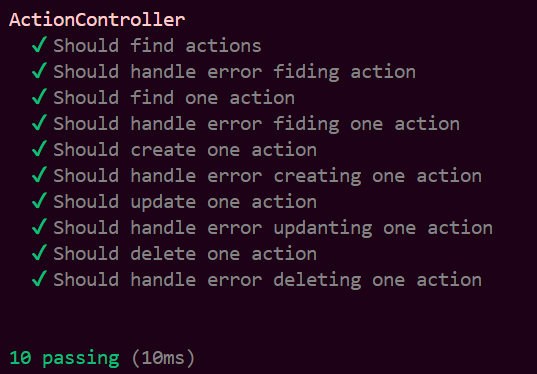
    <br>
    <sup>Fonte: Material produzido pelos autores (2024)</sup>
</div>

**Resultado do FeedAndCommunityActionsController.test.js**
<div align="center" style="width: 100%;">
    <sub>Figura 61: Resultado Teste do Feed and Community Actions Controller</sub>
    <br>
    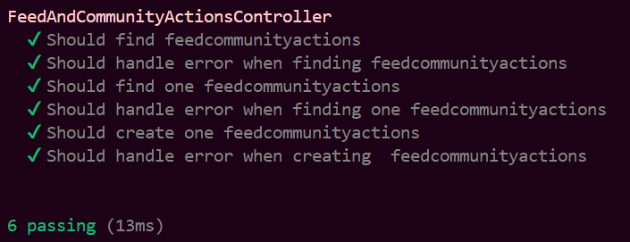
    <br>
    <sup>Fonte: Material produzido pelos autores (2024)</sup>
</div>  

**Resultado do FeedAndCommunityController.test.js**
<div align="center" style="width: 100%;">
    <sub>Figura 62: Resultado Teste do Feed and CommunityController</sub>
    <br>
    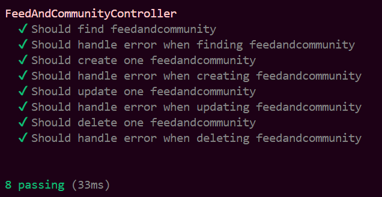
    <br>
    <sup>Fonte: Material produzido pelos autores (2024)</sup>
</div>

**Resultado do FeedAndCommunityTargetPublicController.test.js**
<div align="center" style="width: 100%;">
    <sub>Figura 63: Resultado Teste do Feed and Community Target Public Controller</sub>
    <br>
    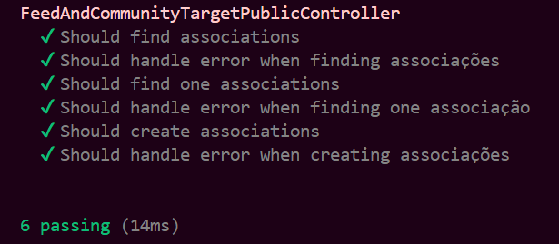
    <br>
    <sup>Fonte: Material produzido pelos autores (2024)</sup>
</div>

**Resultado do LikedContentController.test.js**
<div align="center" style="width: 100%;">
    <sub>Figura 64: Resultado Teste do Liked Content Controller</sub>
    <br>
    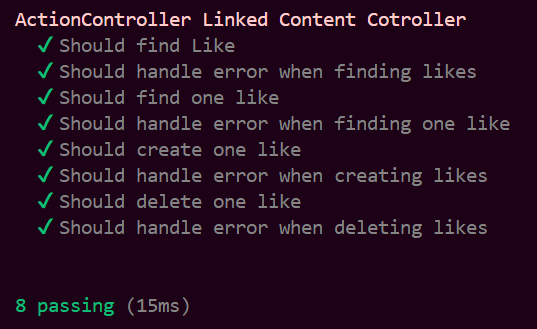
    <br>
    <sup>Fonte: Material produzido pelos autores (2024)</sup>
</div>

**Resultado do TargetPublicController.test**
<div align="center" style="width: 100%;">
    <sub>Figura 65: Resultado Teste do Target Public Controller</sub>
    <br>
    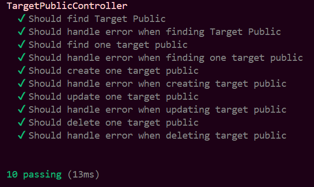
    <br>
    <sup>Fonte: Material produzido pelos autores (2024)</sup>
</div>

**Resultado do TypePostController.test.js**
<div align="center" style="width: 100%;">
    <sub>Figura 66: Resultado Teste do Type Post Controller</sub>
    <br>
    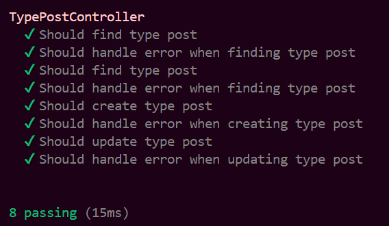
    <br>
    <sup>Fonte: Material produzido pelos autores (2024)</sup>
</div>

**Resultado do UserActionsInterestsController.test**
<div align="center" style="width: 100%;">
    <sub>Figura 67: Resultado Teste do User Actions and Interests Controller</sub>
    <br>
    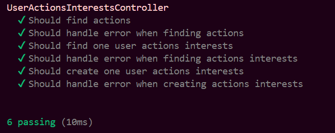
    <br>
    <sup>Fonte: Material produzido pelos autores (2024)</sup>
</div>

**Resultado do UserController.test.js**
<div align="center" style="width: 100%;">
    <sub>Figura 68: Resultado Teste do Controller</sub>
    <br>
    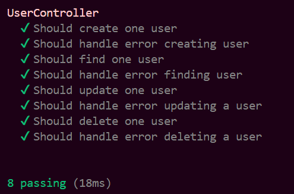
    <br>
    <sup>Fonte: Material produzido pelos autores (2024)</sup>
</div>

**Resultado do UserTargetPublicInterestsController.test.js**
<div align="center" style="width: 100%;">
    <sub>Figura 69: Resultado Teste do User Target Public Interests Controller</sub>
    <br>
    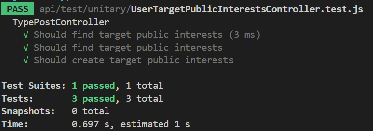
    <br>
    <sup>Fonte: Material produzido pelos autores (2024)</sup>
</div>

  ### Porcentagem de cobertura
  
&nbsp;&nbsp;&nbsp;&nbsp;Devido a alguma configuração ou problema, não foi possível confirmar a porcentagem exata do código que estava sendo testado. O comando "npx nyc mocha [diretório]" não estava conseguindo rodar nossas funções dos controllers, apesar de o Mocha e as libs de teste conseguirem verificar o código por outros comandos.

<div align="center" style="width: 100%;">
    <sub>Figura 70: Resultado Teste do Controller</sub>
    <br>
    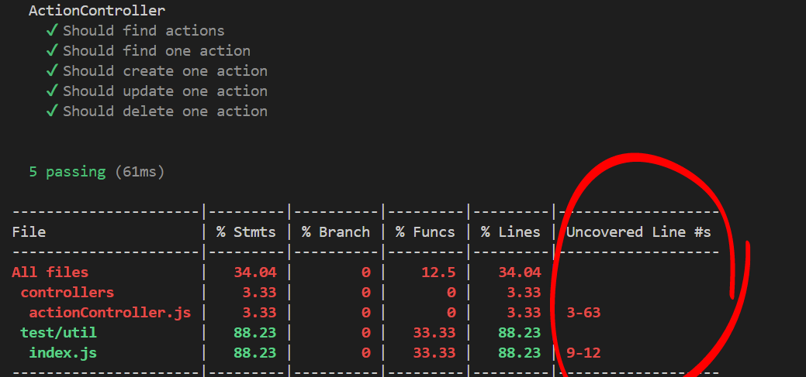
    <br>
    <sup>Fonte: Material produzido pelos autores (2024)</sup>
</div>

&nbsp;&nbsp;&nbsp;&nbsp;É possível ver nessas imagens que demonstram tanto o teste de porcentagem de cobertura quanto os testes rodados por meio do "Jest Runner" que os testes dos controllers com o "Mocha" funcionam. Não foi possível gerar a porcentagem confirmando a quantidade de cobertura devido a algum erro no "nyc", que não rodou as funções assíncronas dos controllers. Diferente dos próprios testes rodados que confirmam o funcionamento do código. Portanto, os testes estão funcionando; apenas o comando/módulo que calcula essa porcentagem, que é separado dos testes propriamente ditos, não funcionou. 
<br>

&nbsp;&nbsp;&nbsp;&nbsp;Isso pode ser explicado pelo fato de que, apesar de depender do Mocha, para conseguir calcular a porcentagem é necessário o "nyc", que depende do "Node.js". 

<div align="center" style="width: 100%;">
    <sub>Figura 71: Resultado Teste do Controller</sub>
    <br>
    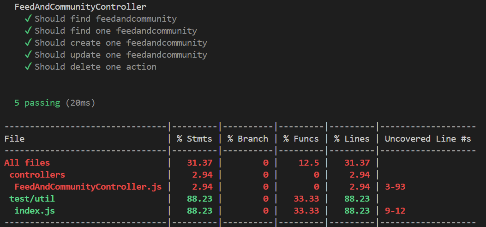
    <br>
    <sup>Fonte: Material produzido pelos autores (2024)</sup>
</div>

### Conclusão dos testes

&nbsp;&nbsp;&nbsp;&nbsp;Para cada função assíncrona, o teste realiza duas verificações: uma para verificar se a função foi utilizada e outra para capturar e imprimir eventuais erros na função. Se ambas as verificações retornarem positivas, isso significa que as função está funcionando corretamente e que não há nenhum erro. Ao todo, todos os nossos testes indicaram que todas as funções estão funcionando corretamente.
<br>
&nbsp;&nbsp;&nbsp;&nbsp;Enquanto que as porcentagens de cobertura total não funcionaram, foi possível confirmar o funcionamento de todas as funções asíncronas dos controllers por meio das funções "it" dentro do "describe". Foram tentadas diversas medidas para consertar as porcentagens de cobertura, como mover a pasta "test" para a pasta root mas não funcionou. Também diversas mudanças no "package.json", reconfigurar o "node.js" ou "nyc".
<br>
&nbsp;&nbsp;&nbsp;&nbsp;A partir das imagens, com mensagens explicando que todas as funções assíncronas de todos os controllers foram testadas, é possível concluir que os testes foram realizados com sucesso. Uma vez que os controllers compõem mais da metade do código que deve ser testado, também é possível afirmar que grande parte do código foi verificada. Os controllers estão funcionando corretamente com os inputs e variáveis criadas e utilizadas no mockAsync (função mock do Sinon utilizada para teste), rodadas no ambiente de testes formado por diversas bibliotecas, frameworks e módulos.

## 5.2. Testes de usabilidade (sprint 5)

&nbsp;&nbsp;&nbsp;&nbsp; O teste de usabilidade consiste em apresentar o produto desenvolvido para o público-alvo com a finalidade de observar o comportamento quanto à interação com a interface e se condiz com o esperado. Nesse sentido, os testes são focados em identificar problemas na aplicação, como também em aprender mais sobre o desempenho e preferências do usuário. Sendo essa prática de grande importância para descobrir maneiras de como aprimorar o produto.

  ### 5.2.1 Registros de testes e melhorias

  #### Registros dos testes de usabilidade e melhorias

  &nbsp;&nbsp;&nbsp;&nbsp; Os testes de usabilidade realizados pela equipe do *CodeVolunteer* ocorreram no dia 16 de junho de 2024 e foram focados na observação e no registro do comportamento de um possível público-alvo, entretanto não conseguiu-se encontrar pessoas com perfil necessário, dessa forma, foi realizado um teste de guerrilha com um total de oito alunos do Inteli com uma média de idade entre 18 e 22 anos, testando a aplicação web. Nessa conjuntura, com base nas interações dos usuários com a plataforma “Borbulha”, foi feita uma tabulação considerando as métricas de taxa de sucesso na realização de cada tarefa e a identificação de funcionalidades específicas. Assim, as tarefas propostas para os usuários incluíam: criar uma conta, navegar pela plataforma, fazer diferentes publicações, encontrar onde ficam as publicações e navegar pelo perfil.

  &nbsp;&nbsp;&nbsp;&nbsp; Seguindo por esse viés, as tarefas foram divididas em subtarefas para ser possível ter uma conclusão mais embasada. Nesse sentido, a tarefa de criar conta foi subdivida em inserir o nome e e-mail, definir uma senha e selecionar o tipo de usuário, dessa maneira, foi observado se o usuário conseguiu concluir esses quatro pontos. Assim, o gráfico a seguir mostra a quantidade de usuários que conseguiram realizar as subtarefas ou não.

  <div align="center" style="width: 100%;">
      <sub>Figura 72: Gráfico da taxa de sucesso das subtarefas 1</sub>
      <br>
      
      <br>
      <sup>Fonte: Material produzido pelos autores (2024)</sup>
  </div>

  &nbsp;&nbsp;&nbsp;&nbsp; O próximo gráfico apresenta a porcentagem da taxa de sucesso geral da conclusão da tarefa de criar uma conta.

  <div align="center" style="width: 100%;">
      <sub>Figura 73: Gráfico da taxa de sucesso da tarefa 1</sub>
      <br>
      
      <br>
      <sup>Fonte: Material produzido pelos autores (2024)</sup>
  </div>

  &nbsp;&nbsp;&nbsp;&nbsp; Por fim, com base nos dados apresentados evidencia-se que a tarefa de criar uma conta foi realizada com sucesso para quase todos os usuários, exceto por uma pessoa que não conseguiu identificar a area para escolher o tipo de conta. 

  &nbsp;&nbsp;&nbsp;&nbsp; Ademais, a próxima tarefa esperada que o usuário consiga cumprir é navegar pela plataforma, sendo capaz de explorar todos os recursos e funcionalidades disponíveis. Nesse sentido, as subtarefas são identificar os ícones de navegação para cada página (feed, criar publicação, comunidade e perfil) no rodapé, como também diferenciar as seções “bolhinhas” e “ver perfil”.  Assim, com base no comportamento observado dos possíveis  usuários elaborou-se o seguinte gráfico:

  <div align="center" style="width: 100%;">
      <sub>Figura 74: Gráfico da taxa de sucesso das subtarefas 2 </sub>
      <br>
      
      <br>
      <sup>Fonte: Material produzido pelos autores (2024)</sup>
  </div>

  &nbsp;&nbsp;&nbsp;&nbsp; O próximo gráfico apresenta a porcentagem da taxa de sucesso geral da conclusão da tarefa de navegar pela plataforma e explorar suas funcionalidades.

  <div align="center" style="width: 100%;">
      <sub>Figura 75: Gráfico da taxa de sucesso da tarefa 2</sub>
      <br>
      
      <br>
      <sup>Fonte: Material produzido pelos autores (2024)</sup>
  </div>

  &nbsp;&nbsp;&nbsp;&nbsp; Portanto, tendo em vista os dados apontados acima, conclui-se que grande parte dos possíveis usuários conseguiram atingir a proposta de navegar pela plataforma. Entretanto, nota-se que houve uma notável dificuldade de 50% das pessoas que testaram a aplicação em entender o conceito de bolhinhas e a sua diferença com o ver perfil. Dessa maneira, como ponto de melhoria da aplicação web será implementado uma *landing page*, a qual explicará conceito de borbulha em geral, incluindo o que seria a aba de "Bolhinhas".

  &nbsp;&nbsp;&nbsp;&nbsp; Outrossim, espera-se que o usuário consiga criar diferentes publicações na plataforma "Borbulha". Nesse contexto, as subtarefas propostas são localizar a aba de criação de novas publicações e, assim, criar um post, seja para a seção do feed ou da comunidade, compreendendo a diferença entre os dois tipos de compartilhamento. A seguir, apresenta-se o gráfico baseado nos testes realizados:

  <div align="center" style="width: 100%;">
      <sub>Figura 76: Gráfico da taxa de sucesso das subtarefas 3</sub>
      <br>
      
      <br>
      <sup>Fonte: Material produzido pelos autores (2024)</sup>
  </div>

  &nbsp;&nbsp;&nbsp;&nbsp; O próximo gráfico apresenta a porcentagem da taxa de sucesso geral da conclusão da tarefa de criar diferentes publicações.

  <div align="center" style="width: 100%;">
      <sub>Figura 77: Gráfico da taxa de sucesso da tarefa 3</sub>
      <br>
      
      <br>
      <sup>Fonte: Material produzido pelos autores (2024)</sup>
  </div>

  &nbsp;&nbsp;&nbsp;&nbsp; Logo, tendo em vista os dados apresentados acima, conclui-se que grande parte dos usuários conseguiram realizar novas publicações. Entretanto, três das oito pessoas que testaram a plataforma web tiveram dificuldade em realizar uma publicação, pois não entenderam a diferença dos dois tipos de publicações. Dessa maneira, por razões de tempo hábil, a resolução desse problema ficará para os próximos passos desse projeto.

  &nbsp;&nbsp;&nbsp;&nbsp; Além disso, espera-se que o usuário consiga identificar e  localizar na plataforma os dois tipos de publicações. Nesse sentido, as subtarefas propostas são  identificar uma publicação, abrir a seção do feed e da comunidade. A seguir, apresenta-se o gráfico baseado nos testes realizados:

  <div align="center" style="width: 100%;">
      <sub>Figura 78: Gráfico da taxa de sucesso das subtarefas 4</sub>
      <br>
      
      <br>
      <sup>Fonte: Material produzido pelos autores (2024)</sup>
  </div>

  &nbsp;&nbsp;&nbsp;&nbsp; O próximo gráfico apresenta a porcentagem da taxa de sucesso geral da conclusão da tarefa de localizar as diferentes publicações.

  <div align="center" style="width: 100%;">
      <sub>Figura 79: Gráfico da taxa de sucesso da tarefa 4</sub>
      <br>
      
      <br>
      <sup>Fonte: Material produzido pelos autores (2024)</sup>
  </div>

  &nbsp;&nbsp;&nbsp;&nbsp; Por fim, com base nos dados apresentados evidencia-se que a tarefa de localizar as diferentes publicações foi realizada com sucesso para quase todos os usuários, exceto por alguns usuários que tiveram dificuldade em associar os ícones do rodapé como símbolos do feed e da comunidade. Dessa maneira, por razões de tempo hábil, a resolução desse problema ficará para os próximos passos desse projeto.

  &nbsp;&nbsp;&nbsp;&nbsp; Como última proposta ao usuário, tem-se a tarefa de navegar pela aba do perfil pessoal,  sendo capaz de explorar todos os recursos e funcionalidades disponíveis. Nessa lógica, as subtarefas são conseguir abrir a aba do perfil, colocar uma foto, editar e adicionar as informações da biografia. Assim, com base no comportamento observado dos possíveis  usuários elaborou-se o seguinte gráfico:

  <div align="center" style="width: 100%;">
      <sub>Figura 80: Gráfico da taxa de sucesso das subtarefas 5</sub>
      <br>
      
      <br>
      <sup>Fonte: Material produzido pelos autores (2024)</sup>
  </div>

  &nbsp;&nbsp;&nbsp;&nbsp; O próximo gráfico apresenta a porcentagem da taxa de sucesso geral da conclusão da tarefa de navegar pelo perfil.

  <div align="center" style="width: 100%;">
      <sub>Figura 81: Gráfico da taxa de sucesso da tarefa 5</sub>
      <br>
      
      <br>
      <sup>Fonte: Material produzido pelos autores (2024)</sup>
  </div>

&nbsp;&nbsp;&nbsp;&nbsp; Portanto, com base nos dados apresentados pode-se concluir que houve uma boa taxa de sucesso na realização da tarefa de navegar pelo perfil. Entretanto, nota-se que nas subtarefas de editar alguma informação na biografia e adicionar uma foto, ocorreram algumas falhas. Dessa maneira, por razões de tempo hábil, a resolução desse problema ficará para os próximos passos desse projeto.

#### Conclusões dos testes de usabilidade

&nbsp;&nbsp;&nbsp;&nbsp; Os testes de usabilidade permitiram embasar e aprimorar de maneira efetiva a aplicação web "Borbulha", uma vez que forneceram, de maneira clara, tanto os pontos que funcionaram bem quanto aqueles que necessitam ser modificados. Dessa maneira, ao analisar os dados dos possíveis usuários que "conseguiram realizar a atividade" ou que "conseguiram realizar a atividade com dificuldade" em todas as cinco tarefas propostas, obteve-se um índice de sucesso de 82,5%.

  <div align="center" style="width: 100%;">
      <sub>Figura 82: Gráfico da taxa de sucesso geral</sub>
      <br>
      
      <br>
      <sup>Fonte: Material produzido pelos autores (2024)</sup>
  </div>


 **Link:** [Planilha com as tabelas completas dos testes de usabilidade](https://docs.google.com/spreadsheets/d/1SAPdgvIHdS7wSmwu3s4cRDsJB3ox1ZxeQ7WcFpXvIa0/edit?gid=0#gid=0)

#### *System Usability Scale* (Escala de usabilidade do sistema) - (SUS) 

&nbsp;&nbsp;&nbsp;&nbsp; O grupo CodeVolunteer realizou testes SUS (*System Usability Scale*) e de Usabilidade Qualitativa para sua plataforma VTM, chamada Borbulha, para o projeto com a Parceiros Voluntários. Uma vez coletadas as avaliações SUS feitas pelos testadores, foram calculados os valores de cada teste, somado o total e calculada a pontuação. O SUS avalia a efetividade, eficiência e satisfação dos usuários com a plataforma de forma científica e que não ocupa muito tempo do usuário. Os testes de Usabilidade permitem verificar se o usuário consegue realizar certas tarefas, seguir narrativas e entender a plataforma.

<div align="center" width="100%">
<sub>Tabela 28: System Usability Scale </sub><br>
</div>

| System Usability Scale (SUS) - Gustavo | Discordo Totalmente | Discordo | Neutro | Concordo | Concordo Totalmente |
| --------------- | --------------- | --------------- | --------------- | --------------- | --------------- |
| 1. Eu acredito que gostaria de usar esse sistema frequentemente. | - | - | - | X | - |
| 2. Eu achei o sistema desnecessariamente complexo. | X | - | - | - | - |
| 3. Eu achei o sistema fácil de usar. | - | - | - | X | - |
| 4. Eu acho que precisaria do suporte de uma pessoa técnica para poder usar esse sistema.| - | X | - | - | - |
| 5. Eu achei as várias funções neste sistema bem integradas. | - | - | - | X | - |
| 6. Eu achei que havia uma inconsistência nesse sistema. | - | X | - | - | - |
| 7. Eu imagino que a maioria das pessoas aprenderia a usar esse sistema muito rapidamente. | - | - | - | X | - |
| 8. Eu achei esse sistema muito desajeitado/incômodo de usar | - | X | - | - | - |
| 9. Me senti muito confiante usando esse sistema | - | - | - | X | - |
| 10. Eu precisei aprender muitas coisas antes de poder começar a usar este sistema. | X | - | - | - | - |

<div align="center">
<sup>Fonte: Material produzido pelos autores (2024)</sup>
</div>

[Link para arquivo com as tabelas](https://docs.google.com/spreadsheets/d/1d7H4kHWJsQe0zENK0JrCogMlMI5fKfs4X7Nf2NW5myA/edit?usp=sharing)

<br>

<div align="center" width="100%">
<sub>Tabela 29: System Usability Scale </sub><br>
</div>

| System Usability Scale (SUS) - Sofi | Discordo Totalmente | Discordo | Neutro | Concordo | Concordo Totalmente |
| --------------- | --------------- | --------------- | --------------- | --------------- | --------------- |
| 1. Eu acredito que gostaria de usar esse sistema frequentemente. | - | - | - | X | - |
| 2. Eu achei o sistema desnecessariamente complexo. | - | X | - | - | - |
| 3. Eu achei o sistema fácil de usar. | - | - | - | X | - |
| 4. Eu acho que precisaria do suporte de uma pessoa técnica para poder usar esse sistema.| - | - | X | - | - |
| 5. Eu achei as várias funções neste sistema bem integradas. | - | - | - | X | - |
| 6. Eu achei que havia uma inconsistência nesse sistema. | - | X | - | - | - |
| 7. Eu imagino que a maioria das pessoas aprenderia a usar esse sistema muito rapidamente. | - | - | X | - | - |
| 8. Eu achei esse sistema muito desajeitado/incômodo de usar | X | - | - | - | - |
| 9. Me senti muito confiante usando esse sistema | - | - | X | - | - |
| 10. Eu precisei aprender muitas coisas antes de poder começar a usar este sistema. | X | - | - | - | - |

<div align="center">
<sup>Fonte: Material produzido pelos autores (2024)</sup>
</div>

[Link para arquivo com as tabelas](https://docs.google.com/spreadsheets/d/1d7H4kHWJsQe0zENK0JrCogMlMI5fKfs4X7Nf2NW5myA/edit?usp=sharing)

<br>

<div align="center" width="100%">
<sub>Tabela 30: System Usability Scale </sub><br>
</div>

| System Usability Scale (SUS) - Flakas | Discordo Totalmente | Discordo | Neutro | Concordo | Concordo Totalmente |
| --------------- | --------------- | --------------- | --------------- | --------------- | --------------- |
| 1. Eu acredito que gostaria de usar esse sistema frequentemente. | - | - | - | - | X |
| 2. Eu achei o sistema desnecessariamente complexo. | - | X | - | - | - |
| 3. Eu achei o sistema fácil de usar. | - | - | - | X | - |
| 4. Eu acho que precisaria do suporte de uma pessoa técnica para poder usar esse sistema.| - | - | X | - | - |
| 5. Eu achei as várias funções neste sistema bem integradas. | - | - | - | - | X |
| 6. Eu achei que havia uma inconsistência nesse sistema. | X | - | - | - | - |
| 7. Eu imagino que a maioria das pessoas aprenderia a usar esse sistema muito rapidamente. | - | - | - | X | - |
| 8. Eu achei esse sistema muito desajeitado/incômodo de usar | X | - | - | - | - |
| 9. Me senti muito confiante usando esse sistema | - | - | - | - | X |
| 10. Eu precisei aprender muitas coisas antes de poder começar a usar este sistema. | - | X | - | - | - |

<div align="center">
<sup>Fonte: Material produzido pelos autores (2024)</sup>
</div>

[Link para arquivo com as tabelas](https://docs.google.com/spreadsheets/d/1d7H4kHWJsQe0zENK0JrCogMlMI5fKfs4X7Nf2NW5myA/edit?usp=sharing)

<br>

<div align="center" width="100%">
<sub>Tabela 31: System Usability Scale </sub><br>
</div>

| System Usability Scale (SUS) - Renan | Discordo Totalmente | Discordo | Neutro | Concordo | Concordo Totalmente |
| --------------- | --------------- | --------------- | --------------- | --------------- | --------------- |
| 1. Eu acredito que gostaria de usar esse sistema frequentemente. | - | X | - | - | - |
| 2. Eu achei o sistema desnecessariamente complexo. | X | - | - | - | - |
| 3. Eu achei o sistema fácil de usar. | - | - | - | - | X |
| 4. Eu acho que precisaria do suporte de uma pessoa técnica para poder usar esse sistema.| X | - | - | - | X |
| 5. Eu achei as várias funções neste sistema bem integradas. | - | - | - | - | X |
| 6. Eu achei que havia uma inconsistência nesse sistema. | X | - | - | - | - |
| 7. Eu imagino que a maioria das pessoas aprenderia a usar esse sistema muito rapidamente. | - | - | - | X | - |
| 8. Eu achei esse sistema muito desajeitado/incômodo de usar | X | - | - | - | - |
| 9. Me senti muito confiante usando esse sistema | - | - | - | X | - |
| 10. Eu precisei aprender muitas coisas antes de poder começar a usar este sistema. | X | - | - | - | - |

<div align="center">
<sup>Fonte: Material produzido pelos autores (2024)</sup>
</div>

[Link para arquivo com as tabelas](https://docs.google.com/spreadsheets/d/1d7H4kHWJsQe0zENK0JrCogMlMI5fKfs4X7Nf2NW5myA/edit?usp=sharing)

<br>

<div align="center" width="100%">
<sub>Tabela 32: System Usability Scale </sub><br>
</div>


| System Usability Scale (SUS) - Vinicios | Discordo Totalmente | Discordo | Neutro | Concordo | Concordo Totalmente |
| --------------- | --------------- | --------------- | --------------- | --------------- | --------------- |
| 1. Eu acredito que gostaria de usar esse sistema frequentemente. | - | - | - | - | X |
| 2. Eu achei o sistema desnecessariamente complexo. | X | - | - | - | - |
| 3. Eu achei o sistema fácil de usar. | - | - | - | X | - |
| 4. Eu acho que precisaria do suporte de uma pessoa técnica para poder usar esse sistema.| X | - | - | - | - |
| 5. Eu achei as várias funções neste sistema bem integradas. | - | - | - | - | X |
| 6. Eu achei que havia uma inconsistência nesse sistema. | X | - | - | - | - |
| 7. Eu imagino que a maioria das pessoas aprenderia a usar esse sistema muito rapidamente. | - | - | - | - | X |
| 8. Eu achei esse sistema muito desajeitado/incômodo de usar | X | - | - | - | - |
| 9. Me senti muito confiante usando esse sistema | - | - | - | - | X |
| 10. Eu precisei aprender muitas coisas antes de poder começar a usar este sistema. | X | - | - | - | - |

<div align="center">
<sup>Fonte: Material produzido pelos autores (2024)</sup>
</div>

[Link para arquivo com as tabelas](https://docs.google.com/spreadsheets/d/1d7H4kHWJsQe0zENK0JrCogMlMI5fKfs4X7Nf2NW5myA/edit?usp=sharing)

<br>

<div align="center" width="100%">
<sub>Tabela 33: System Usability Scale </sub><br>
</div>

| System Usability Scale (SUS) - Mateus | Discordo Totalmente | Discordo | Neutro | Concordo | Concordo Totalmente |
| --------------- | --------------- | --------------- | --------------- | --------------- | --------------- |
| 1. Eu acredito que gostaria de usar esse sistema frequentemente. | - | - | - | X | - |
| 2. Eu achei o sistema desnecessariamente complexo. | X | - | - | - | - |
| 3. Eu achei o sistema fácil de usar. | - | X | - | - | - |
| 4. Eu acho que precisaria do suporte de uma pessoa técnica para poder usar esse sistema.| - | - | X | - | - |
| 5. Eu achei as várias funções neste sistema bem integradas. | - | - | - | - | X |
| 6. Eu achei que havia uma inconsistência nesse sistema. | - | X | - | - | - |
| 7. Eu imagino que a maioria das pessoas aprenderia a usar esse sistema muito rapidamente. | - | X | - | - | - |
| 8. Eu achei esse sistema muito desajeitado/incômodo de usar | - | - | X | - | - |
| 9. Me senti muito confiante usando esse sistema | - | - | X | - | - |
| 10. Eu precisei aprender muitas coisas antes de poder começar a usar este sistema. | - | - | - | X | - |

<div align="center">
<sup>Fonte: Material produzido pelos autores (2024)</sup>
</div>

[Link para arquivo com as tabelas](https://docs.google.com/spreadsheets/d/1d7H4kHWJsQe0zENK0JrCogMlMI5fKfs4X7Nf2NW5myA/edit?usp=sharing)

<br>

<div align="center" width="100%">
<sub>Tabela 34: System Usability Scale </sub><br>
</div>

| System Usability Scale (SUS) - Davi | Discordo Totalmente | Discordo | Neutro | Concordo | Concordo Totalmente |
| --------------- | --------------- | --------------- | --------------- | --------------- | --------------- |
| 1. Eu acredito que gostaria de usar esse sistema frequentemente. | - | X | - | - | - |
| 2. Eu achei o sistema desnecessariamente complexo. | X | - | - | - | - |
| 3. Eu achei o sistema fácil de usar. | - | - | - | X | - |
| 4. Eu acho que precisaria do suporte de uma pessoa técnica para poder usar esse sistema.| - | X | - | - | - |
| 5. Eu achei as várias funções neste sistema bem integradas. | - | - | - | X | - |
| 6. Eu achei que havia uma inconsistência nesse sistema. | - | X | - | - | - |
| 7. Eu imagino que a maioria das pessoas aprenderia a usar esse sistema muito rapidamente. | X | - | - | - | - |
| 8. Eu achei esse sistema muito desajeitado/incômodo de usar | X | - | - | - | - |
| 9. Me senti muito confiante usando esse sistema | - | - | - | X | - |
| 10. Eu precisei aprender muitas coisas antes de poder começar a usar este sistema. | X | - | - | - | - |

<div align="center">
<sup>Fonte: Material produzido pelos autores (2024)</sup>
</div>

[Link para arquivo com as tabelas](https://docs.google.com/spreadsheets/d/1d7H4kHWJsQe0zENK0JrCogMlMI5fKfs4X7Nf2NW5myA/edit?usp=sharing)

<br>

<div align="center" width="100%">
<sub>Tabela 35: System Usability Scale </sub><br>
</div>

| System Usability Scale (SUS) - Marco | Discordo Totalmente | Discordo | Neutro | Concordo | Concordo Totalmente |
| --------------- | --------------- | --------------- | --------------- | --------------- | --------------- |
| 1. Eu acredito que gostaria de usar esse sistema frequentemente. | - | - | - | X | - |
| 2. Eu achei o sistema desnecessariamente complexo. | - | - | X | - | - |
| 3. Eu achei o sistema fácil de usar. | - | - | - | X | - |
| 4. Eu acho que precisaria do suporte de uma pessoa técnica para poder usar esse sistema.| - | X | - | - | - |
| 5. Eu achei as várias funções neste sistema bem integradas. | - | - | - | X | - |
| 6. Eu achei que havia uma inconsistência nesse sistema. | - | - | X | - | - |
| 7. Eu imagino que a maioria das pessoas aprenderia a usar esse sistema muito rapidamente. | - | - | - | - | X |
| 8. Eu achei esse sistema muito desajeitado/incômodo de usar | - | X | - | - | - |
| 9. Me senti muito confiante usando esse sistema | - | - | X | - | - |
| 10. Eu precisei aprender muitas coisas antes de poder começar a usar este sistema. | - | - | - | - | X |

<div align="center">
<sup>Fonte: Material produzido pelos autores (2024)</sup>
</div>

[Link para arquivo com as tabelas](https://docs.google.com/spreadsheets/d/1d7H4kHWJsQe0zENK0JrCogMlMI5fKfs4X7Nf2NW5myA/edit?usp=sharing)

#### Resultado (SUS e Testes de Usabilidade Qualitativos)

$$ \left(80+72,5+85+87,5+97,5+62,5+70+62,5\right)\div8=617,5\div8=77,1875 $$

Pontuação Total (SUS) = 77,19

&nbsp;&nbsp;&nbsp;&nbsp; A pontuação atingida no SUS foi acima da média (sendo essa 68), o que indica uma boa usabilidade da aplicação web testada. Ao mesmo tempo, os testes de usabilidade qualitativos indicaram que os usuários testadores conseguiram cumprir a maioria das tarefas esperadas sem nenhuma instrução. Portanto, pode-se dizer que, de acordo com os diferentes sistemas de avaliação e teste da plataforma para usuários, a aplicação web se apresenta como satisfatória em termos de usabilidade.

#### Link para resultados

[Relatório completo da análise SUS](https://drive.google.com/file/d/145xFjJYCEZZM-3yDXWYwP7JDEcHW9yR_/view?usp=sharing)

[Planilha com as tabelas completas do SUS](https://docs.google.com/spreadsheets/d/1d7H4kHWJsQe0zENK0JrCogMlMI5fKfs4X7Nf2NW5myA/edit?usp=sharing)

# <a name="c6"></a>6. Conclusões e trabalhos futuros (sprint 5)

&nbsp;&nbsp;&nbsp;&nbsp; Mencionada na seção dois, a problemática a ser solucionada com esse projeto reside na premissa do trabalho voluntário ser descentralizado no Brasil. Por esse motivo, durante as primeiras duas sprints foi idealizada a criação de um protótipo de uma plataforma que atendesse às necessidades dos voluntários, visando a conexão entre voluntários, como também inspirar pessoas que não fazem dessa causa a convergirem sua bolha com a do universo da ação voluntária. 

&nbsp;&nbsp;&nbsp;&nbsp; Ao longo de dez semanas a equipe do “Borbulha” construiu uma plataforma baseada em uma rede social voltada para o incentivo do trabalho voluntário. Nessa lógica, a aplicação web conta com uma página de criar conta e login, o perfil com informações como nome, cidade e estado, e-mail, idade, tipo da ação e público-alvo que o usuário tem preferência, todas essas informações para facilitar o encontro e a comunicação entre os voluntários e, assim, convergindo suas bolhas para o voluntariado.  Além dessas páginas, construiu-se outros dois tipos de publicação: a comunidade, um espaço para os usuários compartilharem na íntegra os detalhes sobre uma experiência no voluntariado, a qual contém título, descrição, custo, quantidade pessoas necessárias, tipo de ação e o público-alvo. Ademais, a página do feed é dedicada a publicações mais livres, onde o usuário pode compartilhar com os demais suas experiências, como o que aprendeu e sentiu ao realizar uma ação voluntária. 

&nbsp;&nbsp;&nbsp;&nbsp; Dessa maneira, com base no que foi mencionado anteriormente, a equipe CodeVolunteer conseguiu cumprir o escopo principal definido no início do projeto. Entretanto, durante os testes de usabilidade, foram apontados alguns pontos de melhoria, dos quais conseguimos implementar alguns na última versão, como a adição de uma landing page para ajudar os usuários a entenderem o conceito de “borbulha” dentro da plataforma. Porém, devido à falta de tempo hábil, não foi possível adicionar todos os pontos mencionados nesses testes.

&nbsp;&nbsp;&nbsp;&nbsp; Como próximos passos, com a finalidade de solucionar os problemas mencionados nos testes de usabilidade, pretende-se adicionar um tutorial que explique todas as funcionalidades da aplicação quando o usuário entrar na plataforma, bem como alterar os ícones de navegação das páginas do rodapé para a parte superior do site. Além dessas mudanças, considerou-se implementar outras melhorias, como a funcionalidade de compartilhar publicações, tornar a seção de ‘bolhinhas’ do perfil funcional com as publicações realizadas pelo usuário visíveis, e mudar a cor do botão ao curtir uma publicação. Por fim, pretende-se também como próximos passos a realização de testes de usabilidade com o público-alvo desta aplicação. Dessa maneira, essas alterações visam melhorar a experiência dentro da plataforma do “Borbulha”.


# <a name="c7"></a>7. Referências (sprints 1 a 5)

GUSHIKEM, Amanda. **Value Proposition Canvas: o que é e como funciona essa metodologia?** Disponível em: https://g4educacao.com/portal/value-proposition-canvas. Acesso em: 25 abr. 2024. <br>

NECCACHE, Silvia. **Pesquisa voluntariado no Brasil em 2021**. Disponível em: https://pesquisavoluntariado.org.br/. Acesso em: 25 abr. 2024.<br>

GUIMARAES, Felipe. **Wireframe: O Que É e Como Criar Um Para Seus Projetos De UX Design?**. Disponível em: https://aelaschool.com/pt/designdeinteracao/wireframe-o-que-e-como-desenhar/. Acesso em: 25 abr. 2024.<br>

LAUBHEIMER, Page. **3 Persona Types: Lightweight, Qualitative, and Statistical**. Disponível em: https://www.nngroup.com/articles/persona-types/. Acesso em: 17 abr. 2024.<br>

HARLEY, Aurora. **Personas Make Users Memorable for Product Team Members**. Disponível em: https://www.nngroup.com/articles/persona/. Acesso em: 17 abr. 2024.<br>

PORTER, Michael E. **Estratégia Competitiva: Técnicas para Análise de Indústrias e da Concorrência.** Disponível em: https://edisciplinas.usp.br/pluginfile.php/7821655/mod_resource/content/1/Estrategia_Competitiva_dos_conceitos_a_i.pdf. Acesso em: 19 abr. 2024.<br>

PEARCE II, John A.; ROBINSON Jr., Richard B. **Estratégia de Negócios.** Livro Físico. Acesso em: 20 abr. 2024.<br>

OSTERWALDER, Alexander; PIGNEUR, Yves. **Business Model Generation: Inovação em Modelos de Negócios.** Disponível em: https://edisciplinas.usp.br/pluginfile.php/4453284/mod_resource/content/1/Business-Model-Generation.pdf. Acesso em: 23 abr. 2024.<br>

Ferro, Daniel dos Santos. **Gestão de Riscos Corporativos: Um Estudo Multicaso Sobre Seus Métodos e Técnicas.** Disponível em: https://www.teses.usp.br/teses/disponiveis/12/12139/tde-19012016-150607/publico/corrigidoDaniel.pdf. Acesso em: 20 abr. 2024.<br>

LALA - Latin American Leadership Academy. **Título da página ou artigo** Disponível em: https://latinamericanleadershipacademy.org/pt-br/ Acesso em: 17 abr. 2024.<br>

GUIMARAES, Felipe; Equipe Aela. **Style Guide: Como Desenvolver o Guia de Estilo da Sua Interface?** Disponível em: https://aelaschool.com/pt/designvisual/style-guide-como-desenvolver-o-guia-de-estilo-da-sua-interface/ Acesso em: 24 abr. 2024.<br>

LOSA, Victor; Coest Studio Oficial. **COMO FAZER UM STYLE GUIDE! - Tornando-se um Web Designer** Disponível em: https://www.youtube.com/watch?v=AiCp-VWb6LU Acesso em: 26 abr. 2024.<br>

FIGMA. **Figma For Beginners: Explore ideas (1/4)** Disponível em: https://www.youtube.com/watch?v=dXQ7IHkTiMM Acesso em: 02 mai. 2024.<br>

DEVMIDEA. **Tutorial SQL** Disponível em: https://www.devmedia.com.br/tutorial-sql/2973 Acesso em: 03 mai. 2024.<br>

CARDOSO, Giselle C.; CARDOSO, Virgínia M. **Linguagem SQL, fundamentos e práticas - 1ª edição** Disponível em: https://integrada.minhabiblioteca.com.br/reader/books/9788502200463/pageid/13 Acesso em: 30 abr. 2024.<br>

AMOASEI, Juliana.; ALURA. **O que é Node.js? ** Disponível em: https://www.youtube.com/watch?v=8VSTrZY8vwI Acesso em: 06 mai. 2024.<br>

RALLO, Rafael. **Tipografia: como usar um dos pilares do Design Gráfico a seu favor** https://rockcontent.com/br/blog/tipografia/ Acesso em: 02 mai. 2024.<br>

ARTY, David. **Elementos da interface do usuário – UI Design elements** https://chiefofdesign.com.br/ui-design-elementos-da-interface-do-usuario/#google_vignette Acesso em: 02 mai. 2024.<br>

TEMPORAL, Jessica. **Desfazendo os últimos commits** https://jtemporal.com/desfazendo-um-ou-mais-commits/ Acesso em: 09 mai. 2024.<br>

GUERRETA, Mônica. **Qual é o certo: logotipo ou logomarca?** https://www.linkedin.com/pulse/qual-%C3%A9-o-certo-logotipo-ou-logomarca-m%C3%B4nica-guerretta/ Acesso em: 08 mai. 2024.<br>

BRANDÃO, Afonso. **PostgreSQL on Render + DBeaver** https://www.youtube.com/watch?v=icpPqD0tjLg Acesso em: 03 mai. 2024.<br>

TUTORIALSPOINT. **Node.js - RESTful API** https://www.tutorialspoint.com/nodejs/nodejs_restful_api.htm Acesso em: 06 mai. 2024.<br>

ARTY, David. **O que é Gestalt?** https://chiefofdesign.com.br/gestalt/ Acesso em: 06 mai. 2024.<br>

GOOGLE. **Material Design: Responsive layout grid** https://m2.material.io/design/layout/responsive-layout-grid.html Acesso em: 08 mai. 2024. <br>

NIELSEN, Jacob. **Classificação de ícones: semelhança, referência e ícones arbitrários**  https://www.nngroup.com/articles/classifying-icons/ Acesso em: 08 mai. 2024. <br>

SIRLANGE, Wilma. **Design de interfaces : introdução** https://philos.sophia.com.br/terminal/9418/Resultado/Listar?guid=1716503754500 Acesso em: 08 mai. 2024. <br>

FIGMA. **Open Source Icon** https://www.figma.com/design/33l0saRPK1toaianOkY28r/4%2C000-Free-Icons---Open-Source-Icon-set-Community?node-id=1-3&t=7jxIDwQCaJ3jUXOD-0 Acesso em: 01 jun. 2024. <br>

FIGMA. **Map & Filter Screen** https://dribbble.com/shots/6984741-Map-Filter-Screen Acesso em: 01 jun. 2024. <br>


